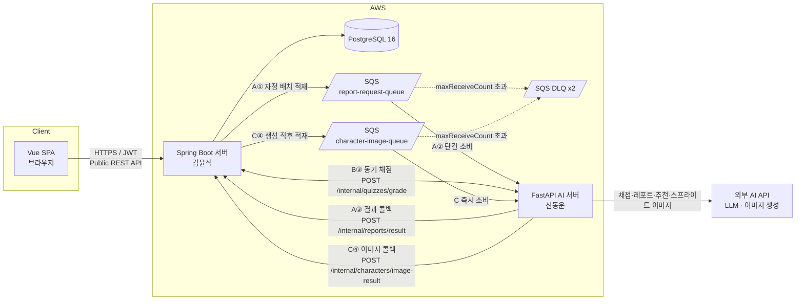
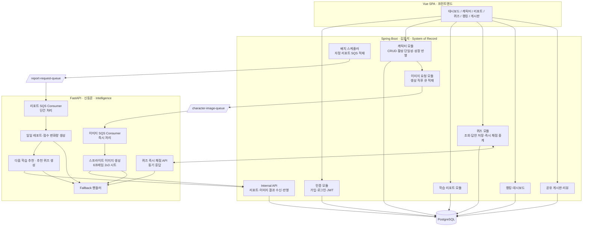
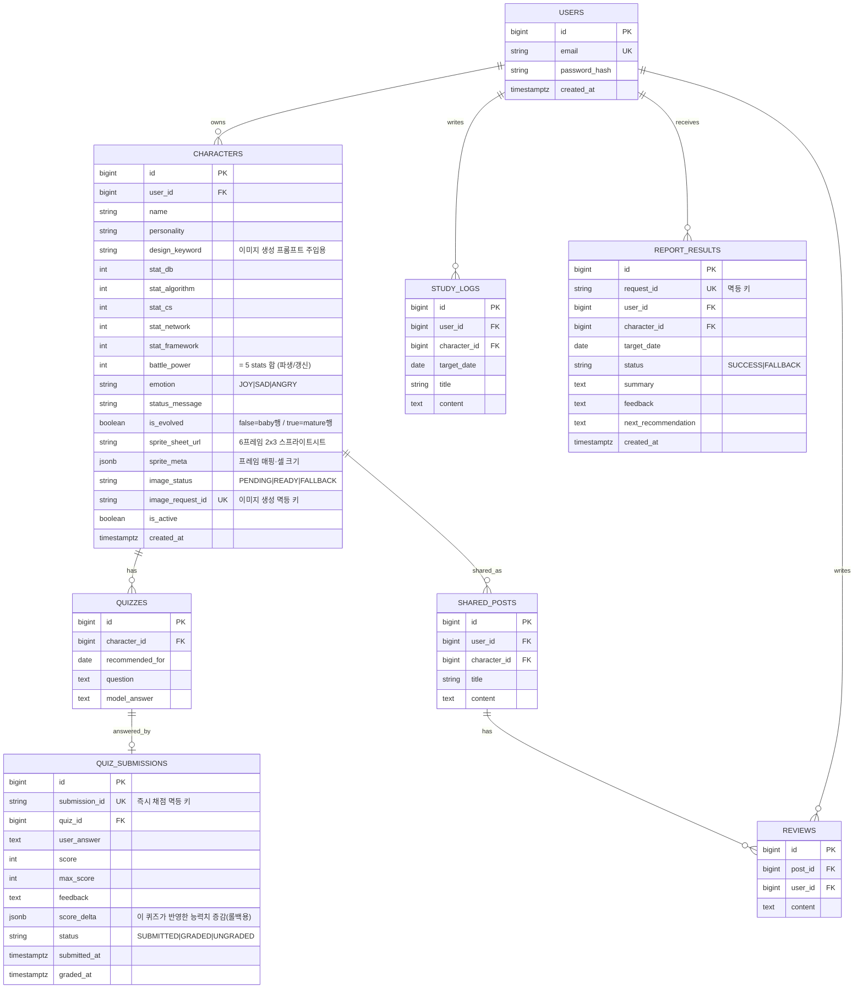
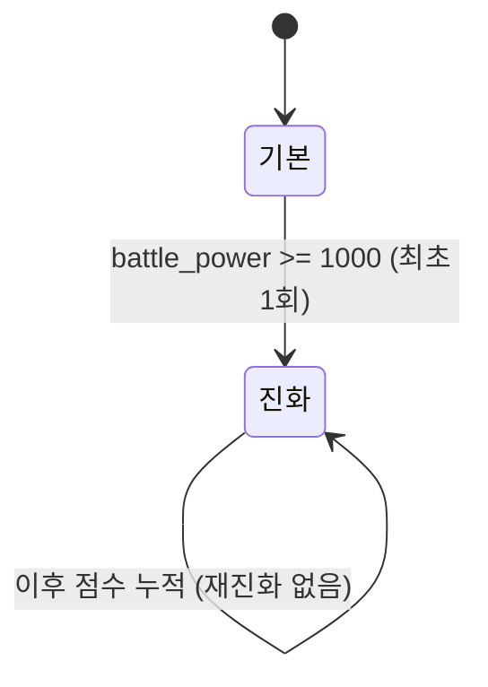
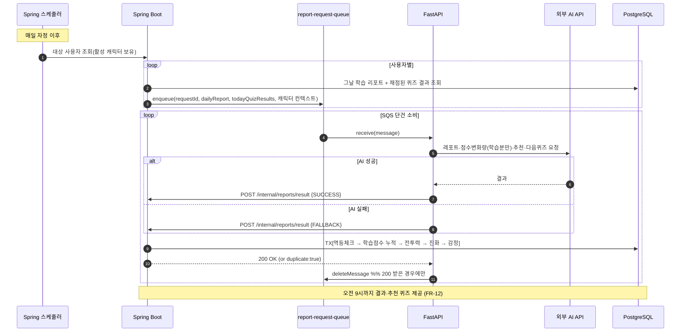
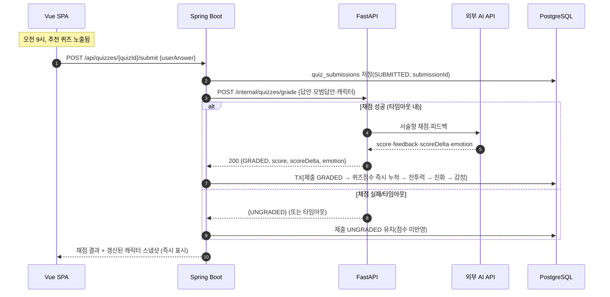
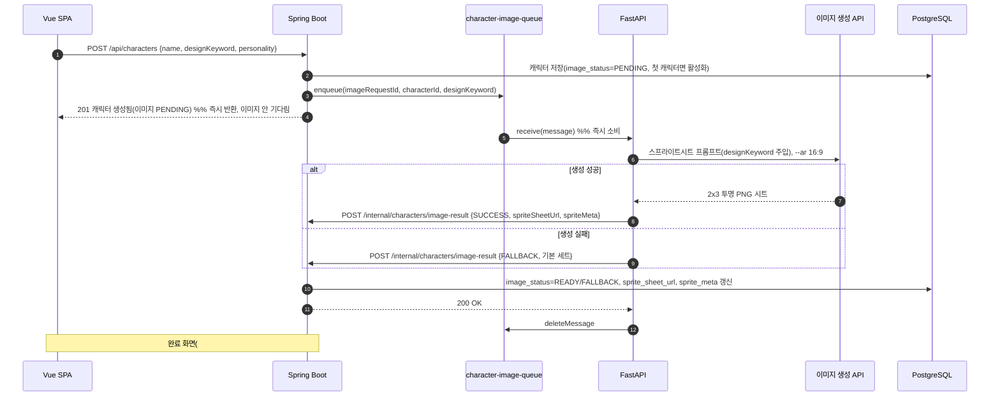

# Architecture Decision Document — commitgotchi

_혼자 CS를 공부하는 사람의 학습을 캐릭터 성장으로 바꾸는 학습 동반자 서비스. 본 문서는 Brief·PRD·Addendum을 입력으로, 팀 구성과 담당 역할에 맞춰 AI 에이전트(및 개발자)가 일관되게 구현할 수 있는 기술 결정을 고정한다._

> 표기 규칙: 추론·미확정 결정은 `[ASSUMPTION]`, PRD Open Questions를 해소한 결정은 `[RESOLVES Q#]`로 표시한다.

---

## 0. 팀 구성 및 역할 담당 (Team & Ownership)

본 아키텍처의 모든 컴포넌트 경계는 아래 담당 분리를 1차 기준으로 설계되었다. 즉 **소유권 경계 = 배포 가능한 서비스 경계**다.

| 담당자 | 컴포넌트 | 핵심 책임 |
|--------|----------|-----------|
| **김윤석** | Spring Boot 서버 (System of Record) | 가입·로그인·JWT 인증, 사용자/캐릭터 CRUD, 활성 캐릭터 단일성 보장, 학습 리포트 저장, **퀴즈 즉시 채점 중계(동기)**, **캐릭터 이미지 생성 요청 적재(비동기-즉시)**, 자정 리포트 SQS 요청 적재(Producer), AI 결과 수신(Internal API), 점수·전투력·진화·감정 반영 트랜잭션, 랭킹·대시보드 API, 공유 게시글·리뷰 CRUD |
| **신동운** | FastAPI AI 서버 (Intelligence) | **퀴즈 답안 즉시 채점·피드백(동기 응답)**, **캐릭터 스프라이트 이미지 생성(비동기-즉시)**, 리포트 SQS 메시지 단건 소비(Consumer), AI 일일 레포트 생성, 다음 학습 추천, 추천 퀴즈 생성, 결과를 Spring Boot Internal API로 콜백, 멱등성·실패 Fallback |
| **공통 / 프런트엔드** | Vue SPA (목업 기반) | 대시보드·캐릭터·리포트·퀴즈·랭킹·게시판 화면, **스프라이트시트 프레임 선택·idle 애니메이션 렌더**, JWT 보관, Spring Boot Public API 소비 |

**경계 원칙**

- 두 서버는 **DB를 공유하지 않는다.** PostgreSQL은 Spring Boot만 소유한다. FastAPI는 DB에 직접 접근하지 않고, 입력은 SQS 메시지 또는 동기 요청으로, 출력은 동기 응답 또는 Internal API 콜백으로만 주고받는다. → 担当 간 결합도를 낮추고 스키마 변경 충돌을 차단한다.
- 두 서버 사이의 계약은 **3개의 흐름·4개의 계약**으로 정리된다(§4). 이 계약들이 본 문서의 핵심 산출물이다:
  - **흐름 A — 일일 리포트(비동기·자정 배치):** ① 리포트 요청 SQS 메시지, ② `POST /api/internal/reports/result` 콜백.
  - **흐름 B — 퀴즈 채점(동기·즉시):** ③ `POST /api/internal/quizzes/grade` 요청/응답.
  - **흐름 C — 캐릭터 이미지 생성(비동기·즉시):** ④ 이미지 생성 요청 SQS 메시지 + `POST /api/internal/characters/image-result` 콜백.
- 통신 모드는 흐름별로 다르다 `[RESOLVES Q1: 채점은 즉시 동기, 리포트는 자정 배치로 확정]`:
  - **흐름 A**는 비동기 단방향(자정 SQS → FastAPI → 콜백). 일 1회 윈도우(자정 적재 → 오전 9시 제공).
  - **흐름 B**는 **동기 요청/응답**. 사용자가 퀴즈 답안을 제출하면 Spring Boot가 FastAPI를 동기 호출해 즉시 채점 결과를 받아 사용자에게 바로 보여준다.
  - **흐름 C**는 **비동기-즉시**. 자정 배치를 기다리지 않고 캐릭터 생성 직후 전용 큐로 흘려 곧바로 처리하며, 완료 시 콜백으로 이미지가 채워진다. 캐릭터 생성 응답 자체는 이미지를 기다리지 않고 즉시 반환된다(image_status=PENDING).

---

## 1. Project Context Analysis

### 1.1 Requirements Overview

**기능 요구사항 (PRD FR-1~23)** 은 9개 기능군으로 묶이며, 아키텍처 관점에서 3개 책임 영역으로 재분류된다:

- **Transactional / SoR (Spring Boot):** 회원(FR-1~2), 캐릭터 CRUD·활성화(FR-3~7), 리포트 저장(FR-8), 요청 적재(FR-9), 점수 반영(FR-11), 결과 제공(FR-12), 능력치·전투력·진화·감정(FR-21~23), 랭킹·대시보드(FR-17~18), 공유·리뷰(FR-19~20).
- **AI / Intelligence (FastAPI):** 일일 레포트 생성(FR-10), 추천 퀴즈(FR-13), **퀴즈 즉시 채점·피드백(FR-15)**, **스프라이트 이미지 생성(FR-3 내)**, Fallback 생성(FR-16).
- **계약 모드 3종:**
  - **비동기 단방향(흐름 A):** 일일 리포트는 자정 SQS → FastAPI → 콜백(FR-9~12).
  - **동기 요청/응답(흐름 B):** 퀴즈 답안 제출은 Spring Boot 동기 저장 후 FastAPI를 동기 호출해 즉시 채점·반영(FR-14~15). 제출 즉시 사용자에게 결과 표시.
  - **비동기-즉시(흐름 C):** 캐릭터 생성 시 이미지 생성을 전용 큐로 즉시 비동기 처리(FR-3). 자정 배치와 분리.

**비기능 요구사항 (NFR — PRD에서 도출)**

- **신뢰성(최우선):** AI는 실패할 수 있는 의존성으로 취급한다. 어떤 단일 AI 실패도 일일 종단 플로우를 중단시키지 않아야 한다(FR-16, SM-3). → Fallback을 1급 설계 요소로 둔다.
- **데이터 정합성:** 활성 캐릭터는 항상 정확히 1개, 전투력 = 능력치 5종 합이 언제나 성립해야 한다(FR-7, FR-11, FR-21). → 트랜잭션·제약·멱등성 설계가 필수.
- **AI 품질(증명 1순위, SM-1):** 채점·피드백·추천이 "그럴듯하고 유용"해야 한다. → 프롬프트·모델 선택을 FastAPI에 캡슐화하고 교체 가능하게 둔다.
- **보안:** 비밀번호 해시, JWT 인증, Internal API는 외부 비노출(서버 간 인증).

### 1.2 Scale & Complexity

- **Primary domain:** Full-stack web (Vue SPA + 2 backend services).
- **Complexity level:** Medium. 도메인 규칙(활성 단일성·점수 누적·진화 임계)은 까다롭지만, 사용자 규모는 포트폴리오 MVP 수준(저트래픽). 진짜 난도는 **트래픽이 아니라 비동기 일관성과 AI 실패 처리**에 있다.
- **Estimated components:** 4 (Vue SPA, Spring Boot, FastAPI, PostgreSQL) + 1 인프라(SQS) + 외부 AI API.

### 1.3 Cross-Cutting Concerns

- **멱등성:** 흐름 A·C의 결과 콜백이 두 번 와도(같은 `requestId`/`characterId`+요청) 점수·이미지가 중복 반영되지 않아야 한다. 흐름 B(동기)는 `submissionId` 단위로 중복 채점·중복 반영을 막는다.
- **점수 이중계상 금지:** 흐름 B(퀴즈 즉시 채점)와 흐름 A(자정 리포트)는 **각자의 점수 변화량 출처가 겹치지 않는다.** 퀴즈 점수는 흐름 B에서 즉시 1회 반영, 리포트 점수는 흐름 A에서 학습 리포트 분석분만 반영(§4.5). 자정 리포트는 그날 퀴즈 결과를 **읽어서 종합 코멘트에만 활용**하고 점수를 다시 더하지 않는다.
- **시간 경계:** 흐름 A에만 "자정 적재 → 오전 9시 제공" 윈도우가 적용된다(FR-9, FR-12). 흐름 B·C는 즉시 처리이며 사용자 체감 지연(수 초 내 응답)이 SLA다.
- **Fallback 일관성:** 이미지·레포트·채점 각각의 실패 대체가 사용자에게 일관된 "상태 안내"로 표현되어야 한다(FR-16). 동기 채점(흐름 B) 실패 시에도 사용자 제출은 저장되고 "채점 잠시 후 재시도" 상태로 응답한다.
- **관측성:** 데모 안정성이 성공 기준이므로 각 흐름의 처리 상태(대기/처리중/완료/실패), 이미지 생성 상태(PENDING/READY/FALLBACK)를 추적 가능해야 한다.

---

## 2. Technology Stack & Starter

> 스택은 팀의 기보유 역량과 Addendum에 명시된 구성으로 이미 고정되어 있다. 본 절은 그 결정을 버전·근거와 함께 박제한다. (스택 변경이 아니라 합의 고정이 목적.)

### 2.1 결정된 스택

| 레이어 | 기술 | 버전(권장) | 근거 |
|--------|------|-----------|------|
| Frontend | Vue 3 + Vite | Vue 3.4+, Vite 5+ | 목업이 이미 Vue로 작성됨(`docs/Commit-Gotchi 목업 (Vue)`). SPA로 Spring Boot REST 소비. |
| Backend (SoR) | Spring Boot (Java 17 LTS) | Spring Boot 3.3.x | 담당자(김윤석) 역량, JPA/트랜잭션·Security 성숙도, 정합성 요구에 적합. |
| ORM/DB 접근 | Spring Data JPA + Hibernate | — | 활성 단일성·점수 누적 트랜잭션을 선언적으로 표현. |
| AI Service | FastAPI (Python 3.11+) | FastAPI 0.11x | 담당자(신동운) 역량, AI/LLM 생태계(SDK)와의 친화성. |
| Database | PostgreSQL | 16 | 단일 RDB로 충분. 부분 유니크 인덱스로 활성 단일성 보장(§5.2). |
| Message Queue | AWS SQS (Standard) | — | Addendum 명시. 자정 배치 적재·단건 소비·DLQ 지원. |
| AI 모델 | LLM(채점·레포트·추천) + 이미지 생성 모델 | 교체 가능 | FastAPI 내부에 캡슐화. 모델 벤더는 구현 세부로 격리. `[ASSUMPTION]` |
| 인증 | JWT (Spring Security) | — | FR-2. 무상태 인증, SPA 친화. |

**Starter 평가:** 별도 보일러플레이트 스타터는 채택하지 않는다. 두 서버 모두 공식 이니셜라이저(Spring Initializr / `fastapi` 표준 레이아웃)로 충분하며, 팀 분리 구조상 모노레포 스타터(T3 등)는 오히려 경계를 흐린다. → **폴리레포 또는 모노레포 내 디렉터리 분리**(§6).

### 2.2 배포 토폴로지 `[ASSUMPTION]`



**큐 분리 근거:** 리포트 큐(자정에 N건 폭증, 일 1회)와 이미지 큐(생성 시점 산발·즉시 처리 기대)는 트래픽 성격이 달라 **별도 큐**로 둔다. 한 큐의 자정 적체가 캐릭터 생성 체감 지연으로 번지지 않게 격리한다. 퀴즈 채점(흐름 B)은 사용자 대기 중 즉답이 필요하므로 큐를 거치지 않고 **동기 HTTP**로 처리한다.

---

## 3. 시스템 아키텍처 & 컴포넌트 책임

### 3.1 컴포넌트 책임 경계



### 3.2 책임 매핑 (FR → 컴포넌트 → 담당)

| FR | 기능 | 컴포넌트 | 담당 |
|----|------|----------|------|
| FR-1,2 | 가입·로그인·JWT | 인증 모듈 | 김윤석 |
| FR-3 | 캐릭터 생성(+비동기-즉시 스프라이트 이미지 생성, 흐름 C) | 캐릭터 모듈 → 이미지 요청 모듈 ↔ 이미지 생성 | 김윤석 ↔ 신동운 |
| FR-4,5,6,7 | 캐릭터 조회·수정·삭제·활성화 | 캐릭터 모듈 | 김윤석 |
| FR-8 | 학습 리포트 저장 | 리포트 모듈 | 김윤석 |
| FR-9 | 자정 리포트 요청 SQS 적재(흐름 A) | 배치 스케줄러(Producer) | 김윤석 |
| FR-10 | AI 일일 레포트 생성 | 레포트 생성 | 신동운 |
| FR-11 | 점수 변화량 활성 캐릭터 반영(일 누적) | Internal API + 캐릭터 모듈 | 김윤석 |
| FR-12 | 사용자 결과 제공 | 레포트 조회 API | 김윤석 |
| FR-13 | 추천 퀴즈 제공 | 추천/퀴즈 모듈 | 신동운(생성)→김윤석(저장·제공) |
| FR-14 | 퀴즈 답안 제출(동기 저장) | 퀴즈 모듈 | 김윤석 |
| FR-15 | **퀴즈 즉시 채점·피드백·점수 즉시 반영(동기, 흐름 B)** | 퀴즈 모듈 ↔ 즉시 채점 API + 캐릭터 모듈 | 김윤석 ↔ 신동운 |
| FR-16 | Fallback(리포트·채점·이미지 각각) | Fallback 핸들러 + Internal API/동기 응답 | 신동운 + 김윤석 |
| FR-17,18 | 대시보드·랭킹 | 랭킹·대시보드 | 김윤석 |
| FR-19,20 | 공유 게시글·리뷰 CRUD | 게시판 모듈 | 김윤석 |
| FR-21,22,23 | 능력치·전투력·진화·감정 | 캐릭터 성장 규칙(Internal API 내) | 김윤석 |

---

## 4. 핵심 계약 (Core Contracts) — 두 서버 간 인터페이스

> 본 절이 본 아키텍처에서 가장 중요한 산출물이다. **3개 흐름·4개 계약**(A①②, B③, C④)만 합의되면 두 담당자가 독립적으로 개발할 수 있다. `[RESOLVES Q1, Q5]`

| 흐름 | 모드 | 트리거 | 계약 |
|------|------|--------|------|
| **A 일일 리포트** | 비동기·자정 배치 | 매일 자정 스케줄러 | ① `report-request-queue` SQS 메시지 → ② `POST /api/internal/reports/result` 콜백 |
| **B 퀴즈 채점** | 동기·즉시 | 사용자 답안 제출 | ③ `POST /api/internal/quizzes/grade` 요청/응답 |
| **C 캐릭터 이미지** | 비동기·즉시 | 캐릭터 생성 | ④ `character-image-queue` SQS 메시지 → `POST /api/internal/characters/image-result` 콜백 |

---

### 4.1 흐름 A · 계약 ① — 리포트 요청 SQS 메시지 (Spring Boot → FastAPI)

큐: `report-request-queue` (Standard). 메시지 1건 = 사용자 1명의 그날 **학습 리포트** 처리 요청. **퀴즈 채점은 이 메시지에 더 이상 포함되지 않는다**(흐름 B로 분리). 대신 그날 **이미 채점된 퀴즈 결과 요약**(`todayQuizResults`)을 컨텍스트로 동봉해, 자정 리포트가 학습+퀴즈를 종합 코멘트할 수 있게 한다.

```json
{
  "requestId": "report-request-uuid",
  "userId": 1,
  "targetDate": "2026-06-06",
  "userMetadata": {
    "weeklyStudyStreak": "0100011",
    "weeklyScoreChanges": {
      "db": 0, "algorithm": 3, "cs": 0, "network": 1, "framework": 0
    }
  },
  "characterMetadata": {
    "characterId": 10,
    "name": "커밋 몬스터",
    "personality": "칭찬을 많이 하지만 틀린 부분은 명확하게 지적하는 성격",
    "currentStats": { "db": 120, "algorithm": 200, "cs": 80, "network": 60, "framework": 140 }
  },
  "dailyReport": {
    "title": "오늘 학습 기록",
    "content": "Spring JPA의 N+1 문제와 해결 방법을 공부했다."
  },
  "todayQuizResults": [
    {
      "quizId": 55,
      "question": "JPA N+1 문제란 무엇인가?",
      "score": 7,
      "maxScore": 10,
      "feedback": "원인은 맞췄으나 해결책(페치 조인)이 빠졌습니다."
    }
  ]
}
```

- `requestId`: **멱등 키.** Spring Boot가 생성, FastAPI가 콜백 시 그대로 반환. (UUID, `userId+targetDate` 조합으로 결정적 생성 권장)
- `currentStats`: 진화 임계(1,000) 판정·점수 인플레 경계(SM-C1)를 위해 AI에 현재 능력치 컨텍스트로 제공. `[ASSUMPTION]`
- `todayQuizResults`: 그날 흐름 B에서 **이미 채점 완료된** 퀴즈들의 점수·피드백 요약. **읽기 전용 컨텍스트** — 리포트의 종합 코멘트·다음 추천 근거로만 쓰고, **점수는 여기서 다시 더하지 않는다**(이중계상 금지, §4.5). 퀴즈 미제출 시 빈 배열.

> **변경점(1.4):** 기존 `quizSubmissions`(미채점 답안)는 제거된다. 자정 리포트는 채점을 하지 않고, 이미 채점된 결과를 종합한다. 이것이 "리포트 제출 시 AI 서버로 추가로 보내야 할 내용" — **그날 채점된 퀴즈 결과 요약**이다.

### 4.2 흐름 A · 계약 ② — 리포트 결과 콜백 (FastAPI → Spring Boot)

```
POST /api/internal/reports/result
Authorization: Internal (서버 간 시크릿/네트워크 격리)  [ASSUMPTION]
Content-Type: application/json
```

**요청 바디 (성공):**

```json
{
  "requestId": "report-request-uuid",
  "userId": 1,
  "characterId": 10,
  "targetDate": "2026-06-06",
  "status": "SUCCESS",
  "scoreDelta": { "db": 0, "algorithm": 3, "cs": 0, "network": 1, "framework": 0 },
  "emotion": "JOY",
  "statusMessage": "오늘 학습 기록이 알찼어요! 퀴즈에서 본 약점도 내일 같이 잡아봐요.",
  "dailyReport": {
    "summary": "오늘 학습은 JPA 영속성 영역에 집중되었습니다 ...",
    "feedback": "학습 강점: 문제 정의. 약점: 즉시 로딩 트레이드오프.",
    "quizReflection": "오늘 푼 퀴즈(JPA N+1)는 원인은 맞췄으나 해결책이 약했습니다."
  },
  "nextRecommendation": {
    "topics": ["JPA 페치 조인", "@BatchSize"],
    "rationale": "N+1 원인은 이해했으니 해결 도구로 확장"
  },
  "recommendedQuizzes": [
    { "question": "페치 조인과 일반 조인의 차이는?", "modelAnswer": "..." }
  ]
}
```

- `scoreDelta`: **학습 리포트 분석분만.** 퀴즈 점수는 흐름 B에서 이미 반영됐으므로 여기 포함하지 않는다(§4.5).
- `dailyReport.quizReflection`: `todayQuizResults`를 종합한 코멘트(점수 미반영, 코멘트 전용). **신규 필드.**
- `gradings` 배열 제거: 채점은 흐름 B 책임이 되었으므로 리포트 콜백에서 빠진다.
- `recommendedQuizzes`: 다음날(오전 9시) 사용자에게 제공될 추천 퀴즈. 흐름 B의 입력이 된다.

**요청 바디 (실패 / Fallback):**

```json
{
  "requestId": "report-request-uuid",
  "userId": 1, "characterId": 10, "targetDate": "2026-06-06",
  "status": "FALLBACK",
  "failedStages": ["REPORT"],
  "scoreDelta": { "db": 0, "algorithm": 0, "cs": 0, "network": 0, "framework": 0 },
  "emotion": "SAD",
  "statusMessage": "오늘은 분석을 제대로 못 했어요. 내일 다시 도전!",
  "dailyReport": null,
  "nextRecommendation": null,
  "recommendedQuizzes": []
}
```

**응답 (Spring Boot → FastAPI):**

| 상태 | 의미 | FastAPI 동작 |
|------|------|--------------|
| `200 OK` | 결과 저장·점수 반영 완료 | **SQS 메시지 삭제** |
| `200 OK` + `{"duplicate": true}` | 이미 처리된 requestId(멱등) | SQS 메시지 삭제 |
| `4xx` | 스키마 오류 등 비재시도성 | DLQ로 보냄(삭제 안 함 → maxReceiveCount) |
| `5xx` / 타임아웃 | Spring Boot 일시 장애 | 삭제하지 않음 → SQS 재전달(재시도) |

> 핵심 규칙: **FastAPI는 Spring Boot가 200을 응답한 경우에만 SQS 메시지를 삭제한다.** 이로써 "결과는 만들었는데 저장은 못 한" 유실을 방지한다(at-least-once + 멱등 = effectively-once).

---

### 4.3 흐름 B · 계약 ③ — 퀴즈 즉시 채점 (동기 요청/응답)

사용자가 추천 퀴즈 답안을 제출하면, Spring Boot가 답안을 **동기 저장**한 뒤 FastAPI를 **동기 호출**해 즉시 채점 결과를 받아 같은 트랜잭션에서 점수를 반영하고 사용자에게 **바로** 결과를 돌려준다.

```
사용자 흐름: Vue --POST /api/quizzes/{quizId}/submit--> Spring Boot
            Spring Boot --POST /api/internal/quizzes/grade--> FastAPI (동기)
            FastAPI --채점 결과--> Spring Boot --결과+갱신 캐릭터--> Vue
```

**Spring Boot → FastAPI 요청 (`POST /api/internal/quizzes/grade`):**

```json
{
  "submissionId": "quiz-submission-uuid",
  "userId": 1,
  "characterId": 10,
  "quizId": 55,
  "question": "JPA N+1 문제란 무엇인가?",
  "modelAnswer": "연관 엔티티를 지연 로딩할 때 ...",
  "userAnswer": "쿼리가 N번 더 나가는 문제",
  "characterMetadata": {
    "personality": "칭찬을 많이 하지만 틀린 부분은 명확하게 지적하는 성격",
    "currentStats": { "db": 120, "algorithm": 200, "cs": 80, "network": 60, "framework": 140 }
  }
}
```

**FastAPI → Spring Boot 응답 (성공, 동기 200):**

```json
{
  "submissionId": "quiz-submission-uuid",
  "quizId": 55,
  "status": "GRADED",
  "score": 7,
  "maxScore": 10,
  "feedback": "원인은 맞췄으나 해결책(페치 조인/배치 사이즈)이 빠졌습니다.",
  "scoreDelta": { "db": 0, "algorithm": 1, "cs": 0, "network": 0, "framework": 0 },
  "emotion": "JOY",
  "statusMessage": "좋아요, 핵심은 잡았어요!"
}
```

**FastAPI → Spring Boot 응답 (채점 실패, Fallback):**

```json
{
  "submissionId": "quiz-submission-uuid",
  "quizId": 55,
  "status": "UNGRADED",
  "score": null,
  "maxScore": 10,
  "feedback": null,
  "scoreDelta": { "db": 0, "algorithm": 0, "cs": 0, "network": 0, "framework": 0 },
  "emotion": null,
  "statusMessage": "AI가 잠깐 쉬는 중 — 답안은 저장됐어요. 잠시 후 다시 채점할 수 있어요."
}
```

**Spring Boot 처리 (한 트랜잭션):** ① `quiz_submissions` upsert(`submissionId` 멱등) → ② `GRADED`면 활성 캐릭터에 `scoreDelta` 즉시 가산 → ③ `battle_power` 재계산 → ④ 진화 판정(§7.1) → ⑤ 감정·상태 메시지 갱신 → ⑥ 채점 결과 + 갱신된 캐릭터 스냅샷을 사용자에게 즉시 응답.

- **멱등:** `submissionId` 유니크. 같은 제출 재채점 시 점수 재반영 없음. 재제출(답안 수정)은 새 `submissionId`가 아니라 **기존 submission 갱신 + 이전 delta 롤백 후 신규 delta 반영** 정책으로 처리한다 `[ASSUMPTION — §7.5]`.
- **동기 타임아웃:** FastAPI 채점 호출에 타임아웃(예: 8s)을 두고, 초과/오류 시 Spring Boot는 답안만 저장하고 `UNGRADED` 상태로 사용자에게 응답(흐름 끊김 없음, FR-16).
- **퀴즈 출처:** 채점 대상 퀴즈는 전날 흐름 A가 생성한 `recommendedQuizzes`. 오전 9시에 사용자에게 노출된다.

### 4.4 흐름 C · 계약 ④ — 캐릭터 이미지 생성 (비동기·즉시)

캐릭터 생성 시 Spring Boot는 캐릭터를 `image_status=PENDING`으로 즉시 저장·응답하고, 전용 큐 `character-image-queue`에 생성 요청을 적재한다. FastAPI가 즉시 소비해 **스프라이트시트**(§4.6 / §7.6)를 생성하고 콜백으로 채운다. 자정 배치를 기다리지 않는다(2.2 요구).

**큐: `character-image-queue` (Standard). Spring Boot → FastAPI 메시지:**

```json
{
  "imageRequestId": "image-request-uuid",
  "userId": 1,
  "characterId": 10,
  "designKeyword": "작고 둥근 초록 슬라임",
  "name": "커밋 몬스터"
}
```

- `designKeyword`: 사용자가 캐릭터 생성 시 입력한 **디자인 키워드**. §7.6의 이미지 생성 프롬프트 `[사용자가 입력할 디자인 키워드]` 자리에 주입된다.
- `imageRequestId`: 멱등 키. 같은 키 재처리 시 이미지 중복 생성/덮어쓰기 방지.

**FastAPI → Spring Boot 콜백 (`POST /api/internal/characters/image-result`):**

```json
{
  "imageRequestId": "image-request-uuid",
  "userId": 1,
  "characterId": 10,
  "status": "SUCCESS",
  "spriteSheetUrl": "https://cdn.example.com/sprites/char-10.png",
  "spriteMeta": {
    "columns": 3,
    "rows": 2,
    "frameMap": {
      "baby":   { "joy": [0,0], "sad": [0,1], "angry": [0,2] },
      "mature": { "joy": [1,0], "sad": [1,1], "angry": [1,2] }
    },
    "frame": { "babyPx": 16, "maturePx": 18 },
    "transparent": true
  }
}
```

**실패 / Fallback 콜백:**

```json
{
  "imageRequestId": "image-request-uuid",
  "userId": 1, "characterId": 10,
  "status": "FALLBACK",
  "spriteSheetUrl": "https://cdn.example.com/sprites/default-set-3.png",
  "spriteMeta": { "...": "기본 스프라이트 세트의 동일 레이아웃 메타" }
}
```

**응답 (Spring Boot → FastAPI):** 200이면 `image_status=READY`(or `FALLBACK`)로 갱신하고 메시지 삭제. 4xx/5xx 처리·DLQ는 흐름 A와 동일 정책(§4.6). 이미지 생성은 **캐릭터 생성을 차단하지 않으므로**, 실패해도 캐릭터는 이미 존재하고 기본 스프라이트 세트로 대체된다(FR-16).

- 프런트엔드는 캐릭터 생성 완료 화면(#11)에서 `image_status`를 폴링/조회하다가 `READY`가 되면 스프라이트를 렌더한다. PENDING 동안은 로딩 플레이스홀더 표시.

---

### 4.5 점수 출처 분리 — 이중계상 금지 (흐름 A ↔ B)

점수 변화량의 출처를 흐름별로 **상호 배타**로 고정한다. 같은 학습 활동이 두 번 점수화되지 않게 한다.

| 출처 | 반영 흐름 | 반영 시점 | scoreDelta 산정 근거 |
|------|-----------|-----------|----------------------|
| **학습 리포트** | A (자정 배치) | 다음날 오전 9시까지 | `dailyReport` 본문 분석 |
| **퀴즈 답안** | B (즉시 동기) | 제출 즉시 | 해당 퀴즈 채점 점수 |

- 자정 리포트(흐름 A)는 `todayQuizResults`를 **코멘트(`quizReflection`)에만** 쓰고 `scoreDelta`에는 더하지 않는다.
- 두 출처 모두 **활성 캐릭터에 일 단위 누적**된다(§5.3). 즉 하루 동안 퀴즈 점수가 즉시 쌓이고, 자정에 학습 리포트 점수가 추가로 쌓인다. 누적 단위·정합성 규칙은 동일하다.

### 4.6 멱등성·재시도·DLQ 정책 `[RESOLVES Q5]`

- **멱등 키:** 흐름 A `requestId`(`report_results` 유니크), 흐름 B `submissionId`(`quiz_submissions` 유니크), 흐름 C `imageRequestId`(`characters.image_request_id` 유니크). 같은 키 재수신 시 재반영 없이 멱등 응답.
- **at-least-once:** SQS Standard는 중복 전달 가능 → 멱등 처리로 흡수(흐름 A·C). 흐름 B는 동기라 클라이언트 재시도를 `submissionId`로 흡수.
- **재시도:** 큐 흐름(A·C)은 Visibility Timeout 만료 또는 5xx 시 SQS 재전달, `maxReceiveCount = 3` `[ASSUMPTION]`. 동기 흐름(B)은 사용자 재제출 또는 명시적 "다시 채점" 버튼으로 재시도.
- **DLQ:** 3회 초과 실패 메시지는 큐별 DLQ로 이동. 운영자 수동 점검(데모에서는 미처리로 남고 사용자에게 Fallback/PENDING 상태 표시).

---

## 5. 데이터 모델 (PostgreSQL · Spring Boot 소유)

### 5.1 ER 개요



### 5.2 핵심 제약 — 활성 캐릭터 단일성 (FR-7)

PostgreSQL **부분 유니크 인덱스**로 DB 레벨에서 보장한다. 애플리케이션 로직 실수와 무관하게 "사용자당 활성 1개"가 깨질 수 없다.

```sql
CREATE UNIQUE INDEX uq_one_active_character_per_user
  ON characters (user_id)
  WHERE is_active = true;
```

- 새 활성 지정(FR-7)·첫 캐릭터 자동 활성(FR-3)·활성 캐릭터 삭제 후 재지정(FR-6)은 모두 단일 트랜잭션에서 기존 활성 해제 → 신규 활성 지정 순으로 수행.

### 5.3 핵심 제약 — 점수 누적 정합성 (FR-11, FR-21)

점수는 **두 출처**(흐름 A 리포트·흐름 B 퀴즈)에서 활성 캐릭터에 **일 단위 누적**된다(주간은 집계·표시용일 뿐 반영 단위 아님) `[RESOLVES Q5 / PRD §4.4]`. 두 경로 모두 동일한 트랜잭션 골격을 쓴다:

- **흐름 A(자정 리포트):** ① `report_results` insert(멱등 체크) → ② 활성 캐릭터 `stat_*` 가산 → ③ `battle_power` 재계산(=5종 합) → ④ 진화 판정(§7.1) → ⑤ 감정·상태 메시지 갱신.
- **흐름 B(즉시 퀴즈):** ① `quiz_submissions` upsert(`submission_id` 멱등) → ② 활성 캐릭터 `stat_*` 가산(이 퀴즈의 `score_delta`) → ③ `battle_power` 재계산 → ④ 진화 판정 → ⑤ 감정·상태 메시지 갱신. 부분 성공 없음.
- **동시성:** 흐름 B는 낮 동안 여러 퀴즈가 빠르게 들어올 수 있으므로 활성 캐릭터 행에 **비관적 락(`SELECT ... FOR UPDATE`)** 또는 낙관적 버전 컬럼으로 합계 정합성을 보장한다. 흐름 A 콜백과 흐름 B 채점이 동시에 같은 캐릭터를 갱신해도 락으로 직렬화된다.
- **이중계상 금지:** 퀴즈 점수는 흐름 B에서 1회만 반영, 리포트 콜백은 퀴즈 점수를 더하지 않는다(§4.5).

### 5.4 캐릭터 상세 페이지네이션 — 리포트/퀴즈 2-리스트 분리 (1.3 요구)

캐릭터 상세 화면(UX #4)은 **독립적으로 페이지네이션되는 두 리스트**를 가진다. 한 페이저로 섞지 않는다.

| 리스트 | 데이터 출처 | 조회 API | 한 행의 내용 |
|--------|-------------|----------|--------------|
| **리포트 리스트** | `STUDY_LOGS` + `REPORT_RESULTS` (targetDate 조인) | `GET /api/characters/{id}/reports?page=&size=` | 날짜·리포트 제목·요약·점수 변화량·감정 |
| **퀴즈 리스트** | `QUIZZES` + `QUIZ_SUBMISSIONS` | `GET /api/characters/{id}/quizzes?page=&size=` | 추천일·질문·제출/채점 상태·점수·피드백 |

- 두 API는 각자 `page`/`size`/`totalPages`를 반환한다. 프런트엔드는 탭 또는 좌우 2-섹션으로 배치하고 페이저를 분리 운용한다.
- 리포트 리스트는 자정 배치 결과(흐름 A) 기준 정렬(최신일 우선), 퀴즈 리스트는 추천일·제출시각 기준 정렬. 채점 상태(`SUBMITTED`/`GRADED`/`UNGRADED`)를 배지로 구분.

---

## 6. 소스 트리 / 모듈 구조

폴리레포(또는 모노레포 내 디렉터리) — 소유권 경계를 디렉터리로 표현한다.

```text
commitgotchi/
├── frontend/                      # Vue SPA (공통/프런트)
│   └── src/
│       ├── views/                 # dashboard, character, studylog, quiz, ranking, board
│       ├── api/                   # Spring Boot REST 클라이언트, JWT 인터셉터
│       └── components/
│
├── backend-spring/                # 김윤석 — System of Record
│   └── src/main/java/com/commitgotchi/
│       ├── auth/                  # 가입·로그인·JWT (FR-1,2)
│       ├── character/             # CRUD·활성 단일성·성장 반영·스프라이트 메타 (FR-3~7,21~23)
│       │   └── image/             # 흐름 C: 이미지 큐 Producer + image-result 콜백 수신
│       ├── studylog/              # 학습 리포트 (FR-8)
│       ├── quiz/                  # 추천 퀴즈 제공·답안 저장·즉시 채점 중계 (FR-13,14,15)
│       │   └── grading/           # 흐름 B: FastAPI 동기 채점 클라이언트 + 점수 즉시 반영
│       ├── report/
│       │   ├── batch/             # 흐름 A: 자정 SQS Producer (FR-9)
│       │   └── internal/          # POST /api/internal/reports/result (FR-11,12,16)
│       ├── ranking/               # 랭킹·대시보드 (FR-17,18)
│       ├── board/                 # 공유 게시글·리뷰 (FR-19,20)
│       └── common/                # 예외·트랜잭션·SQS(2큐) 설정·보안
│
└── ai-fastapi/                    # 신동운 — Intelligence
    └── app/
        ├── consumer/
        │   ├── report_consumer.py   # 흐름 A: report-request-queue 폴링
        │   └── image_consumer.py    # 흐름 C: character-image-queue 폴링(즉시)
        ├── api/
        │   └── grade.py             # 흐름 B: POST /internal/quizzes/grade 동기 채점
        ├── pipeline/              # report / grading / recommendation 파이프라인
        ├── llm/                   # 프롬프트·모델 클라이언트 (교체 가능)
        ├── image/                 # 스프라이트시트 생성·프롬프트 템플릿 (FR-3, §7.6)
        ├── fallback/              # 단계별 Fallback (FR-16)
        └── client/                # Spring Boot Internal API 콜백 클라이언트
```

---

## 7. 도메인 규칙 구체화 (Open Questions 해소)

### 7.1 진화 규칙 (FR-22) `[RESOLVES Q3]`

- 전투력(5종 합) ≥ **1,000** 도달 시 진화, 캐릭터당 **최대 1회**(`is_evolved` 플래그).
- 진화 시: 스프라이트시트의 **mature 행(행1)으로 전환** + `is_evolved = true`(별도 이미지 교체가 아니라 같은 시트의 아래 행 사용, §7.6). **추가 능력치 보너스 없음**(임계 통과 자체가 보상, SM-C1 인플레 경계 준수).
- 판정 위치: Internal API 점수 반영 트랜잭션 ④단계. 진화는 부수효과로 같은 트랜잭션에서 처리.



### 7.2 감정 규칙 (FR-23) `[RESOLVES Q2 — 제안값, 검토 후 조정 가능]`

AI(FastAPI)가 `scoreDelta` 합과 학습 여부를 바탕으로 결정하고 `emotion`을 콜백/응답에 포함. **두 흐름 모두 감정을 갱신**한다 — 퀴즈 즉시 채점(흐름 B) 직후에도 감정이 바뀌어 사용자가 바로 반응을 본다. 제안 기준 `[ASSUMPTION]`:

| 흐름 | 조건 | 감정 |
|------|------|------|
| A(리포트) | 당일 학습 있음 & scoreDelta 합 > 0 | `JOY` (기쁨) |
| A(리포트) | 당일 학습 있음 & scoreDelta 합 = 0 | `SAD` (슬픔) |
| A(리포트) | 당일 미학습(리포트 없음) | `ANGRY` (화남) |
| B(퀴즈) | 점수 ≥ 만점의 60% | `JOY` |
| B(퀴즈) | 점수 < 60% | `SAD` |

- 흐름 B 채점이 감정을 갱신한 뒤 자정 흐름 A가 다시 갱신할 수 있다(**최종 상태는 마지막 갱신 흐름이 결정** — 자정 리포트가 그날의 종합 감정으로 마무리). `[ASSUMPTION — 검토 후 조정]`
- `statusMessage`는 캐릭터 `personality`를 반영해 AI가 생성(FR-23).

### 7.3 Fallback 정책 (FR-16) `[RESOLVES Q4]`

| 흐름 | 실패 단계 | 대체 처리 | 사용자 표시 |
|------|-----------|-----------|-------------|
| C | 스프라이트 이미지 생성(FR-3) | 기본 스프라이트 세트 중 1개 배정(동일 6프레임 레이아웃), `image_status=FALLBACK`, 캐릭터 생성은 **성공** | 정상(기본 스프라이트) |
| A | 레포트 생성(FR-10) | `scoreDelta` 전부 0, `status=FALLBACK` | "오늘 분석 실패" 상태 안내 |
| B | 퀴즈 즉시 채점(FR-15) | 답안만 저장, `status=UNGRADED`, 점수 미반영, 동기 응답은 즉시 반환 | "채점 잠시 후 재시도" + 다시 채점 버튼 |

- 부분 실패 허용: 흐름 A는 `failedStages` 배열로 어떤 단계가 실패했는지 전달. 흐름 B 실패는 그 퀴즈에만 국한되어 다른 퀴즈·리포트에 영향 없음.
- 흐름 C 실패는 캐릭터 생성·활성화를 막지 않는다(이미지는 사후 채움/대체).
- 원칙: **어떤 단일 AI 실패도 사용자 흐름을 멈추지 않는다**(SM-3).

### 7.4 학습 리포트 재작성 (FR-8) `[RESOLVES Q1 관련 / PRD §8.1]`

- MVP: 하루 1개 리포트(`user_id + target_date` 유니크), 같은 날 재작성은 **덮어쓰기**.

### 7.5 퀴즈 답안 재제출 (FR-14/15, 흐름 B) `[ASSUMPTION — 검토 필요]`

즉시 채점이라 사용자가 같은 퀴즈에 답을 고쳐 다시 낼 수 있다. 점수 정합을 위해:

- 같은 `quizId`의 재제출은 **기존 `quiz_submissions` 행을 갱신**한다(새 행 아님).
- 점수 반영은 **이전 `score_delta`를 활성 캐릭터에서 차감(롤백) → 신규 채점 `score_delta` 가산**을 한 트랜잭션에서 수행. 그래서 한 퀴즈는 항상 "최종 1회분"만 캐릭터에 남는다.
- 재제출 마감: 해당 퀴즈 추천일 당일 자정까지(자정 배치가 `todayQuizResults`를 읽기 전). 이후엔 잠금. `[ASSUMPTION]`

### 7.6 캐릭터 스프라이트시트 (FR-3, 3번 요구) `[RESOLVES Q6]`

캐릭터 이미지는 단일 이미지가 아니라 **6프레임 스프라이트시트**다. 한 장에 진화 2단계 × 감정 3종이 2×3 격자로 들어가고, 프런트엔드가 현재 `(is_evolved, emotion)`에 맞는 프레임을 골라 렌더 + idle 애니메이션(bob)을 입힌다("Sprite를 이용한 약간의 애니메이션").

**레이아웃 (2행 3열, 투명 PNG):**

| | 열0 = 기쁨(joy) | 열1 = 슬픔(sad) | 열2 = 화남(angry) |
|---|---|---|---|
| **행0 = 유아형(baby, 16×16px)** | [0,0] | [0,1] | [0,2] |
| **행1 = 진화형(mature, 18×18px)** | [1,0] | [1,1] | [1,2] |

- 프레임 선택: `is_evolved=false` → 행0, `true` → 행1. `emotion` JOY/SAD/ANGRY → 열0/1/2. 매핑은 `characters.sprite_meta.frameMap`(§4.4)에 박제.
- 진화(§7.1)는 곧 **행 전환**(baby행 → mature행)으로 표현된다. 별도 이미지 교체가 아니라 같은 시트의 아래 행을 쓴다.
- 애니메이션은 프레임 교체가 아닌 **CSS bob/idle**(DESIGN.md `cg-spr`의 `bob`)로 구현. Reduce Motion 시 정적. 스프라이트시트는 어떤 프레임을 **보여줄지**만 결정한다.
- 프런트 렌더: `background-image: url(spriteSheetUrl)` + 셀 크기/`background-position`으로 해당 프레임만 노출(나머지 잘라냄).

**이미지 생성 프롬프트 (FastAPI `image/` 모듈에 박제, `designKeyword` 주입):**

```
A comprehensive retro Tamagotchi character design sheet, **presented on a clean transparent background**, png style with alpha channel support. The sheet displays six distinct pixel art characters arranged in a precise 2x3 grid, representing two evolution stages and three emotional states.

Row 1: Stage 1 (16x16px size) 'baby' creatures.
Column 1: Happy baby pixel art creature with a cheerful, smiling expression.
Column 2: Sad baby pixel art creature with small tearful eyes and a downcast look.
Column 3: Angry baby pixel art creature with a furrowed brow and a tiny steam puff.

Row 2: Stage 2 (18x18px size) 'mature' evolved creatures.
Column 1: Happy mature pixel art creature with a wide, confident smiling expression.
Column 2: Sad mature pixel art creature with a downcast mouth and larger tear pixels.
Column 3: Angry mature pixel art creature with narrowed eyes and a prominent 'fire' or 'steam' effect.

All six characters are based on the design keyword "[사용자가 입력할 디자인 키워드]" and feature clean black outlines, a vibrant color palette, and a strict retro 8-bit handheld game aesthetic. This sheet functions as a game asset sprite sheet with no grid lines, no UI text, and is designed for easy extraction with an alpha channel. --ar 16:9
```

- `[사용자가 입력할 디자인 키워드]` ← 메시지의 `designKeyword`(= `characters.design_keyword`)로 치환.
- 생성 결과(2×3 시트)에서 셀 경계는 `sprite_meta`로 알려준다. AI가 격자선 없이 그리므로, 시트 픽셀 크기를 6등분한 셀 박스를 프런트가 사용.
- 기본(Fallback) 스프라이트 세트도 **동일 6프레임 2×3 레이아웃**으로 미리 제작해, 실패 시 렌더 코드를 바꾸지 않고 교체만 한다.

---

## 8. 핵심 시퀀스 (3개 흐름)

### 8.1 흐름 A — 일일 리포트 배치 (FR-9~12)



### 8.2 흐름 B — 퀴즈 즉시 채점 (동기, FR-14~15)



### 8.3 흐름 C — 캐릭터 이미지 생성 (비동기·즉시, FR-3)



---

## 9. 아키텍처 결정 요약 (ADR 인덱스)

| # | 결정 | 근거 | 상태 |
|---|------|------|------|
| AD-1 | DB는 Spring Boot 단독 소유, FastAPI는 직접 접근 금지 | 担当 결합도 최소화, 스키마 충돌 차단 | 확정 |
| AD-2 | 서버 간 계약은 3흐름·4계약(리포트 SQS+콜백, 퀴즈 동기 채점, 이미지 큐+콜백) | 독립 개발 가능 | 확정(개정) |
| AD-3 | **리포트는 자정 배치, 퀴즈 채점은 즉시 동기, 이미지는 비동기-즉시로 분리** | 1번·2번 요구, 즉시 피드백 UX | 확정(개정) `[RESOLVES Q1]` |
| AD-4 | effectively-once = at-least-once + 멱등키(requestId/submissionId/imageRequestId) | 중복 반영 방지 | 확정 `[RESOLVES Q5]` |
| AD-5 | 활성 단일성은 부분 유니크 인덱스로 DB 강제 | 로직 무관 불변식 보장 | 확정 |
| AD-6 | 점수는 일 단위 누적, 주간은 집계·표시용 | PRD §4.4 정합 | 확정 |
| AD-7 | 진화는 스프라이트 행 전환(baby→mature) + 플래그, 보너스 없음 | 점수 인플레 경계(SM-C1) | 제안 `[RESOLVES Q3]` |
| AD-8 | 감정은 규칙 기반 AI 결정, 흐름 A·B 모두 갱신 | FR-23, 즉시 반응 | 제안 `[RESOLVES Q2]` |
| AD-9 | Fallback은 흐름별 부분 실패 허용 | 흐름 무중단(SM-3) | 확정 `[RESOLVES Q4]` |
| AD-10 | AI 모델 벤더는 FastAPI 내부에 캡슐화·교체 가능 | AI 품질 반복개선(SM-1) | 확정 |
| AD-11 | **퀴즈/리포트 점수 출처 상호 배타(이중계상 금지)** | 같은 학습 2회 점수화 방지 | 확정 `[§4.5]` |
| AD-12 | **캐릭터 이미지는 6프레임 2×3 스프라이트시트(진화 2×감정 3)** | 3번 요구, 진화·감정 프레임 전환 | 확정 `[RESOLVES Q6]` |
| AD-13 | **이미지·리포트 큐 분리(2 SQS 큐), 퀴즈는 큐 없이 동기** | 트래픽 성격 격리, 즉답 | 확정 |
| AD-14 | **캐릭터 상세는 리포트/퀴즈 독립 페이지네이션 2-리스트** | 1.3 요구 | 확정 `[§5.4]` |

---

## 10. 검증 — FR 커버리지

PRD FR-1~23 전부가 컴포넌트·계약·데이터 모델에 매핑됨(§3.2). 본 개정으로 해소·변경된 항목:

- **FR-15 (퀴즈 채점):** 자정 배치 → **즉시 동기 채점**(흐름 B)으로 변경. PRD/Addendum 동기화 필요(§아래 핸드오프).
- **Q6 (기본 이미지 세트):** 스프라이트시트 6프레임 2×3 레이아웃으로 확정(§7.6). 기본 세트도 동일 레이아웃으로 N개 준비 후 Fallback 랜덤 배정. `[ASSUMPTION: N개수]`
- **점수 이중계상:** 흐름 A·B 출처 분리로 해소(AD-11, §4.5).

미해결로 남은 항목:

- **Internal API 서버 간 인증 방식:** 공유 시크릿 헤더 또는 VPC 내부 네트워크 격리 중 택1 — 인프라 구성 시 확정. `[ASSUMPTION]`
- **퀴즈 재제출 마감·롤백 정책(§7.5):** 당일 자정 잠금 제안, 확정 필요.
- **감정 최종 상태 우선순위(흐름 B↔A):** 마지막 갱신 우선 제안(§7.2), 확정 필요.

---

## 11. 다음 단계 (Handoff)

1. **김윤석(Spring Boot):** §5 스키마(스프라이트·이미지 상태·submission 멱등 포함)로 엔티티·마이그레이션, §4.2/§4.4 Internal API 엔드포인트, §4.3 퀴즈 동기 채점 중계, §4.6 멱등/DLQ, 자정 리포트 Producer + 이미지 큐 Producer, §5.4 리포트/퀴즈 페이지네이션 API 구현.
2. **신동운(FastAPI):** §8.1 리포트 컨슈머, §8.2 동기 채점 API(`/internal/quizzes/grade`), §8.3 이미지 컨슈머 + 스프라이트시트 생성(§7.6 프롬프트), §4 콜백, §7.2~7.3 감정·Fallback 구현.
3. **공통:** §4의 4개 계약(JSON 스키마)을 양 팀 공유 단일 진실(SSOT)로 고정 — 변경 시 동시 합의. 프런트엔드는 §7.6 스프라이트 프레임 선택·bob 렌더, §5.4 2-리스트 페이지네이션, 이미지 PENDING 폴링 구현.
4. **PRD/Addendum 동기화:** FR-15(즉시 채점)·FR-3(스프라이트)·D1·D4 결정 변경을 상류 문서에 반영(본 개정과 함께 수정됨).
5. **에픽/스토리:** 본 문서를 입력으로 `bmad-create-epics-and-stories` 진행 권장.
