# Architecture Decision Document — commitgotchi

_혼자 CS를 공부하는 사람의 학습을 캐릭터 성장으로 바꾸는 학습 동반자 서비스. 본 문서는 Brief·PRD·Addendum을 입력으로, 팀 구성과 담당 역할에 맞춰 AI 에이전트(및 개발자)가 일관되게 구현할 수 있는 기술 결정을 고정한다._

> 표기 규칙: 추론·미확정 결정은 `[ASSUMPTION]`, PRD Open Questions를 해소한 결정은 `[RESOLVES Q#]`로 표시한다.

---

## 0. 팀 구성 및 역할 담당 (Team & Ownership)

본 아키텍처의 모든 컴포넌트 경계는 아래 담당 분리를 1차 기준으로 설계되었다. 즉 **소유권 경계 = 배포 가능한 서비스 경계**다.

| 담당자 | 컴포넌트 | 핵심 책임 |
|--------|----------|-----------|
| **김윤석** | Spring Boot 서버 (System of Record) | 가입·로그인·JWT 인증, 사용자/캐릭터 CRUD, 활성 캐릭터 단일성 보장, 학습 리포트 저장, **퀴즈 채점 요청·웹훅 결과 수신**, **캐릭터 이미지 생성 동기 HTTP 요청**, 자정 리포트 SQS 요청 적재(Producer), AI 결과 수신(Internal API), 점수·전투력·진화·감정 반영 트랜잭션, 랭킹·대시보드 API, 캐릭터 리뷰 CRUD |
| **신동운** | FastAPI AI 서버 (Intelligence) | **퀴즈 답안 비동기 채점·피드백 웹훅**, **캐릭터 스프라이트 이미지 동기 생성·S3 저장**, 리포트 SQS 메시지 단건 소비(Consumer), AI 일일 레포트 생성, 다음 학습 추천, 추천 퀴즈 생성, 결과를 Spring Boot Internal API로 콜백, 멱등성·실패 Fallback |
| **공통 / 프런트엔드** | Vue SPA (목업 기반) | 대시보드·캐릭터(리뷰 통합)·리포트·퀴즈·랭킹 화면, **스프라이트시트 프레임 선택·idle 애니메이션 렌더**, JWT 보관, Spring Boot Public API 소비 |

**경계 원칙**

- 두 서버는 **DB를 공유하지 않는다.** PostgreSQL은 Spring Boot만 소유한다. FastAPI는 DB에 직접 접근하지 않고, 입력은 SQS 메시지 또는 HTTP 요청으로, 출력은 HTTP 응답 또는 Internal API 웹훅/콜백으로만 주고받는다. → 担当 간 결합도를 낮추고 스키마 변경 충돌을 차단한다.
- 두 서버 사이의 계약은 **3개의 흐름·4개의 계약**으로 정리된다(§4). 이 계약들이 본 문서의 핵심 산출물이다:
  - **흐름 A — 일일 리포트(비동기·자정 배치):** ① 리포트 요청 SQS 메시지, ② `POST /api/report` 콜백.
  - **흐름 B — 퀴즈 채점(비동기·웹훅):** ③ `POST /api/internal/quizzes/grade` 요청 수락 + `POST /api/internal/quizzes/grade-result` 웹훅.
  - **흐름 C — 캐릭터 이미지 생성(동기 HTTP):** ④ `POST /api/ai/commitgotchi` 요청/응답.
- 통신 모드는 흐름별로 다르다 `[RESOLVES Q1: 리포트는 자정 배치, 퀴즈 채점은 웹훅, 캐릭터 이미지는 동기 HTTP로 확정]`:
  - **흐름 A**는 비동기 단방향(자정 SQS → FastAPI → 콜백). 일 1회 윈도우(자정 적재 → 오전 9시 제공).
  - **흐름 B**는 **비동기 웹훅**. 사용자가 퀴즈 답안을 제출하면 Spring Boot가 제출을 저장하고 FastAPI에 채점 요청을 보낸다. FastAPI는 채점 완료 후 Spring Boot 웹훅으로 결과를 돌려준다.
  - **흐름 C**는 **동기 HTTP**. 캐릭터 생성 시 Spring Boot가 FastAPI 이미지 생성 엔드포인트를 호출하고, FastAPI는 제공받은 S3 URL에 1x3 스프라이트시트를 저장한 뒤 성공/실패와 URL을 동기 응답한다.

---

## 1. Project Context Analysis

### 1.1 Requirements Overview

**기능 요구사항 (PRD FR-1~28)** 은 9개 기능군으로 묶이며, 아키텍처 관점에서 3개 책임 영역으로 재분류된다:

- **Transactional / SoR (Spring Boot):** 회원·인증·인가(FR-1~2, FR-24~28), 캐릭터 CRUD·활성화(FR-3~7), 리포트 저장(FR-8), 요청 적재(FR-9), 점수 반영(FR-11), 결과 제공(FR-12), 능력치·전투력·진화·감정(FR-21~23), 랭킹·대시보드(FR-17~18), 캐릭터 리뷰(FR-19~20).
- **AI / Intelligence (FastAPI):** 일일 레포트 생성(FR-10), 추천 퀴즈(FR-13), **퀴즈 비동기 채점·피드백(FR-15)**, **스프라이트 이미지 생성(FR-3 내)**, Fallback 생성(FR-16).
- **계약 모드 3종:**
  - **비동기 단방향(흐름 A):** 일일 리포트는 자정 SQS → FastAPI → 콜백(FR-9~12).
  - **비동기 웹훅(흐름 B):** 퀴즈 답안 제출은 Spring Boot 저장 후 FastAPI에 채점 요청을 보내고, 결과는 FastAPI → Spring Boot 웹훅으로 반영(FR-14~15).
  - **동기 요청/응답(흐름 C):** 캐릭터 생성 시 이미지 생성을 FastAPI HTTP 요청으로 처리하고, FastAPI가 S3 저장 후 URL을 응답(FR-3). 자정 배치와 분리.

**비기능 요구사항 (NFR — PRD에서 도출)**

- **신뢰성(최우선):** AI는 실패할 수 있는 의존성으로 취급한다. 어떤 단일 AI 실패도 일일 종단 플로우를 중단시키지 않아야 한다(FR-16, SM-3). → Fallback을 1급 설계 요소로 둔다.
- **데이터 정합성:** 활성 캐릭터는 항상 정확히 1개, 전투력 = 능력치 5종 합이 언제나 성립해야 한다(FR-7, FR-11, FR-21). → 트랜잭션·제약·멱등성 설계가 필수.
- **AI 품질(증명 1순위, SM-1):** 채점·피드백·추천이 "그럴듯하고 유용"해야 한다. → 프롬프트·모델 선택을 FastAPI에 캡슐화하고 교체 가능하게 둔다.
- **보안:** 비밀번호 해시, JWT 인증, Internal API는 외부 비노출(서버 간 인증).
- **첫 번째 구현 증분:** Spring Boot 인증·인가만 종단 구현한다. 이 증분의 DB 변경은 `users`, `refresh_tokens`로 제한하고, 상세 계약과 구현 순서는 §12를 SSOT로 사용한다.

### 1.2 Scale & Complexity

- **Primary domain:** Full-stack web (Vue SPA + 2 backend services).
- **Complexity level:** Medium. 도메인 규칙(활성 단일성·점수 누적·진화 임계)은 까다롭지만, 사용자 규모는 포트폴리오 MVP 수준(저트래픽). 진짜 난도는 **트래픽이 아니라 비동기 일관성과 AI 실패 처리**에 있다.
- **Estimated components:** 4 (Vue SPA, Spring Boot, FastAPI, PostgreSQL) + 1 인프라(SQS) + 외부 AI API.

### 1.3 Cross-Cutting Concerns

- **멱등성:** 흐름 A의 결과 콜백이 두 번 와도 같은 `requestId`로 점수가 중복 반영되지 않아야 한다. 흐름 B는 `submissionId` 단위로 웹훅 중복 수신과 점수 중복 반영을 막는다. 흐름 C는 `userId + s3ObjectUrl` 기준으로 같은 이미지 결과 중복 저장을 흡수한다.
- **점수 이중계상 금지:** 흐름 B(퀴즈 채점)와 흐름 A(자정 리포트)는 **각자의 점수 변화량 출처가 겹치지 않는다.** 퀴즈 점수는 흐름 B 웹훅에서 1회 반영, 리포트 점수는 흐름 A에서 학습 리포트 분석분만 반영(§4.5).
- **시간 경계:** 흐름 A에만 "자정 적재 → 오전 9시 제공" 윈도우가 적용된다(FR-9, FR-12). 흐름 B는 제출을 즉시 접수한 뒤 웹훅으로 채점 결과를 반영하고, 흐름 C는 캐릭터 생성 요청 안에서 동기 HTTP로 이미지 결과를 받는다.
- **Fallback 일관성:** 이미지·레포트·채점 각각의 실패 대체가 사용자에게 일관된 "상태 안내"로 표현되어야 한다(FR-16). 웹훅 채점(흐름 B) 실패 시에도 사용자 제출은 저장되고 `GRADING`/`UNGRADED` 상태로 조회된다.
- **관측성:** 데모 안정성이 성공 기준이므로 각 흐름의 처리 상태(대기/처리중/완료/실패), 이미지 생성 결과(READY/FALLBACK)를 추적 가능해야 한다.

---

## 2. Technology Stack & Starter

> 스택은 팀의 기보유 역량과 Addendum에 명시된 구성으로 이미 고정되어 있다. 본 절은 그 결정을 버전·근거와 함께 박제한다. (스택 변경이 아니라 합의 고정이 목적.)

### 2.1 결정된 스택

| 레이어 | 기술 | 버전(권장) | 근거 |
|--------|------|-----------|------|
| Frontend | Vue 3 + Vite | Vue 3.4+, Vite 5+ | 목업이 이미 Vue로 작성됨(`docs/Commit-Gotchi 목업 (Vue)`). SPA로 Spring Boot REST 소비. |
| Backend (SoR) | Spring Boot (Java 17 LTS) | Spring Boot 3.3.x | 담당자(김윤석) 역량, MyBatis/트랜잭션·Security 성숙도, 정합성 요구에 적합. |
| SQL 매퍼/DB 접근 | MyBatis (`mybatis-spring-boot-starter`) | 3.0.x | 활성 단일성·점수 누적 트랜잭션을 명시적 SQL 매퍼(XML/애노테이션)로 표현. 부분 유니크·`FOR UPDATE`·soft delete 필터를 SQL로 직접 제어. |
| AI Service | FastAPI (Python 3.11+) | FastAPI 0.11x | 담당자(신동운) 역량, AI/LLM 생태계(SDK)와의 친화성. |
| Database | PostgreSQL | 16 | 단일 RDB로 충분. 부분 유니크 인덱스로 활성 단일성 보장(§5.2). |
| Message Queue | AWS SQS (Standard) | — | Addendum 명시. 자정 배치 적재·단건 소비·DLQ 지원. |
| AI 모델 | LLM(채점·레포트·추천) + 이미지 생성 모델 | 교체 가능 | FastAPI 내부에 캡슐화. 모델 벤더는 구현 세부로 격리. `[ASSUMPTION]` |
| 인증 | JWT (Spring Security) | — | FR-2. 무상태 인증, SPA 친화. |

**Starter 평가:** 별도 보일러플레이트 스타터는 채택하지 않는다. 두 서버 모두 공식 이니셜라이저(Spring Initializr / `fastapi` 표준 레이아웃)로 충분하며, 팀 분리 구조상 모노레포 스타터(T3 등)는 오히려 경계를 흐린다. → **폴리레포 또는 모노레포 내 디렉터리 분리**(§6).

### 2.2 배포 토폴로지 `[ASSUMPTION]`

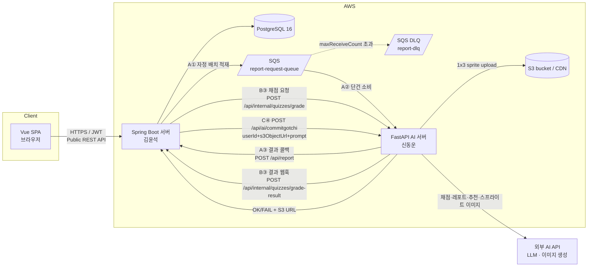

**통신 분리 근거:** 리포트만 자정에 N건 폭증하는 배치성 작업이므로 SQS를 사용한다. 퀴즈 채점은 사용자 제출과 채점 완료 시점이 분리되므로 HTTP 요청 수락 + 웹훅으로 처리한다. 캐릭터 이미지는 현재 협업 계약상 MQ 없이 동기 HTTP로 생성하고, FastAPI가 Spring Boot가 지정한 S3 URL에 결과를 저장한다.

---

## 3. 시스템 아키텍처 & 컴포넌트 책임

### 3.1 컴포넌트 책임 경계

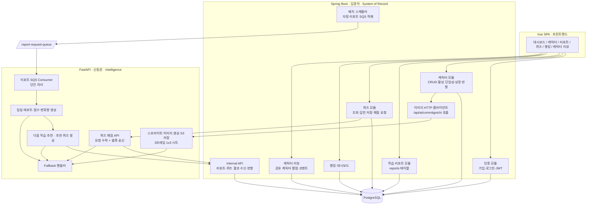

### 3.2 책임 매핑 (FR → 컴포넌트 → 담당)

| FR | 기능 | 컴포넌트 | 담당 |
|----|------|----------|------|
| FR-1,2 | 가입·로그인·JWT | 인증 모듈 | 김윤석 |
| FR-24~28 | Refresh Token Rotation·로그아웃·Role 인가·검증 API·인증 오류 계약 | 인증 모듈 + Spring Security + 공통 오류 처리 | 김윤석 |
| FR-3 | 캐릭터 생성(+동기 HTTP 스프라이트 이미지 생성, 흐름 C) | 캐릭터 모듈 → 이미지 HTTP 클라이언트 ↔ 이미지 생성 | 김윤석 ↔ 신동운 |
| FR-4,5,6,7 | 캐릭터 조회·수정·삭제·활성화 | 캐릭터 모듈 | 김윤석 |
| FR-8 | 학습 리포트 저장 | 리포트 모듈 | 김윤석 |
| FR-9 | 자정 리포트 요청 SQS 적재(흐름 A) | 배치 스케줄러(Producer) | 김윤석 |
| FR-10 | AI 일일 레포트 생성 | 레포트 생성 | 신동운 |
| FR-11 | 점수 변화량 활성 캐릭터 반영(일 누적) | Internal API + 캐릭터 모듈 | 김윤석 |
| FR-12 | 사용자 결과 제공 | 레포트 조회 API | 김윤석 |
| FR-13 | 추천 퀴즈 제공 | 추천/퀴즈 모듈 | 신동운(생성)→김윤석(저장·제공) |
| FR-14 | 퀴즈 답안 제출(동기 저장) | 퀴즈 모듈 | 김윤석 |
| FR-15 | **퀴즈 비동기 채점·피드백·점수 웹훅 반영(흐름 B)** | 퀴즈 모듈 ↔ 채점 API/웹훅 + 캐릭터 모듈 | 김윤석 ↔ 신동운 |
| FR-16 | Fallback(리포트·채점·이미지 각각) | Fallback 핸들러 + Internal API/HTTP 응답 | 신동운 + 김윤석 |
| FR-17,18 | 대시보드·랭킹 | 랭킹·대시보드 | 김윤석 |
| FR-19,20 | 공유 캐릭터 리뷰 CRUD (캐릭터 상세 통합) | 리뷰 모듈 | 김윤석 |
| FR-21,22,23 | 능력치·전투력·진화·감정 | 캐릭터 성장 규칙(Internal API 내) | 김윤석 |

---

## 4. 핵심 계약 (Core Contracts) — 두 서버 간 인터페이스

> 본 절이 본 아키텍처에서 가장 중요한 산출물이다. **3개 흐름·4개 계약**(A①②, B③, C④)만 합의되면 두 담당자가 독립적으로 개발할 수 있다. `[RESOLVES Q1, Q5]`

| 흐름 | 모드 | 트리거 | 계약 |
|------|------|--------|------|
| **A 일일 리포트** | 비동기·자정 배치 | 매일 자정 스케줄러 | ① `report-request-queue` SQS 메시지 → ② `POST /api/report` 콜백 |
| **B 퀴즈 채점** | 비동기·웹훅 | 사용자 답안 제출 | ③ `POST /api/internal/quizzes/grade` 요청 수락 → `POST /api/internal/quizzes/grade-result` 웹훅 |
| **C 캐릭터 이미지** | 동기 HTTP | 캐릭터 생성 | ④ `POST /api/ai/commitgotchi` 요청/응답 |

---

### 4.1 흐름 A · 계약 ① — 리포트 요청 SQS 메시지 (Spring Boot → FastAPI)

큐: `report-request-queue` (Standard). 메시지 1건 = 사용자 1명의 그날 **학습 리포트** 처리 요청. **퀴즈 채점 결과는 이 메시지에 포함하지 않는다.** 리포트 생성 입력은 사용자 주간 추세, 리포트 방향, 커밋 몬스터 메타데이터, 사용자의 그날 학습 리포트로 제한한다.

```json
{
  "requestId": "report-request-uuid",
  "userId": 1,
  "targetDate": "2026-06-06",
  "userMetadata": {
    "weeklyStudyStreak": "0100011",
    "reportDirection": {
      "scoreDeltaHint": {
        "db": 0, "algorithm": 3, "cs": 0, "network": 1, "framework": 0
      },
      "focus": "알고리즘과 네트워크 학습 증가분을 중심으로 코멘트"
    }
  },
  "characterMetadata": {
    "characterId": 10,
    "name": "커밋 몬스터",
    "personality": "칭찬을 많이 하지만 틀린 부분은 명확하게 지적하는 성격",
    "emotion": "JOY",
    "currentStats": { "db": 120, "algorithm": 200, "cs": 80, "network": 60, "framework": 140 }
  },
  "dailyReport": {
    "title": "오늘 학습 기록",
    "content": "Spring JPA의 N+1 문제와 해결 방법을 공부했다."
  }
}
```

- `requestId`: **멱등 키.** Spring Boot가 생성, FastAPI가 콜백 시 그대로 반환. (UUID, `userId+targetDate` 조합으로 결정적 생성 권장)
- `characterMetadata.characterId`: **`user_character.id`** (유저 게임 인스턴스 PK). 공유 템플릿 `characters.id`가 아님에 주의. `name`, `emotion`, `currentStats`는 모두 `user_character` 행에서 조회하며, `personality`는 `characters` 테이블 JOIN으로 가져온다.
- `reportDirection.scoreDeltaHint`: 최근 1주일 추세에서 도출한 리포트 방향. 예: `algorithm +3`, `network +1`.
- `characterMetadata.emotion`: Spring Boot가 결정한 현재 캐릭터 감정. enum은 `JOY`(기쁨), `ANGRY`(화남), `SAD`(슬픔) 3개만 허용한다. FastAPI는 이 값을 새로 판정하지 않고 리포트 문장의 말투에만 반영한다.
- `currentStats`: 진화 임계(1,000) 판정·점수 인플레 경계(SM-C1)를 위해 AI에 현재 능력치 컨텍스트로 제공. `[ASSUMPTION]`
- 자정 리포트는 퀴즈 채점 결과를 종합하지 않고, 학습 리포트와 주간 추세만으로 리포트·점수 변화량·추천 퀴즈를 생성한다.
- Spring Boot는 자정 스케줄러가 직접 `reports`를 스캔해 SQS 전송 여부를 추론하지 않고, `report_request_outbox`에 `PENDING` 요청을 먼저 기록한다. 스케줄러는 outbox의 `PENDING` 행을 읽어 SQS `SendMessage`를 단건 반복 호출하고, 성공한 행만 `SENT`로 전환한다. SQS batch API 사용 여부와 무관하게 outbox의 `request_id`가 멱등 키다.

### 4.2 흐름 A · 계약 ② — 리포트 결과 콜백 (FastAPI → Spring Boot)

```
POST /api/report
Authorization: Internal (서버 간 시크릿/네트워크 격리)  [ASSUMPTION]
Content-Type: application/json
```

**요청 바디 (성공):**

```json
{
  "requestId": "report-request-uuid",
  "userId": 1,
  "characterId": 10,
  "targetDate": "2026-06-06",
  "status": "SUCCESS",
  "scoreDelta": { "db": 0, "algorithm": 3, "cs": 0, "network": 1, "framework": 0 },
  "statusMessage": "오늘 학습 기록이 알찼어요! 퀴즈에서 본 약점도 내일 같이 잡아봐요.",
  "dailyReport": {
    "text": "오늘 학습은 JPA 영속성 영역에 집중되었습니다 ...",
    "feedback": "학습 강점: 문제 정의. 약점: 즉시 로딩 트레이드오프."
  },
  "nextRecommendation": {
    "topics": ["JPA 페치 조인", "@BatchSize"],
    "rationale": "N+1 원인은 이해했으니 해결 도구로 확장"
  },
  "recommendedQuizzes": [
    {
      "problemId": 1,
      "question": "페치 조인과 일반 조인의 차이는?",
      "modelAnswer": "페치 조인은 연관 엔티티를 함께 조회해 지연 로딩으로 인한 추가 쿼리를 줄인다.",
      "scoreAllocation": {
        "db": 0, "algorithm": 3, "cs": 0, "network": 0, "framework": 0
      }
    }
  ]
}
```

- `characterId`: **`user_character.id`** (유저 게임 인스턴스 PK). Spring Boot는 이 값으로 어느 `user_character` 행에 점수를 반영할지 결정한다.
- `userId`/`characterId`/`targetDate`/`requestId`는 콜백 **라우팅·점수 반영용**으로 유지되지만, `report_results`에는 `user_id`를 저장하지 않는다. Spring Boot는 `requestId`(또는 `user_character_id + targetDate`)로 대상 `reports` 행을 찾아 **`report_results.report_id`(1:1)** 로 저장한다(§5.3).
- `scoreDelta`: **학습 리포트 분석분만.** 각 필드(`db`, `algorithm`, `cs`, `network`, `framework`)는 `0..10` 범위를 넘지 않는다.
- `emotion`은 리포트 결과 콜백에 포함하지 않는다. 감정 상태 결정과 저장은 Spring Boot 책임이며, FastAPI는 4.1 요청의 `characterMetadata.emotion`을 문체 컨텍스트로만 소비한다.
- `dailyReport`는 리포트 본문과 학습 피드백만 담는다. 퀴즈 채점·피드백은 흐름 B의 웹훅 결과가 단독 책임을 가진다.
- `gradings` 배열 제거: 채점은 흐름 B 책임이 되었으므로 리포트 콜백에서 빠진다.
- `recommendedQuizzes`: 다음날(오전 9시) 사용자에게 제공될 추천 퀴즈. `problemId`는 효선의 MD 기반 RAG/문제 DB에서 매칭된 문제 번호이며, 신규 생성 문제라면 nullable로 둘 수 있다. `scoreAllocation`은 **이 퀴즈를 모두 맞혔을 때 얻을 수 있는 필드별 최대 점수**이고, 각 필드는 `0..10` 범위다.

**요청 바디 (실패 / Fallback):**

```json
{
  "requestId": "report-request-uuid",
  "userId": 1, "characterId": 10, "targetDate": "2026-06-06",
  "status": "FALLBACK",
  "failedStages": ["REPORT"],
  "scoreDelta": { "db": 0, "algorithm": 0, "cs": 0, "network": 0, "framework": 0 },
  "statusMessage": "오늘은 분석을 제대로 못 했어요. 내일 다시 도전!",
  "dailyReport": null,
  "nextRecommendation": null,
  "recommendedQuizzes": []
}
```

**응답 (Spring Boot → FastAPI):**

| 상태 | 의미 | FastAPI 동작 |
|------|------|--------------|
| `200 OK` | 결과 저장·점수 반영 완료 | **SQS 메시지 삭제** |
| `200 OK` + `{"duplicate": true}` | 이미 처리된 requestId(멱등) | SQS 메시지 삭제 |
| `4xx` | 스키마 오류 등 비재시도성 | DLQ로 보냄(삭제 안 함 → maxReceiveCount) |
| `5xx` / 타임아웃 | Spring Boot 일시 장애 | 삭제하지 않음 → SQS 재전달(재시도) |

> 핵심 규칙: **FastAPI는 Spring Boot가 200을 응답한 경우에만 SQS 메시지를 삭제한다.** 이로써 "결과는 만들었는데 저장은 못 한" 유실을 방지한다(at-least-once + 멱등 = effectively-once).

---

### 4.3 흐름 B · 계약 ③ — 퀴즈 채점 (비동기 웹훅)

사용자가 추천 퀴즈 답안을 제출하면, Spring Boot가 답안을 `GRADING` 상태로 저장하고 FastAPI에 채점 요청을 보낸다. FastAPI는 요청을 수락한 뒤 비동기로 채점하고, 완료 시 Spring Boot의 웹훅 엔드포인트로 결과를 반환한다.

```
사용자 흐름: Vue --POST /api/quizzes/{quizId}/submit--> Spring Boot
            Spring Boot --POST /api/internal/quizzes/grade--> FastAPI (202 Accepted)
            FastAPI --POST /api/internal/quizzes/grade-result--> Spring Boot (웹훅)
            Vue --GET /api/quizzes/submissions/{submissionId}--> Spring Boot
```

**Spring Boot → FastAPI 요청 (`POST /api/internal/quizzes/grade`):**

```json
{
  "submissionId": "quiz-submission-uuid",
  "userId": 1,
  "characterId": 10,
  "quizId": 55,
  "problemId": 1,
  "question": "JPA N+1 문제란 무엇인가?",
  "modelAnswer": "연관 엔티티를 지연 로딩할 때 ...",
  "userAnswer": "쿼리가 N번 더 나가는 문제",
  "scoreAllocation": {
    "db": 0, "algorithm": 3, "cs": 0, "network": 0, "framework": 0
  },
  "characterMetadata": {
    "personality": "칭찬을 많이 하지만 틀린 부분은 명확하게 지적하는 성격",
    "currentStats": { "db": 120, "algorithm": 200, "cs": 80, "network": 60, "framework": 140 }
  },
  "callbackUrl": "https://spring.example.com/api/internal/quizzes/grade-result"
}
```

- `characterId`: **`user_character.id`** (유저 게임 인스턴스 PK). `characterMetadata.personality`는 해당 `user_character`가 참조하는 `characters` 행에서 JOIN해 가져온다.
- `question`, `modelAnswer`, `scoreAllocation`은 Spring Boot가 문제 DB와 §4.2의 추천 결과를 기준으로 전달한다.
- `scoreAllocation`: 이 퀴즈의 필드별 최고 배점. 각 필드는 `0..10`이며, FastAPI는 이 배점을 초과하는 점수를 줄 수 없다.
- `callbackUrl`: FastAPI가 채점 결과를 반환할 Spring Boot 웹훅 엔드포인트. MVP에서는 고정 URL이어도 되지만, 요청 바디에 포함해 협업 계약을 명확히 한다.

**FastAPI → Spring Boot 즉시 응답 (수락):**

```json
{
  "accepted": true,
  "submissionId": "quiz-submission-uuid"
}
```

**FastAPI → Spring Boot 웹훅 (`POST /api/internal/quizzes/grade-result`, 성공):**

```json
{
  "submissionId": "quiz-submission-uuid",
  "userId": 1,
  "quizId": 55,
  "status": "GRADED",
  "scoreAllocation": {
    "db": 0, "algorithm": 3, "cs": 0, "network": 0, "framework": 0
  },
  "scoreDelta": {
    "db": 0, "algorithm": 2, "cs": 0, "network": 0, "framework": 0
  },
  "feedback": "원인은 맞췄으나 해결책(페치 조인/배치 사이즈)이 빠졌습니다.",
  "emotion": "JOY",
  "statusMessage": "좋아요, 핵심은 잡았어요!"
}
```

**FastAPI → Spring Boot 웹훅 (`POST /api/internal/quizzes/grade-result`, 채점 실패/Fallback):**

```json
{
  "submissionId": "quiz-submission-uuid",
  "userId": 1,
  "quizId": 55,
  "status": "UNGRADED",
  "scoreAllocation": {
    "db": 0, "algorithm": 3, "cs": 0, "network": 0, "framework": 0
  },
  "scoreDelta": {
    "db": 0, "algorithm": 0, "cs": 0, "network": 0, "framework": 0
  },
  "feedback": null,
  "emotion": null,
  "statusMessage": "AI가 잠깐 쉬는 중 — 답안은 저장됐어요. 잠시 후 다시 채점할 수 있어요.",
  "failedReason": "LLM_TIMEOUT"
}
```

**Spring Boot 처리:**

- 제출 시: ① `quiz_submissions` insert/upsert(`submissionId` 멱등) → ② `status=GRADING` 저장 → ③ FastAPI 요청 수락 여부와 `submissionId`를 사용자에게 응답.
- 웹훅 수신 시: ① `submissionId` 멱등 체크 → ② `GRADED`면 활성 캐릭터에 `scoreDelta` 가산 → ③ `battle_power` 재계산 → ④ 진화 판정(§7.1) → ⑤ 감정·상태 메시지 갱신 → ⑥ 제출 상태와 피드백 저장.
- `scoreDelta[field]`는 `0..scoreAllocation[field]` 범위여야 한다. 단일 총점 필드는 사용하지 않는다.
- **멱등:** `submissionId` 유니크. 같은 웹훅이 두 번 와도 점수 재반영 없음. 재제출(답안 수정)은 새 `submissionId`가 아니라 **기존 submission 갱신 + 이전 delta 롤백 후 신규 delta 반영** 정책으로 처리한다 `[ASSUMPTION — §7.5]`.
- **퀴즈 출처:** 채점 대상 퀴즈는 전날 흐름 A가 생성한 `recommendedQuizzes`. 오전 9시에 사용자에게 노출된다.

### 4.4 흐름 C · 계약 ④ — 캐릭터 이미지 생성 (동기 HTTP)

캐릭터 생성 시 Spring Boot는 FastAPI의 임시 이미지 생성 엔드포인트를 동기 호출한다. FastAPI는 감정 3종(기쁨·슬픔·화남), 총 3개 프레임이 들어 있는 **1행 3열** 투명 PNG 스프라이트시트를 생성하고, Spring Boot가 전달한 S3 URL에 저장한 뒤 성공 여부와 저장 URL을 응답한다.

**Spring Boot → FastAPI 요청 (`POST /api/ai/commitgotchi`):**

```json
{
  "userId": 1,
  "s3ObjectUrl": "s3://commitgotchi-sprites/characters/42/sprite-sheet.png",
  "prompt": "A retro Tamagotchi character design sheet ... design keyword \"작고 둥근 초록 슬라임\" ... --ar 3:1"
}
```

- `userId`: 향후 MQ 전환 시 메시지와 결과를 상관관계로 묶기 위한 필드.
- `s3ObjectUrl`: FastAPI가 생성 결과를 저장해야 하는 대상 URL. `characters.id` 기반 경로(`characters/{characterId}/sprite-sheet.png`)를 사용한다. 스프라이트는 공유 템플릿 `characters`에 귀속되므로 `userId` 경로를 사용하지 않는다. 향후 MQ 전환 시에도 결과 위치를 명시하기 위해 요청·응답에 모두 포함한다.
- `prompt`: §7.6의 이미지 생성 프롬프트에 사용자의 디자인 키워드를 주입한 최종 프롬프트.
- `characterId`는 이 계약 바디에 포함하지 않는다. Spring Boot가 `s3ObjectUrl`에 `characters.id`를 이미 인코딩하므로 중복 전달이 불필요하다.

**FastAPI → Spring Boot 응답 (성공):**

```json
{
  "userId": 1,
  "status": "OK",
  "s3ObjectUrl": "s3://commitgotchi-sprites/characters/42/sprite-sheet.png",
  "spriteSheetUrl": "https://cdn.example.com/sprites/characters/42/sprite-sheet.png",
  "spriteMeta": {
    "columns": 3,
    "rows": 1,
    "frameMap": {
      "joy": [0, 0],
      "sad": [0, 1],
      "angry": [0, 2]
    },
    "transparent": true
  }
}
```

**FastAPI → Spring Boot 응답 (실패):**

```json
{
  "userId": 1,
  "status": "FAIL",
  "s3ObjectUrl": "s3://commitgotchi-sprites/characters/42/sprite-sheet.png",
  "spriteSheetUrl": null,
  "spriteMeta": null,
  "errorMessage": "IMAGE_GENERATION_FAILED"
}
```

- Spring Boot는 `status=OK`면 `spriteSheetUrl`/`spriteMeta`를 **공유 템플릿 `characters` 행**에 저장하고, `status=FAIL`이면 동일 1×3 레이아웃의 기본 스프라이트 세트로 대체한다(FR-16). 이 스프라이트는 해당 `characters` 행을 참조하는 모든 `user_character`가 공유한다.
- 프런트엔드는 `user_character` + `characters` JOIN 결과의 `spriteSheetUrl`과 `spriteMeta`를 사용해 현재 `(is_evolved, emotion)`에 해당하는 프레임을 잘라 렌더한다.

---

### 4.5 점수 출처 분리 — 이중계상 금지 (흐름 A ↔ B)

점수 변화량의 출처를 흐름별로 **상호 배타**로 고정한다. 같은 학습 활동이 두 번 점수화되지 않게 한다.

| 출처 | 반영 흐름 | 반영 시점 | scoreDelta 산정 근거 |
|------|-----------|-----------|----------------------|
| **학습 리포트** | A (자정 배치) | 다음날 오전 9시까지 | `dailyReport` 본문 분석 |
| **퀴즈 답안** | B (웹훅) | 채점 웹훅 수신 시 | 해당 퀴즈의 `scoreAllocation` 범위 안에서 산정된 필드별 부분점수 |

- 리포트 콜백의 `scoreDelta[field]`는 각 필드별 최대 `10`점이다.
- 퀴즈의 `scoreAllocation[field]`도 각 필드별 최대 `10`점이다. 채점 결과 `scoreDelta[field]`는 반드시 `0..scoreAllocation[field]` 범위 안에 있어야 한다.
- 두 출처 모두 **활성 캐릭터에 일 단위 누적**된다(§5.3). 퀴즈 점수는 웹훅 수신 시 쌓이고, 자정에 학습 리포트 점수가 추가로 쌓인다. 누적 단위·정합성 규칙은 동일하다.

### 4.6 멱등성·재시도·DLQ 정책 `[RESOLVES Q5]`

- **멱등 키:** 흐름 A `requestId`(`report_results` 유니크), 흐름 B `submissionId`(`quiz_submissions` 유니크), 흐름 C `userId + s3ObjectUrl`(이미지 저장 대상 유니크). 같은 키 재수신 시 재반영 없이 멱등 응답.
- **at-least-once:** SQS Standard는 중복 전달 가능 → 흐름 A는 `requestId` 멱등 처리로 흡수. 흐름 B 웹훅은 HTTP 재시도 가능성을 `submissionId`로 흡수한다.
- **재시도:** 흐름 A는 Visibility Timeout 만료 또는 5xx 시 SQS 재전달, `maxReceiveCount = 3` `[ASSUMPTION]`. 흐름 B는 FastAPI가 웹훅 실패 시 동일 `submissionId`로 재시도한다. 흐름 C는 동기 HTTP 실패 시 Spring Boot가 기본 스프라이트로 대체하거나 같은 `s3ObjectUrl`로 제한 재시도한다.
- **DLQ:** 흐름 A의 3회 초과 실패 메시지는 리포트 DLQ로 이동. 흐름 B는 별도 DLQ 대신 `GRADING` 장기 미완료 제출을 운영 조회 대상으로 둔다. 흐름 C는 MQ를 쓰지 않으므로 DLQ가 없다.

---

## 5. 데이터 모델 (PostgreSQL · Spring Boot 소유)

### 5.1 ER 개요

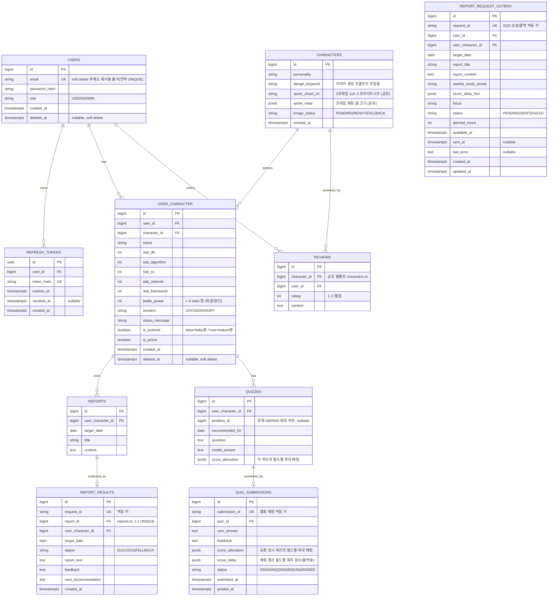

> **인증 증분 경계:** 위 ER은 전체 MVP 목표 모델이다. 첫 번째 Flyway 증분은 §12.2의 `users`, `refresh_tokens`만 생성한다. 나머지 도메인 테이블은 이 증분에서 생성하지 않는다.

### 5.2 핵심 제약 — 활성 캐릭터 단일성 (FR-7)

PostgreSQL **부분 유니크 인덱스**로 DB 레벨에서 보장한다. 애플리케이션 로직 실수와 무관하게 "사용자당 활성 1개"가 깨질 수 없다. 활성 상태는 공유 템플릿 `characters`가 아닌 유저 인스턴스 `user_character`에 있다.

```sql
CREATE UNIQUE INDEX uq_one_active_character_per_user
  ON user_character (user_id)
  WHERE is_active = true AND deleted_at IS NULL;
```

- 새 활성 지정(FR-7)·첫 캐릭터 자동 활성(FR-3)·활성 캐릭터 삭제 후 재지정(FR-6)은 모두 단일 트랜잭션에서 기존 `user_character` 행의 활성 해제 → 신규 `user_character` 행의 활성 지정 순으로 수행.
- soft delete된(`deleted_at IS NOT NULL`) 행은 활성 단일성 인덱스에서 제외되며, 캐릭터 보유 개수(최대 3개) 카운트에도 포함하지 않는다(§5.6).

### 5.3 핵심 제약 — 점수 누적 정합성 (FR-11, FR-21)

점수는 **두 출처**(흐름 A 리포트·흐름 B 퀴즈)에서 활성 캐릭터에 **일 단위 누적**된다(주간은 집계·표시용일 뿐 반영 단위 아님) `[RESOLVES Q5 / PRD §4.4]`. 두 경로 모두 동일한 트랜잭션 골격을 쓴다:

- **흐름 A(자정 리포트):** ① 콜백의 `requestId`·`targetDate`·`userId`로 대상 `reports` 행을 찾아 `report_id`로 매핑 → `report_results` insert(`request_id` 멱등 체크, `report_id` 1:1) → ② 활성 `user_character`의 `stat_*` 가산 → ③ `battle_power` 재계산(=5종 합) → ④ 진화 판정(§7.1) → ⑤ 감정·상태 메시지 갱신.
- **흐름 A 요청 적재:** 리포트 저장 또는 자정 스케줄링 단계는 `report_request_outbox`에 `PENDING` 요청을 생성하거나 갱신한다. outbox는 SQS에 보낼 요청 스냅샷(`report_title`, `report_content`, 주간 추세, 방향 힌트)을 보관한다. `request_id`는 outbox와 `report_results`가 공유하는 멱등 키이며, `user_character_id + target_date`는 하루 1개 리포트 재작성 정책과 맞춰 유니크하게 운용한다. SQS 전송 성공 후에만 outbox를 `SENT`로 바꾸고, 콜백 성공 여부는 `report_results`가 별도로 기록한다.
- **흐름 B(퀴즈 웹훅):** ① `quiz_submissions` upsert(`submission_id` 멱등, 제출 시 `GRADING`) → ② 웹훅 수신 시 활성 `user_character`의 `stat_*` 가산(이 퀴즈의 `score_delta`) → ③ `battle_power` 재계산 → ④ 진화 판정 → ⑤ 감정·상태 메시지 갱신. 부분 성공 없음.
- **동시성:** 흐름 B는 낮 동안 여러 퀴즈가 빠르게 들어올 수 있으므로 활성 `user_character` 행에 **비관적 락(`SELECT ... FOR UPDATE`)** 또는 낙관적 버전 컬럼으로 합계 정합성을 보장한다. 흐름 A 콜백과 흐름 B 채점이 동시에 같은 `user_character`를 갱신해도 락으로 직렬화된다.
- **이중계상 금지:** 퀴즈 점수는 흐름 B에서 1회만 반영, 리포트 콜백은 퀴즈 점수를 더하지 않는다(§4.5).

### 5.4 캐릭터 상세 페이지네이션 — 리포트/퀴즈 2-리스트 분리 (1.3 요구)

캐릭터 상세 화면(UX #4)은 **독립적으로 페이지네이션되는 두 리스트**를 가진다. 한 페이저로 섞지 않는다.

| 리스트 | 데이터 출처 | 조회 API | 한 행의 내용 |
|--------|-------------|----------|--------------|
| **리포트 리스트** | `REPORTS` + `REPORT_RESULTS` (`report_results.report_id = reports.id` 조인) | `GET /api/characters/{id}/reports?page=&size=` (`{id}` = `user_character.id`) | 날짜·리포트 제목·요약·점수 변화량·감정 |
| **퀴즈 리스트** | `QUIZZES` + `QUIZ_SUBMISSIONS` | `GET /api/characters/{id}/quizzes?page=&size=` (`{id}` = `user_character.id`) | 추천일·질문·제출/채점 상태·필드별 획득 점수·피드백 |

- 두 API는 각자 `page`/`size`/`totalPages`를 반환한다. 프런트엔드는 탭 또는 좌우 2-섹션으로 배치하고 페이저를 분리 운용한다.
- 리포트 리스트는 자정 배치 결과(흐름 A) 기준 정렬(최신일 우선), 퀴즈 리스트는 추천일·제출시각 기준 정렬. 채점 상태(`GRADING`/`GRADED`/`UNGRADED`)를 배지로 구분.

### 5.5 캐릭터 리뷰 — 공유 캐릭터 상세 통합 (FR-19, FR-20)

리뷰는 별도 공유 게시판이 아니라 **캐릭터 상세 화면에 통합**된다. 리뷰 대상은 유저 인스턴스(`user_character`)가 아니라 **공유 템플릿 `characters`**다. 같은 `characters` 행을 여러 유저가 재사용하므로, 리뷰는 그 공유 캐릭터 정의(스프라이트·성격 등)에 대한 평가가 된다.

| 항목 | 결정 |
|------|------|
| 대상 | `reviews.character_id → characters.id` (공유 템플릿). 다른 계약의 `characterId`(=`user_character.id`)와 의미가 다름에 주의 |
| 작성자 | `reviews.user_id → users.id` |
| 필드 | `id`, `character_id`, `user_id`, `rating`(1..5 정수 별점), `content` |
| 평점 집계 | 캐릭터 상세에서 해당 `characters`의 `AVG(rating)`·리뷰 수를 표시 |
| 조회 API | `GET /api/characters/{characterId}/reviews?page=&size=` (`{characterId}` = `characters.id`, 페이지네이션) |
| 쓰기 API | `POST/PATCH/DELETE /api/characters/{characterId}/reviews[/{reviewId}]`. 본인 리뷰만 수정·삭제 |

- `rating`은 DB CHECK `rating BETWEEN 1 AND 5`로 강제한다.
- `shared_posts` 테이블은 사용하지 않는다(폐기). 기존 게시판 개념의 "캐릭터 공유"는 N:M `characters` 카탈로그 재사용으로 대체된다.
- `[ASSUMPTION]` 한 유저가 같은 캐릭터에 리뷰를 1개만 작성할지(유니크 `(character_id, user_id)`) 여부는 제품 결정으로 확정 필요.

### 5.6 Soft Delete 정책 (users, user_character) `[RESOLVES — 제품 결정 반영]`

`users`와 `user_character`는 물리 삭제 대신 `deleted_at timestamptz NULL` 마킹으로 **soft delete**한다. 공유 템플릿 `characters`와 그에 달린 `reviews`는 카탈로그 자산이므로 soft delete 대상이 아니다.

| 결정 | 내용 |
|------|------|
| 이메일 재사용 | **불가.** `users.email`은 전역 UNIQUE(`uq_users_email`)를 유지해, soft delete된 계정의 이메일도 영구 예약된다. 부분 유니크로 완화하지 않는다. |
| 연쇄 삭제 | **연쇄 soft delete.** 유저 soft delete 시 그 유저의 `user_character`·`refresh_tokens`를 함께 비활성/폐기하고, `user_character` soft delete 시 그 인스턴스의 `reports`·`quizzes`·`report_results`·`quiz_submissions` 조회를 차단한다. FK `ON DELETE CASCADE`는 물리 삭제용이라 soft delete에서는 발동하지 않으므로, 연쇄는 애플리케이션 트랜잭션이 책임진다. |
| 조회 기본 필터 | 모든 일반 조회·카운트·유니크 판정은 `deleted_at IS NULL`만 대상으로 한다. MyBatis 매퍼 SQL에 `deleted_at IS NULL` 조건을 명시(공통 `WHERE` 조각 `<sql>`/`<include>`로 재사용)한다. 캐릭터 보유 개수(최대 3개)·활성 단일성·로그인 인증 모두 살아있는 행만 본다. |
| 토큰 | 유저 soft delete 시 활성 `refresh_tokens`를 즉시 폐기(`revoked_at`)해 재발급을 차단한다. 발급된 Access Token은 만료(최대 15분)까지 기술적으로 유효할 수 있다. |
| 인증 | soft delete된 유저는 로그인·토큰 재발급·보호 API 접근이 모두 거부된다. |

- 활성 단일성 인덱스는 `WHERE is_active = true AND deleted_at IS NULL`로 soft-deleted 행을 제외한다(§5.2).
- soft delete된 `user_character`가 참조하던 `reviews`(=공유 `characters`에 단 평가)는 유지된다. 리뷰는 `characters`에 귀속되며 인스턴스 삭제와 독립적이다.

---

## 6. 소스 트리 / 모듈 구조

폴리레포(또는 모노레포 내 디렉터리) — 소유권 경계를 디렉터리로 표현한다.

```text
commitgotchi/
├── frontend/                      # Vue SPA (공통/프런트)
│   └── src/
│       ├── views/                 # dashboard, character(리뷰 통합), studylog, quiz, ranking
│       ├── api/                   # Spring Boot REST 클라이언트, JWT 인터셉터
│       └── components/
│
├── springboot/                    # 김윤석 — System of Record (현재 실제 디렉터리)
│   └── src/main/java/com/commitgotchi/
│       ├── auth/                  # 가입·로그인·JWT·Refresh Token (FR-1,2,24,25)
│       ├── user/                  # 사용자 조회·현재 사용자·Role (FR-26,27)
│       ├── security/              # SecurityFilterChain·JWT 필터·EntryPoint·DeniedHandler
│       ├── character/             # 공유 캐릭터 템플릿 도메인 (characters 테이블)
│       │   └── image/             # 흐름 C: FastAPI 이미지 동기 HTTP 클라이언트
│       ├── usercharacter/         # 유저 게임 인스턴스 도메인 (user_character 테이블)
│       │   │                      # CRUD·활성 단일성·성장 반영 (FR-3~7,21~23)
│       ├── studylog/              # 학습 리포트 도메인 (reports 테이블, FR-8)
│       ├── quiz/                  # 추천 퀴즈 제공·답안 저장·비동기 채점 요청 (FR-13,14,15)
│       │   └── grading/           # 흐름 B: FastAPI 채점 요청 + grade-result 웹훅 반영
│       ├── report/
│       │   ├── batch/             # 흐름 A: 자정 SQS Producer (FR-9)
│       │   └── internal/          # POST /api/report (FR-11,12,16)
│       ├── ranking/               # 랭킹·대시보드 (FR-17,18)
│       ├── review/                # 공유 캐릭터 리뷰 (FR-19,20, 캐릭터 상세 통합)
│       └── common/                # 예외·트랜잭션·SQS(리포트)·HTTP 클라이언트·보안
│   └── src/main/resources/db/migration/
│       ├── V1__create_users.sql
│       └── V2__create_refresh_tokens.sql
│
└── ai-fastapi/                    # 신동운 — Intelligence
    └── app/
        ├── consumer/
        │   ├── report_consumer.py   # 흐름 A: report-request-queue 폴링
        ├── api/
        │   ├── grade.py             # 흐름 B: POST /api/internal/quizzes/grade 요청 수락
        │   └── commitgotchi.py      # 흐름 C: POST /api/ai/commitgotchi 동기 이미지 생성
        ├── pipeline/              # report / grading / recommendation 파이프라인
        ├── llm/                   # 프롬프트·모델 클라이언트 (교체 가능)
        ├── image/                 # 스프라이트시트 생성·프롬프트 템플릿 (FR-3, §7.6)
        ├── fallback/              # 단계별 Fallback (FR-16)
        └── client/                # Spring Boot Internal API 콜백 클라이언트
```

---

## 7. 도메인 규칙 구체화 (Open Questions 해소)

### 7.1 진화 규칙 (FR-22) `[RESOLVES Q3]`

- 전투력(5종 합) ≥ **1,000** 도달 시 진화, 캐릭터당 **최대 1회**(`is_evolved` 플래그).
- 진화 시: **baby 프리셋 URL → 자신이 생성한 evolved 스프라이트 URL로 전환** + `is_evolved = true` 설정(§7.6). 별도 이미지 재생성 없이 클라이언트가 참조하는 URL만 교체된다. **추가 능력치 보너스 없음**(임계 통과 자체가 보상, SM-C1 인플레 경계 준수).
- 판정 위치: Internal API 점수 반영 트랜잭션 ④단계. 진화는 부수효과로 같은 트랜잭션에서 처리.

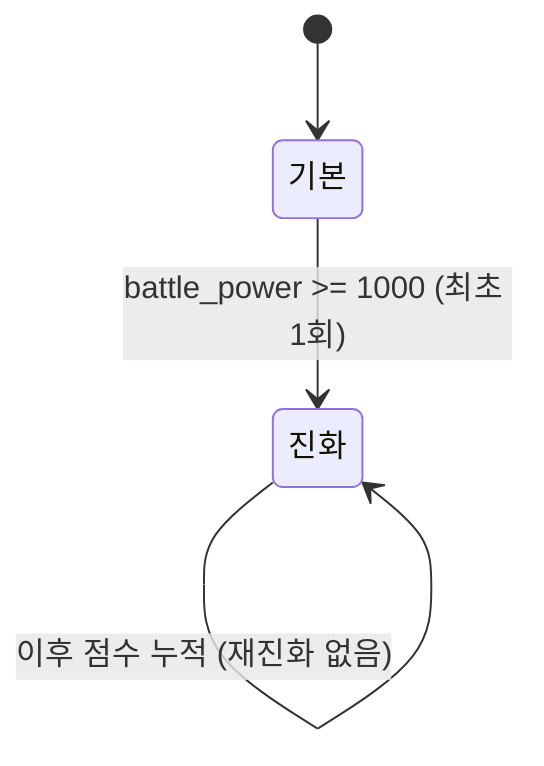

### 7.2 감정 규칙 (FR-23) `[RESOLVES Q2 — 제안값, 검토 후 조정 가능]`

감정 상태(`emotion`) 결정과 저장 책임은 Spring Boot에 있다. FastAPI는 흐름 A 리포트 요청의 `characterMetadata.emotion`을 입력 컨텍스트로 받아 `statusMessage`, `dailyReport.feedback`, `nextRecommendation.rationale`의 말투에만 반영하고, 리포트 콜백에는 `emotion`을 반환하지 않는다. enum은 `JOY`(기쁨), `ANGRY`(화남), `SAD`(슬픔) 3개만 허용한다.

| 흐름 | 조건 | 감정 |
|------|------|------|
| A(리포트) | Spring Boot가 리포트 요청 생성 전 캐릭터 상태를 판정 | `JOY`/`ANGRY`/`SAD` 중 하나를 `characterMetadata.emotion`에 포함 |
| B(퀴즈) | `sum(scoreDelta) >= sum(scoreAllocation) * 0.6` | `JOY` |
| B(퀴즈) | `sum(scoreDelta) < sum(scoreAllocation) * 0.6` | `SAD` |

- 흐름 B 채점이 감정을 갱신한 뒤 자정 흐름 A 요청을 만들 때 Spring Boot가 다시 현재 감정을 산정할 수 있다. `[ASSUMPTION — 검토 후 조정]`
- `statusMessage`는 캐릭터 `personality`와 입력 `emotion`을 반영해 AI가 생성(FR-23).

### 7.3 Fallback 정책 (FR-16) `[RESOLVES Q4]`

| 흐름 | 실패 단계 | 대체 처리 | 사용자 표시 |
|------|-----------|-----------|-------------|
| C | 스프라이트 이미지 생성(FR-3) | 기본 스프라이트 세트 중 1개 배정(동일 3프레임 1x3 레이아웃), `image_status=FALLBACK`, 캐릭터 생성은 **성공** | 정상(기본 스프라이트) |
| A | 레포트 생성(FR-10) | `scoreDelta` 전부 0, `status=FALLBACK` | "오늘 분석 실패" 상태 안내 |
| B | 퀴즈 웹훅 채점(FR-15) | 답안은 `GRADING`으로 저장, 실패 웹훅 또는 만료 시 `UNGRADED`, 점수 미반영 | "채점 잠시 후 재시도" + 다시 채점 버튼 |

- 부분 실패 허용: 흐름 A는 `failedStages` 배열로 어떤 단계가 실패했는지 전달. 흐름 B 실패는 그 퀴즈에만 국한되어 다른 퀴즈·리포트에 영향 없음.
- 흐름 C 실패는 캐릭터 생성·활성화를 막지 않는다(동기 응답 실패 시 기본 스프라이트로 대체).
- 원칙: **어떤 단일 AI 실패도 사용자 흐름을 멈추지 않는다**(SM-3).

### 7.4 학습 리포트 재작성 (FR-8) `[RESOLVES Q1 관련 / PRD §8.1]`

- MVP: 하루 1개 리포트(`reports`의 `user_character_id + target_date` 유니크), 같은 날 재작성은 **덮어쓰기**. (`reports`에는 `user_id`가 없으며 유저는 `user_character_id → user_character.user_id`로 도달한다.)

### 7.5 퀴즈 답안 재제출 (FR-14/15, 흐름 B) `[ASSUMPTION — 검토 필요]`

웹훅 채점이라 사용자가 같은 퀴즈에 답을 고쳐 다시 낼 수 있다. 점수 정합을 위해:

- 같은 `quizId`의 재제출은 **기존 `quiz_submissions` 행을 갱신**한다(새 행 아님).
- 점수 반영은 **이전 `score_delta`를 활성 캐릭터에서 차감(롤백) → 신규 채점 `score_delta` 가산**을 한 트랜잭션에서 수행. 그래서 한 퀴즈는 항상 "최종 1회분"만 캐릭터에 남는다.
- 재제출 마감: 해당 퀴즈 추천일 당일 자정까지. 이후엔 잠금. `[ASSUMPTION]`

### 7.6 캐릭터 스프라이트시트 (FR-3, 3번 요구) `[RESOLVES Q6]`

캐릭터 이미지는 단일 이미지가 아니라 **3프레임 스프라이트시트**다. 한 장에 감정 3종이 1×3 격자로 들어가고, 프런트엔드가 현재 `emotion`에 맞는 프레임을 골라 렌더 + idle 애니메이션(bob)을 입힌다("Sprite를 이용한 약간의 애니메이션"). 진화 단계(baby/mature)는 같은 시트의 행이 아니라 **서로 다른 `characters` 행(다른 스프라이트시트 URL)** 으로 표현된다.

**레이아웃 (1행 3열, 투명 PNG):**

| | 열0 = 기쁨(joy) | 열1 = 슬픔(sad) | 열2 = 화남(angry) |
|---|---|---|---|
| **행0** | [0,0] | [0,1] | [0,2] |

- 한 `characters` 스프라이트시트는 **한 진화 단계의 감정 3종**만 담는다. 매핑은 `characters.sprite_meta.frameMap`(§4.4)에 박제: `{ "joy":[0,0], "sad":[0,1], "angry":[0,2] }`.
- **프레임 선택(열):** `emotion` JOY/SAD/ANGRY → 열0/1/2.
- **진화 표현(시트 URL 전환, 클라이언트가 선택):** 프런트엔드가 `is_evolved`에 따라 두 후보 URL 중 하나를 고른다.
  - `is_evolved=false` → **baby 프리셋 스프라이트.** `characters.id = (user_character.id % 3) + 1` 인 프리셋 baby 캐릭터의 `sprite_sheet_url`/`sprite_meta`를 사용한다. (프리셋 baby 3종은 `characters` 테이블에 id 1·2·3으로 사전 시딩.)
  - `is_evolved=true` → **본인이 생성한 evolved 스프라이트.** 해당 `user_character.character_id`가 가리키는 `characters` 행의 `sprite_sheet_url`/`sprite_meta`를 사용한다.
  - 따라서 캐릭터 상세/대시보드 응답은 두 후보(프리셋 baby URL·메타와 evolved URL·메타)를 모두 내려보내고, **클라이언트가 `is_evolved`로 최종 선택**한다(§AD-27).
- 진화(§7.1)는 곧 **참조 URL 전환**(baby 프리셋 시트 → evolved 시트)으로 표현된다. 같은 시트 내 행 전환이 아니다.
- 애니메이션은 프레임 교체가 아닌 **CSS bob/idle**(DESIGN.md `cg-spr`의 `bob`)로 구현. Reduce Motion 시 정적. 스프라이트시트는 어떤 프레임을 **보여줄지**만 결정한다.
- 프런트 렌더: `background-image: url(spriteSheetUrl)` + 셀 크기/`background-position`으로 해당 프레임만 노출(나머지 잘라냄).

**이미지 생성 프롬프트 (FastAPI `image/` 모듈에 박제, `designKeyword` 주입):**

```
A retro Tamagotchi character design sheet, presented on a clean transparent background, png style with alpha channel support. The sheet displays three distinct pixel art characters arranged in a precise 1x3 horizontal grid, representing three emotional states of a single creature.

Column 1: Happy pixel art creature with a cheerful, smiling expression.
Column 2: Sad pixel art creature with small tearful eyes and a downcast look.
Column 3: Angry pixel art creature with a furrowed brow and a tiny steam puff.

All three characters are based on the design keyword "[사용자가 입력할 디자인 키워드]" and feature clean black outlines, a vibrant color palette, and a strict retro 8-bit handheld game aesthetic. This sheet functions as a game asset sprite sheet with no grid lines, no UI text, and is designed for easy extraction with an alpha channel. --ar 3:1
```

- `[사용자가 입력할 디자인 키워드]` ← 사용자의 디자인 키워드로 치환하고, 최종 문자열을 §4.4의 `prompt`로 보낸다.
- 생성 결과(1×3 시트)에서 셀 경계는 `sprite_meta`로 알려준다. AI가 격자선 없이 그리므로, 시트 픽셀 너비를 3등분한 셀 박스를 프런트가 사용.
- 기본(Fallback) 스프라이트 세트와 프리셋 baby 세트도 **동일 3프레임 1×3 레이아웃**으로 미리 제작해, 실패·미진화 시 렌더 코드를 바꾸지 않고 시트 URL만 교체한다.

---

## 8. 핵심 시퀀스 (3개 흐름)

### 8.1 흐름 A — 일일 리포트 배치 (FR-9~12)

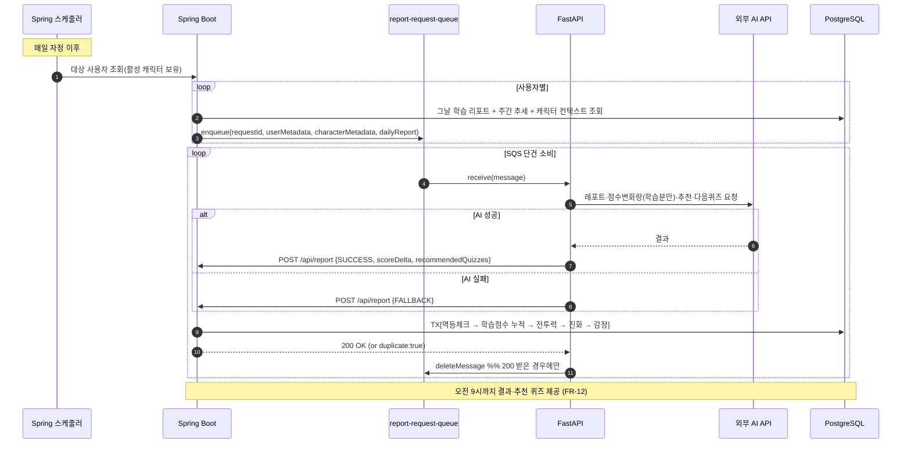

### 8.2 흐름 B — 퀴즈 채점 (비동기 웹훅, FR-14~15)

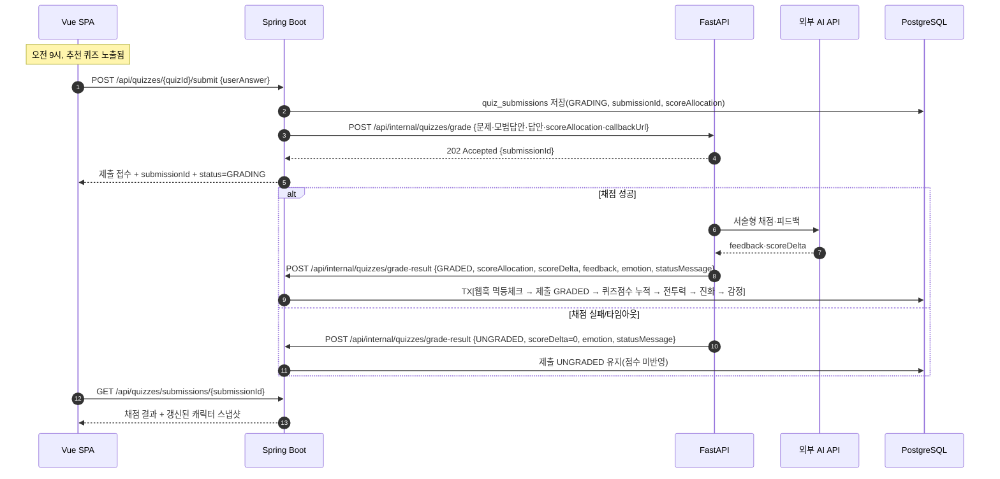

### 8.3 흐름 C — 캐릭터 이미지 생성 (동기 HTTP, FR-3)

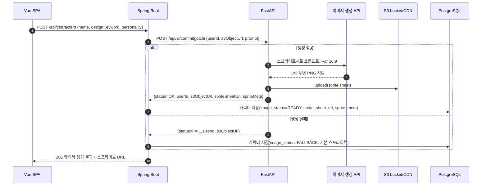

---

## 9. 아키텍처 결정 요약 (ADR 인덱스)

| # | 결정 | 근거 | 상태 |
|---|------|------|------|
| AD-1 | DB는 Spring Boot 단독 소유, FastAPI는 직접 접근 금지 | 担当 결합도 최소화, 스키마 충돌 차단 | 확정 |
| AD-2 | 서버 간 계약은 3흐름·4계약(리포트 SQS+콜백, 퀴즈 웹훅, 이미지 동기 HTTP) | 독립 개발 가능 | 확정(개정) |
| AD-3 | **리포트는 자정 배치, 퀴즈 채점은 비동기 웹훅, 이미지는 동기 HTTP로 분리** | 협업 계약 단순화, 채점 완료 시점 분리 | 확정(개정) `[RESOLVES Q1]` |
| AD-4 | effectively-once = at-least-once/HTTP retry + 멱등키(requestId/submissionId/userId+s3ObjectUrl) | 중복 반영 방지 | 확정 `[RESOLVES Q5]` |
| AD-5 | 활성 단일성은 `user_character(user_id) WHERE is_active=true` 부분 유니크 인덱스로 DB 강제 | 로직 무관 불변식 보장, 게임 상태 인스턴스 기준 | 확정(개정) |
| AD-6 | 점수는 일 단위 누적, 주간은 집계·표시용 | PRD §4.4 정합 | 확정 |
| AD-7 | 진화는 스프라이트 행 전환(baby→mature) + 플래그, 보너스 없음 | 점수 인플레 경계(SM-C1) | 제안 `[RESOLVES Q3]` |
| AD-8 | 감정 상태 결정은 Spring Boot 책임, FastAPI는 입력 emotion을 말투 컨텍스트로만 소비 | FR-23, 계약 책임 분리 | 확정(개정) `[RESOLVES Q2]` |
| AD-9 | Fallback은 흐름별 부분 실패 허용 | 흐름 무중단(SM-3) | 확정 `[RESOLVES Q4]` |
| AD-10 | AI 모델 벤더는 FastAPI 내부에 캡슐화·교체 가능 | AI 품질 반복개선(SM-1) | 확정 |
| AD-11 | **퀴즈/리포트 점수 출처 상호 배타(이중계상 금지)** | 같은 학습 2회 점수화 방지 | 확정 `[§4.5]` |
| AD-12 | **캐릭터 이미지는 3프레임 1×3 스프라이트시트(감정 3종). 진화는 시트 내 행이 아니라 다른 `characters` 행(다른 시트 URL)으로 표현** | 3번 요구, 감정 프레임 전환 + 진화 URL 전환 | 확정(개정) `[RESOLVES Q6]` |
| AD-13 | **MQ는 리포트 요청에만 사용, 퀴즈는 웹훅, 이미지는 동기 HTTP** | 흐름별 협업 계약을 단순화 | 확정 |
| AD-14 | **캐릭터 상세는 리포트/퀴즈 독립 페이지네이션 2-리스트** | 1.3 요구 | 확정 `[§5.4]` |
| AD-15 | **첫 구현 증분은 Spring Boot 인증·인가이며 `users`, `refresh_tokens`만 마이그레이션** | 인증 기반을 먼저 종단 검증, 범위 팽창 방지 | 확정 |
| AD-16 | **Spring Security 무상태 Bearer JWT, 세션·Access Token 블랙리스트 미사용** | SPA/REST 구조와 PRD FR-2·25 일치 | 확정 |
| AD-17 | **Access Token HS256 15분, 운영 키 최소 256-bit 랜덤 Secret** | 단일 발급·검증 서비스에 단순하며 로그아웃 잔여 위험 완화 | 확정 |
| AD-18 | **Refresh Token 256-bit opaque random, 30일, SHA-256 해시 저장, Rotation** | DB 원문 유출 방지와 탈취 토큰 재사용 차단 | 확정 |
| AD-19 | **폐기 Refresh Token 재사용 탐지 시 해당 사용자의 모든 활성 Refresh Token 폐기** | 현재 스키마에 token-family가 없으므로 가능한 보수적 대응 | 확정 |
| AD-20 | **이메일은 애플리케이션에서 trim+lowercase 후 저장하고 DB CHECK+UNIQUE로 강제** | 대소문자·공백에 의한 중복 계정 방지 | 확정 |
| AD-26 | **`characters`(공유 캐릭터 정의 카탈로그) — `user_character`(유저별 게임 상태 인스턴스) N:M 정규화** | 스프라이트·성격은 한 번 생성 후 여러 유저가 재사용 가능. 게임 스탯·감정·이름 등 개인 상태는 `user_character`에 격리. 모든 계약의 `characterId`는 `user_character.id`를 의미한다(단 `reviews.character_id`는 `characters.id`) | 확정 |
| AD-27 | **진화 스프라이트 선택은 클라이언트 책임. 응답에 baby 프리셋 시트와 evolved 시트 두 후보를 모두 내려보내고, 프런트가 `is_evolved`로 선택** | baby는 `(user_character.id % 3)+1` 프리셋 공유, evolved는 본인 생성분. 서버 분기 없이 렌더 계층에서 단순 선택 | 확정 |
| AD-28 | **공유 게시판(`shared_posts`) 폐기, 리뷰는 공유 캐릭터(`characters`)에 직접 작성하고 캐릭터 상세에 통합. `reviews(character_id, user_id, rating 1..5, content)`** | N:M 공유 캐릭터 모델과 일치, 게시판 레이어 제거로 단순화 | 확정 `[§5.5]` |
| AD-29 | **`users`·`user_character` soft delete(`deleted_at`). 이메일 재사용 불가(전역 UNIQUE 유지), 연쇄 soft delete, 조회 기본 `deleted_at IS NULL` 필터, 활성 단일성 인덱스에 `deleted_at IS NULL` 추가** | 데이터 보존·복구 가능성과 식별자 영구성 | 확정 `[§5.6]` |
| AD-30 | **`study_logs` → `reports`로 리네임(`user_id` 제거, 유저는 `user_character` 경유). `report_results`는 `user_id` 대신 `report_id`(FK `reports.id`, 1:1 UNIQUE) 보유** | 리포트 결과를 학습 리포트 1건의 분석으로 정규화, 사용자 참조 중복 제거 | 확정 `[§5.1, §5.4, §7.4]` |
| AD-31 | **자정 리포트 SQS 적재는 `report_request_outbox`를 통해 수행한다** | 스케줄러 재시도와 서버 재시작에도 `PENDING/SENT/FAILED` 상태를 보존하고, SQS 단건 반복 전송과 콜백 멱등 키(`request_id`)를 함께 추적 | 확정 `[§4.1, §5.3]` |
| AD-21 | **Role은 `varchar(20)` + CHECK(`USER`,`ADMIN`), 공개 가입은 항상 `USER`** | PostgreSQL enum 결합도를 피하면서 허용값 강제 | 확정 |
| AD-22 | **초기 ADMIN은 Secret 기반 일회성 Flyway placeholder 마이그레이션이 아니라 운영 CLI/수동 SQL 절차로 프로비저닝** | 자격 증명과 해시를 Git/마이그레이션 이력에서 분리 | 확정 |
| AD-23 | **공통 인증 오류 응답과 traceId를 EntryPoint·DeniedHandler·ControllerAdvice에서 동일 계약으로 제공** | 401/403/400/409 구분과 민감정보 비노출 | 확정 |
| AD-24 | **BCrypt cost 12, 운영에서 기준 장비 성능 검증 후 상향 가능** | 안전한 기본값과 구현 단순성의 균형 | 확정 |
| AD-25 | **DB 스키마는 Flyway 마이그레이션이 단일 진실. MyBatis는 스키마를 생성/검증하지 않으며(자동 DDL 없음), 매퍼 SQL은 Flyway가 만든 스키마에 정합해야 한다** | 재현 가능한 실행 순서와 스키마 드리프트 방지 | 확정(개정) |

---

## 10. 검증 — FR 커버리지

PRD FR-1~28 전부가 컴포넌트·계약·데이터 모델에 매핑됨(§3.2, §12). 본 개정으로 해소·변경된 항목:

- **FR-1~2, FR-24~28 (인증·인가):** 스키마, Spring Security 컴포넌트, API/오류 계약, 7개 보안 시퀀스, 테스트 전략을 §12에 확정.
- **FR-15 (퀴즈 채점):** 자정 배치/동기 응답 → **비동기 웹훅 채점**(흐름 B)으로 변경. PRD/Addendum 동기화 필요(§아래 핸드오프).
- **Q6 (기본 이미지 세트):** 스프라이트시트 3프레임 1×3 레이아웃으로 확정(§7.6). 기본(Fallback) 세트와 baby 프리셋 세트도 동일 레이아웃으로 준비. baby는 프리셋 3종(`characters` id 1·2·3) 사전 시딩, Fallback은 N개 준비 후 랜덤 배정. `[ASSUMPTION: N개수]`
- **점수 이중계상:** 흐름 A·B 출처 분리로 해소(AD-11, §4.5).

미해결로 남은 항목:

- **Internal API 서버 간 인증 방식:** 공유 시크릿 헤더 또는 VPC 내부 네트워크 격리 중 택1 — 인프라 구성 시 확정. `[ASSUMPTION]`
- **퀴즈 재제출 마감·롤백 정책(§7.5):** 당일 자정 잠금 제안, 확정 필요.
- **감정 최종 상태 우선순위(흐름 B↔A):** 마지막 갱신 우선 제안(§7.2), 확정 필요.

---

## 11. 다음 단계 (Handoff)

1. **김윤석(Spring Boot) — 첫 구현 우선순위:** §12 인증 증분을 먼저 구현한다. `V1__create_users.sql` → `V2__create_refresh_tokens.sql` → SecurityFilterChain/JWT → 회원가입·로그인 → 재발급·로그아웃 → `/api/users/me`·`/api/admin/ping` → 통합 테스트 순서다.
2. **김윤석(Spring Boot) — 인증 이후:** §5 나머지 도메인 스키마, §4.1 `report_request_outbox` 기반 자정 리포트 Producer, §4.2 `POST /api/report`, §4.3 `grade-result` 웹훅 수신, §4.4 이미지 동기 HTTP 클라이언트, §4.6 멱등/DLQ, §5.4 리포트/퀴즈 페이지네이션 API 구현.
3. **신동운(FastAPI):** §8.1 리포트 컨슈머, §8.2 비동기 채점 API(`/api/internal/quizzes/grade`) + Spring Boot 웹훅 호출, §8.3 `/api/ai/commitgotchi` 이미지 생성·S3 저장, §4 콜백, §7.2~7.3 감정·Fallback 구현.
4. **공통:** §4의 4개 계약(JSON 스키마)을 양 팀 공유 단일 진실(SSOT)로 고정 — 변경 시 동시 합의. 프런트엔드는 §7.6 스프라이트 프레임 선택·bob 렌더, §5.4 2-리스트 페이지네이션, 퀴즈 `GRADING` 상태 조회 구현.
5. **기존 문서 충돌 정리:** 최신 PRD/Addendum은 퀴즈 동기 채점·이미지 비동기 큐를 기술하지만 본 기존 아키텍처 §4·§8은 퀴즈 웹훅·이미지 동기 HTTP를 기술한다. 인증 증분과 무관하므로 이번 업데이트에서 임의 변경하지 않았으며, 인증 이후 별도 제품 결정으로 정합화해야 한다.
6. **에픽/스토리:** 본 문서를 입력으로 인증 증분 스토리를 먼저 생성한다.

---

## 12. 첫 번째 구현 증분 — Spring Boot 인증·인가 아키텍처

> **범위 SSOT:** 이 절은 FR-1~2, FR-24~28을 구현하기 위한 아키텍처 계약이다. 전체 MVP 아키텍처는 §0~11을 유지하지만, 첫 증분에서는 이 절에 명시된 `users`, `refresh_tokens`, 인증 API, 최소 검증 API만 구현한다. 캐릭터·리포트·퀴즈·리뷰·Spring AI와 Access Token 블랙리스트는 제외한다.

### 12.1 결정 요약과 구현 순서

| 항목 | 결정 |
|---|---|
| 인증 모델 | Spring Security 기반 무상태 Bearer JWT |
| Access Token | HS256, 15분, Claim: `sub`, `role`, `iat`, `exp` |
| Refresh Token | 256-bit CSPRNG opaque token, 30일, DB에는 SHA-256 해시만 저장 |
| Rotation | 재발급 트랜잭션에서 기존 토큰 폐기 후 새 토큰 생성 |
| 재사용 탐지 | 폐기된 Refresh Token 재사용 시 해당 사용자의 모든 활성 Refresh Token 폐기 |
| 비밀번호 | BCrypt cost 12 |
| 이메일 | `trim` 후 `Locale.ROOT` 소문자 변환, 정규화된 값만 저장 |
| Role | `USER`, `ADMIN`; 공개 회원가입은 항상 `USER` |
| 세션/CSRF | `STATELESS`, 세션 미사용, Bearer 토큰 기반 API의 CSRF 비활성화 |
| CORS | 환경변수 allowlist, 운영에서 wildcard 금지 |
| 마이그레이션 | Flyway 전용, `V1 users` → `V2 refresh_tokens`. MyBatis 자동 DDL 미사용(스키마는 Flyway가 단독 소유) |
| 영속성 접근 | MyBatis 매퍼 인터페이스 + XML/애노테이션 SQL. 도메인 객체 ↔ resultMap 매핑, 자동 변경 감지(dirty checking) 없음 → 갱신은 명시적 `UPDATE` 매퍼 호출 |

**구현 순서:** Flyway/도메인·매퍼 → 공통 오류 계약 → SecurityFilterChain/JWT → 회원가입 → 로그인 → 재발급 Rotation → 로그아웃 → 현재 사용자/관리자 API → 통합 테스트.

**필수 Spring 의존성 계약:** 기존 Web/PostgreSQL JDBC에 `spring-boot-starter-security`, `spring-boot-starter-validation`(Bean Validation, JPA와 무관), `spring-security-oauth2-jose`(Spring Security의 `JwtEncoder`/`JwtDecoder` 사용), `mybatis-spring-boot-starter`, `flyway-core`, PostgreSQL용 Flyway 모듈을 추가한다. **Spring Data JPA/Hibernate 스타터는 사용하지 않는다.** 테스트에는 `spring-security-test`, `mybatis-spring-boot-starter-test`, Testcontainers PostgreSQL을 사용한다. Spring Boot dependency management가 관리하는 버전을 사용하고 JWT 서명/파싱 암호 로직을 직접 구현하지 않는다.

### 12.2 PostgreSQL 스키마 계약

#### 12.2.1 `users`

```sql
CREATE TABLE users (
    id            BIGINT GENERATED BY DEFAULT AS IDENTITY PRIMARY KEY,
    email         VARCHAR(254) NOT NULL,
    password_hash VARCHAR(255) NOT NULL,
    role          VARCHAR(20) NOT NULL DEFAULT 'USER',
    created_at    TIMESTAMPTZ NOT NULL DEFAULT CURRENT_TIMESTAMP,
    CONSTRAINT uq_users_email UNIQUE (email),
    CONSTRAINT ck_users_email_normalized
        CHECK (email = lower(btrim(email)) AND length(email) > 0),
    CONSTRAINT ck_users_role
        CHECK (role IN ('USER', 'ADMIN'))
);
```

| 컬럼 | 결정과 근거 |
|---|---|
| `id` | `BIGINT IDENTITY` PK. 전체 MVP의 다른 도메인 FK와 일관된 사용자 식별자. |
| `email` | `VARCHAR(254) NOT NULL UNIQUE`. 서비스 계정 식별자는 정규화된 이메일 하나만 저장한다. **soft delete(§5.6) 도입 후에도 `uq_users_email`을 전역 UNIQUE로 유지해 탈퇴 계정의 이메일 재사용을 영구 차단한다**(부분 유니크로 완화하지 않음). |
| `password_hash` | `VARCHAR(255) NOT NULL`. BCrypt 60자보다 넉넉히 두어 향후 해시 알고리즘 전환을 허용한다. |
| `role` | `VARCHAR(20)` + CHECK. PostgreSQL enum 대신 마이그레이션 결합도가 낮은 문자열 제약을 사용한다. |
| `created_at` | `TIMESTAMPTZ`, DB 기본값 UTC 기준 현재 시각. API에서는 ISO-8601 UTC로 직렬화한다. |

**이메일 정규화:** Controller DTO 검증 후 서비스 경계에서 `trim()` + 소문자 변환을 수행하고, 정규화된 값으로 중복 조회·저장한다. DB CHECK와 UNIQUE가 애플리케이션 실수를 최종 차단한다. 이메일 local-part의 대소문자를 구분하는 공급자는 MVP에서 지원하지 않는다.

#### 12.2.2 `refresh_tokens`

```sql
CREATE TABLE refresh_tokens (
    id         UUID PRIMARY KEY,
    user_id    BIGINT NOT NULL,
    token_hash CHAR(64) NOT NULL,
    expires_at TIMESTAMPTZ NOT NULL,
    revoked_at TIMESTAMPTZ NULL,
    created_at TIMESTAMPTZ NOT NULL DEFAULT CURRENT_TIMESTAMP,
    CONSTRAINT uq_refresh_tokens_token_hash UNIQUE (token_hash),
    CONSTRAINT fk_refresh_tokens_user
        FOREIGN KEY (user_id) REFERENCES users(id) ON DELETE CASCADE,
    CONSTRAINT ck_refresh_tokens_expiry
        CHECK (expires_at > created_at),
    CONSTRAINT ck_refresh_tokens_revocation
        CHECK (revoked_at IS NULL OR revoked_at >= created_at)
);

CREATE INDEX idx_refresh_tokens_user_active
    ON refresh_tokens (user_id, expires_at)
    WHERE revoked_at IS NULL;

CREATE INDEX idx_refresh_tokens_cleanup
    ON refresh_tokens (expires_at);
```

| 결정 | 계약 |
|---|---|
| 관계 | `USERS 1:N REFRESH_TOKENS`. 한 사용자의 기기/브라우저별 로그인을 독립 레코드로 관리한다. |
| PK | 애플리케이션이 생성하는 UUID. 토큰 원문과 DB 식별자를 분리한다. |
| 토큰 저장 | 원문은 응답 시 한 번만 전달하고, DB에는 SHA-256 결과를 lowercase hex 64자로 저장한다. |
| FK 삭제 정책 | `ON DELETE CASCADE`. 사용자 삭제 시 재발급 권한도 함께 제거한다. |
| 활성 토큰 조회 | `token_hash` unique 조회 후 `revoked_at IS NULL AND expires_at > now()`를 검사한다. |
| 정리 전략 | 매일 1회 `expires_at < now() - interval '7 days'` 또는 `revoked_at < now() - interval '7 days'` 레코드를 배치 삭제한다. 7일 보존은 보안 이벤트 조사 창이다. `[ASSUMPTION]` |

#### 12.2.3 Flyway 실행 순서

1. `V1__create_users.sql`: `users` 테이블과 제약 생성.
2. `V2__create_refresh_tokens.sql`: FK 대상인 `users` 이후 `refresh_tokens`와 인덱스 생성.
3. 인증 증분에서는 `V3` 이상의 도메인 테이블을 만들지 않는다.
4. `V4__create_characters.sql`: 공유 캐릭터 정의 카탈로그 `characters` 테이블 생성 (§AD-26).
5. `V5__create_user_character.sql`: 유저 게임 인스턴스 `user_character` 테이블 생성. `user_character(user_id) WHERE is_active=true AND deleted_at IS NULL` 부분 유니크 인덱스 포함 (§5.2).
4. 모든 환경에서 Flyway가 스키마를 단독으로 생성·관리한다. MyBatis는 자동 DDL을 수행하지 않으며, 매퍼 SQL과 스키마 정합은 통합 테스트(Testcontainers + Flyway)로 검증한다.
5. 운영 초기 ADMIN은 Flyway 파일에 자격 증명을 넣지 않는다(§12.10).

### 12.3 Spring Security 컴포넌트 구조

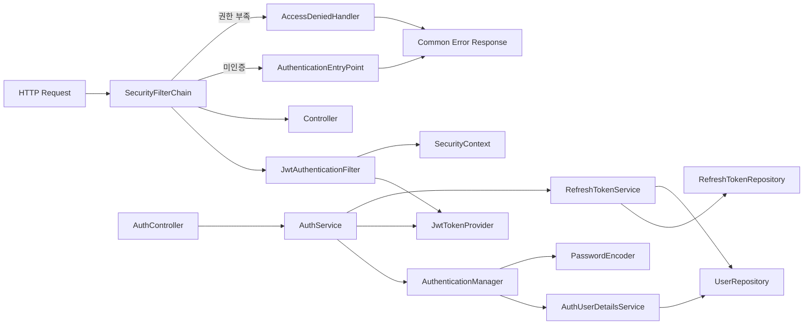

| 컴포넌트 | 책임 | 의존/금지 |
|---|---|---|
| `SecurityFilterChain` | 공개/보호/관리자 경로 정책, stateless, CORS, CSRF, EntryPoint/DeniedHandler 연결 | 비즈니스 로직 금지 |
| `JwtAuthenticationFilter` | `Authorization: Bearer` 파싱, JWT 검증 성공 시 `Authentication`을 `SecurityContext`에 설정 | 토큰 발급·DB 조회 금지; 요청당 1회 |
| `AuthenticationManager` | 로그인 이메일·비밀번호 인증을 위임 | `DaoAuthenticationProvider` + 사용자 조회 + BCrypt |
| `PasswordEncoder` | BCrypt cost 12 해싱·검증 | 평문 로그/저장 금지 |
| `AuthUserDetailsService` | 정규화 이메일로 사용자 조회, Role을 `ROLE_USER`/`ROLE_ADMIN` authority로 변환 | 도메인 수정 금지 |
| `JwtTokenProvider` | Access Token 발급, 서명·형식·만료·필수 Claim 검증 | 비밀키는 환경/Secret에서만 주입 |
| `RefreshTokenService` | opaque 토큰 생성, 해시, 저장, Rotation, 폐기, 재사용 대응 | 원문 저장·로그 금지 |
| `AuthenticationEntryPoint` | 인증 누락·잘못된 JWT를 공통 `401` 응답으로 변환 | 내부 예외 상세 노출 금지 |
| `AccessDeniedHandler` | 인증됐으나 Role 부족을 공통 `403` 응답으로 변환 | 401과 혼용 금지 |
| `AuthController` | 가입·로그인·재발급·로그아웃 DTO/API 계약 | Repository 직접 접근 금지 |
| `AuthService` | 유스케이스 조정과 트랜잭션 경계 | SecurityContext 직접 조작 금지 |
| `UserRepository` (MyBatis Mapper) | 사용자 저장·정규화 이메일 조회. 매퍼 SQL에 `deleted_at IS NULL` 필터 | 인증 정책 로직 금지 |
| `RefreshTokenRepository` (MyBatis Mapper) | 해시 조회, 행 잠금(`SELECT ... FOR UPDATE`), 활성 토큰 폐기/정리 | 원문 토큰 인자/반환 금지 |

**현재 인증 사용자 조회:** 보호 Controller는 `@AuthenticationPrincipal AuthPrincipal principal`을 사용한다. `AuthPrincipal`은 최소 `userId`, `email`, `role`만 가진 불변 객체다. Controller/Service가 JWT Claim을 다시 파싱하거나 이메일로 사용자를 재식별하지 않는다. DB 최신 Role이 반드시 필요한 관리자성 변경 작업은 Service에서 `userId`로 재조회한다.

### 12.4 SecurityFilterChain 정책

| 경로 | 정책 |
|---|---|
| `POST /api/auth/signup` | `permitAll` |
| `POST /api/auth/login` | `permitAll` |
| `POST /api/auth/refresh` | `permitAll`; Refresh Token 자체가 자격 증명 |
| `POST /api/auth/logout` | `permitAll`; Access Token 만료 상태에서도 제출된 Refresh Token 폐기 가능 |
| `GET /api/health`, Actuator health | 공개 범위는 배포 환경에서 명시적으로 제한 |
| `GET /api/users/me` | `hasAnyRole("USER", "ADMIN")` |
| `/api/admin/**` | `hasRole("ADMIN")`; 최소 검증 API는 `GET /api/admin/ping` |
| 그 외 `/api/**` | 기본 `authenticated()` |
| 기타 경로 | 명시적 허용이 없으면 deny 또는 인증 요구. 구현 시 정적 자원 정책을 별도 선언 |

**보안 설정 계약**

- 세션: `SessionCreationPolicy.STATELESS`; 서버 로그인 세션과 `JSESSIONID`를 사용하지 않는다.
- CSRF: Authorization header의 Bearer Token을 사용하는 무상태 API이므로 비활성화한다. Refresh Token을 향후 HttpOnly cookie로 전환하면 CSRF 보호 결정을 재검토한다.
- CORS: `CORS_ALLOWED_ORIGINS` 환경변수 allowlist. 운영은 정확한 HTTPS origin만 허용하고 `*`를 금지한다. 허용 메서드/헤더는 실제 API 계약으로 최소화한다.
- JWT 필터는 `UsernamePasswordAuthenticationFilter` 앞에 배치한다.
- 토큰 누락은 공개 경로에서는 무시하고, 보호 경로에서는 최종적으로 EntryPoint가 `401`을 반환한다.

### 12.5 JWT 및 Refresh Token 보안 계약

#### Access Token

- 알고리즘: `HS256`.
- 유효기간: 15분.
- 필수 Claim:
  - `sub`: `users.id`의 문자열 표현.
  - `role`: `USER` 또는 `ADMIN`.
  - `iat`: 발급 시각.
  - `exp`: 만료 시각.
- 권장 Claim: `iss=commitgotchi-springboot`, `typ=access`. 검증 시 issuer와 token type도 확인한다.
- 운영 비밀키: CSPRNG로 생성한 최소 32바이트(256-bit) raw secret. Base64 인코딩 문자열로 환경변수/외부 Secret에 주입한다. 사람 문장·짧은 패스워드·Git 저장을 금지한다.
- 보호 API 요청마다 서명, 구조, 알고리즘, issuer, type, 필수 Claim, 만료를 검증한다. `alg=none`과 예상 외 알고리즘을 거부한다.

#### Refresh Token

- 형식: JWT가 아닌 32바이트(256-bit) CSPRNG opaque value를 Base64url no-padding으로 인코딩.
- 유효기간: 30일.
- 저장: `SHA-256(rawRefreshToken)`의 lowercase hex만 저장. 고엔트로피 난수이므로 조회 가능한 결정적 해시를 사용하며 BCrypt는 사용하지 않는다.
- 전송: 첫 로그인/재발급 응답에서 원문을 한 번만 반환한다. 응답·로그·DB 외의 영속 저장을 서버가 수행하지 않는다.
- Rotation: `SELECT ... FOR UPDATE`로 제출 토큰 행을 잠근 동일 트랜잭션에서 검증 → 기존 `revoked_at` 설정 → 새 토큰 저장을 수행한다.
- 재사용 탐지: 이미 폐기된 토큰이 재발급에 제출되면 해당 `user_id`의 모든 활성 Refresh Token을 폐기하고 `401 AUTH_REFRESH_TOKEN_REUSED`를 반환한다. token-family 컬럼이 없는 현재 스키마에서 선택한 보수적 대응이다.
- 재사용 대응의 “활성 토큰 전체 폐기”는 `401` 예외 반환 때문에 롤백되면 안 된다. 별도 `REQUIRES_NEW` 트랜잭션 또는 명시적 no-rollback 정책으로 폐기를 먼저 커밋한 뒤 오류를 반환한다.
- 동시 재발급: 같은 토큰의 동시 요청 중 하나만 성공한다. 후속 요청은 재사용으로 판정되어 사용자 전체 Refresh Token이 폐기될 수 있으므로 클라이언트는 재발급 요청을 단일화해야 한다.

### 12.6 API 계약

모든 JSON 필드는 `camelCase`, 모든 시각은 UTC ISO-8601 문자열을 사용한다. 성공 응답은 과도한 공통 wrapper 없이 유스케이스 DTO를 직접 반환하고, 오류만 §12.7 공통 형식을 사용한다.

#### 회원가입

```http
POST /api/auth/signup
Content-Type: application/json
```

```json
{
  "email": "user@example.com",
  "password": "correct horse battery staple"
}
```

```http
HTTP/1.1 201 Created
```

```json
{
  "id": 1,
  "email": "user@example.com",
  "role": "USER",
  "createdAt": "2026-06-11T10:00:00Z"
}
```

- 요청에 `role` 필드를 허용하지 않거나 무시하지 말고 unknown field 검증으로 `400` 처리한다.
- 비밀번호 정책 `[ASSUMPTION]`: 12~64자이며 UTF-8 인코딩 기준 72바이트 이하. BCrypt 입력 한계를 넘는 값은 명시적으로 거부한다.

#### 로그인

```http
POST /api/auth/login
```

```json
{
  "email": "user@example.com",
  "password": "correct horse battery staple"
}
```

```json
{
  "tokenType": "Bearer",
  "accessToken": "<jwt>",
  "accessTokenExpiresAt": "2026-06-11T10:15:00Z",
  "refreshToken": "<opaque-token>",
  "refreshTokenExpiresAt": "2026-07-11T10:00:00Z"
}
```

- 이메일 없음과 비밀번호 불일치를 모두 `401 AUTH_INVALID_CREDENTIALS`로 반환한다.
- 로그인 성공 시 Refresh Token 레코드를 새로 생성한다.

#### 토큰 재발급

```http
POST /api/auth/refresh
```

```json
{ "refreshToken": "<opaque-token>" }
```

성공 응답은 로그인과 동일한 token pair 형식이다. 기존 Refresh Token은 성공 응답 전에 DB에서 폐기되고, 새 Refresh Token 해시가 저장된다.

#### 로그아웃

```http
POST /api/auth/logout
```

```json
{ "refreshToken": "<opaque-token>" }
```

```http
HTTP/1.1 204 No Content
```

- 유효하거나 이미 폐기된 토큰 제출은 멱등 `204`로 처리한다.
- 존재하지 않거나 형식이 잘못된 토큰도 계정/토큰 존재 여부를 노출하지 않기 위해 `204`로 처리한다.
- 로그아웃 후 Access Token은 최대 15분간 기술적으로 유효할 수 있다.

#### 현재 사용자 및 관리자 검증

```http
GET /api/users/me
Authorization: Bearer <access-token>
```

```json
{ "id": 1, "email": "user@example.com", "role": "USER" }
```

```http
GET /api/admin/ping
Authorization: Bearer <admin-access-token>
```

```json
{ "status": "ok" }
```

### 12.7 공통 오류 계약과 민감정보 처리

```json
{
  "status": 401,
  "code": "AUTH_ACCESS_TOKEN_EXPIRED",
  "message": "인증이 필요합니다.",
  "timestamp": "2026-06-11T10:00:00Z",
  "traceId": "7b6f0d7c..."
}
```

| 상황 | HTTP | 애플리케이션 코드 |
|---|---:|---|
| 잘못된 로그인 정보 | 401 | `AUTH_INVALID_CREDENTIALS` |
| Access Token 누락 | 401 | `AUTH_ACCESS_TOKEN_MISSING` |
| Access Token 변조/형식/알고리즘 오류 | 401 | `AUTH_ACCESS_TOKEN_INVALID` |
| Access Token 만료 | 401 | `AUTH_ACCESS_TOKEN_EXPIRED` |
| Refresh Token 만료/변조/미존재/폐기 | 401 | `AUTH_REFRESH_TOKEN_INVALID` |
| 폐기 Refresh Token 재사용 탐지 | 401 | `AUTH_REFRESH_TOKEN_REUSED` |
| 인증됐으나 Role 부족 | 403 | `AUTH_FORBIDDEN` |
| 이메일 중복 | 409 | `USER_EMAIL_CONFLICT` |
| DTO/필드 검증 실패 | 400 | `VALIDATION_FAILED` |

**로그/응답 규칙**

- 비밀번호, `password_hash`, JWT 원문, Refresh Token 원문, Authorization 헤더, Secret, 내부 stack trace를 응답에 포함하지 않는다.
- 인증 로그는 `traceId`, 이벤트 종류, 결과, `userId`(알 수 있을 때), 클라이언트 IP의 정책상 허용된 축약/해시값만 기록한다.
- 이메일은 필요 시 전체가 아닌 마스킹 값(예: `u***@example.com`)만 로그에 기록한다.
- JWT 예외 메시지와 라이브러리 내부 예외 상세는 서버 내부에서도 DEBUG 기본 비활성화로 유지한다.
- `AuthenticationEntryPoint`, `AccessDeniedHandler`, `@RestControllerAdvice` 모두 동일 `ErrorResponse` 직렬화 컴포넌트를 사용한다.

### 12.8 인증·인가 시퀀스

#### 12.8.1 회원가입

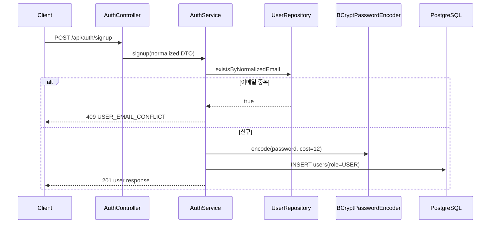

#### 12.8.2 로그인과 Token Pair 발급

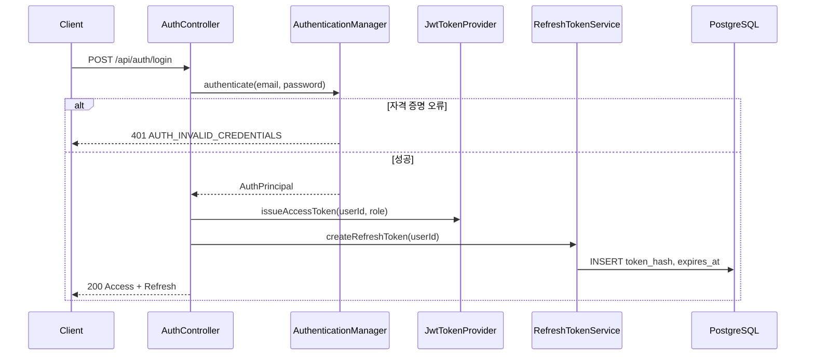

#### 12.8.3 Access Token으로 보호 API 접근

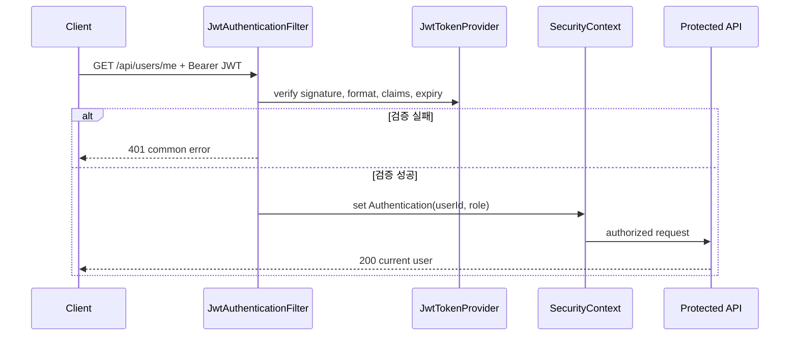

#### 12.8.4 Refresh Token Rotation 재발급

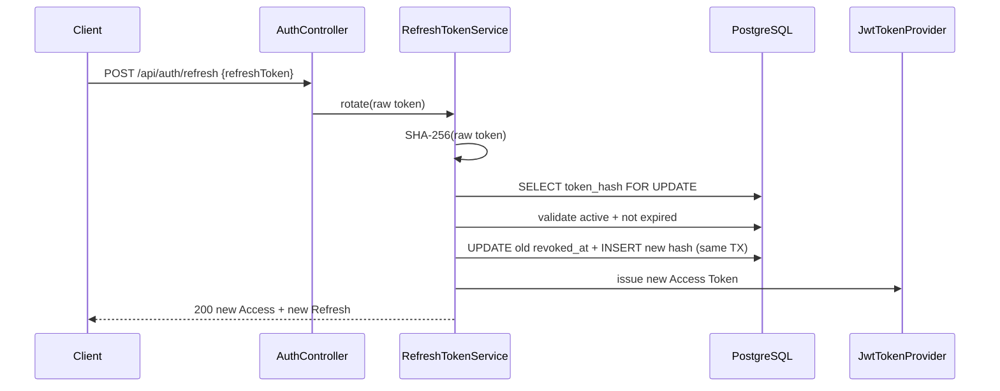

#### 12.8.5 로그아웃

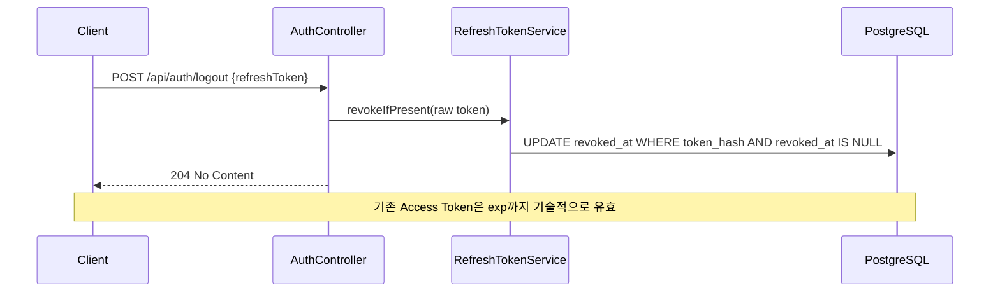

#### 12.8.6 폐기 Refresh Token 재사용

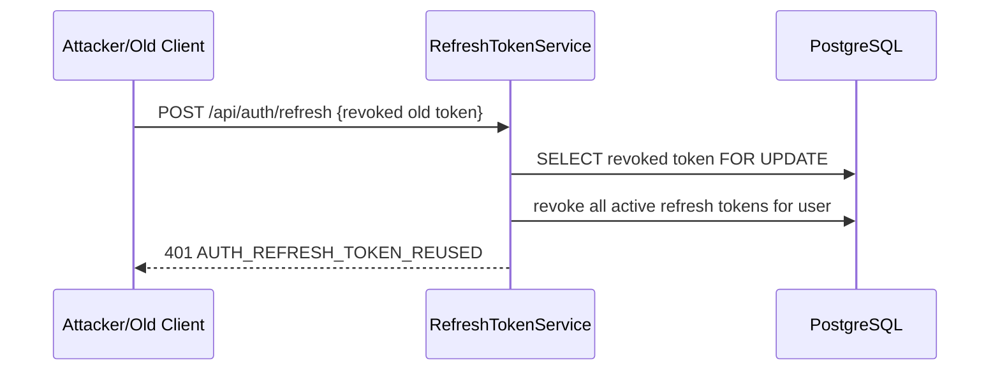

#### 12.8.7 USER의 관리자 API 접근 거부

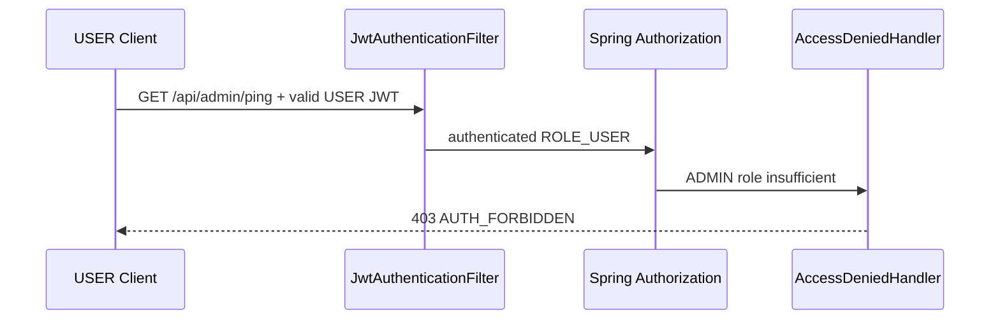

### 12.9 패키지·파일 구조와 경계

현재 실제 Spring Boot 루트는 `springboot/`다. 구현 담당자는 아래 구조를 기준으로 추가한다.

```text
springboot/
├── build.gradle
├── src/main/java/com/commitgotchi/
│   ├── auth/
│   │   ├── api/
│   │   │   ├── AuthController.java
│   │   │   └── dto/
│   │   ├── application/
│   │   │   ├── AuthService.java
│   │   │   └── RefreshTokenService.java
│   │   └── domain/
│   │       ├── RefreshToken.java           # 도메인 객체(POJO, @Entity 아님)
│   │       └── RefreshTokenRepository.java # MyBatis @Mapper 인터페이스
│   ├── user/
│   │   ├── api/UserController.java
│   │   ├── domain/User.java                # 도메인 객체(POJO, @Entity 아님)
│   │   ├── domain/UserRole.java
│   │   └── domain/UserRepository.java      # MyBatis @Mapper 인터페이스
│   ├── admin/api/AdminController.java
│   ├── security/
│   │   ├── SecurityConfig.java
│   │   ├── JwtAuthenticationFilter.java
│   │   ├── JwtTokenProvider.java
│   │   ├── AuthPrincipal.java
│   │   ├── AuthUserDetailsService.java
│   │   ├── RestAuthenticationEntryPoint.java
│   │   └── RestAccessDeniedHandler.java
│   └── common/error/
│       ├── ErrorCode.java
│       ├── ErrorResponse.java
│       └── GlobalExceptionHandler.java
├── src/main/resources/
│   ├── application.yml
│   ├── mybatis/
│   │   └── mapper/                 # MyBatis 매퍼 XML (UserMapper.xml, RefreshTokenMapper.xml ...)
│   └── db/migration/
│       ├── V1__create_users.sql
│       └── V2__create_refresh_tokens.sql
└── src/test/java/com/commitgotchi/
    ├── auth/
    ├── security/
    ├── user/
    └── support/
```

**의존 방향:** API → application → domain/repository(MyBatis @Mapper). `security`는 사용자 읽기 어댑터와 공통 오류만 의존한다. Repository(매퍼)는 Controller에 노출하지 않는다. 인증 증분은 다른 도메인 패키지에 의존하지 않는다.

**MyBatis 영속성 규약:** 도메인 객체는 `@Entity`가 아닌 POJO이며, 매핑은 매퍼 XML의 `resultMap` 또는 애노테이션으로 한다. 자동 변경 감지가 없으므로 모든 갱신은 명시적 `UPDATE` 매퍼 호출이다. soft delete 필터(`deleted_at IS NULL`)·부분 유니크·`SELECT ... FOR UPDATE` 잠금은 매퍼 SQL에 직접 작성한다. 트랜잭션 경계는 application 계층의 `@Transactional`로 둔다.

### 12.10 운영 Secret과 초기 ADMIN

- 환경/외부 Secret 최소 목록: `JWT_SECRET_BASE64`, `JWT_ISSUER`, `CORS_ALLOWED_ORIGINS`, DB 자격 증명.
- `.env.example`에는 값의 형식만 문서화하고 실제 Secret을 넣지 않는다.
- 초기 `ADMIN`은 공개 API로 생성하지 않는다.
- **확정 방식:** 일반 회원가입으로 생성한 특정 사용자에 대해 운영자가 제한된 DB 접속 또는 운영 전용 CLI로 `role='ADMIN'`을 변경한다. 실행자는 배포 감사 로그에 대상 `userId`, 실행 시각, 실행자를 남긴다. 비밀번호/해시는 기록하지 않는다.
- 운영 전용 CLI가 구현되기 전 로컬 개발에서는 테스트 fixture/프로필에서만 ADMIN 사용자를 만든다. 운영 Flyway 마이그레이션에 관리자 이메일·비밀번호·해시를 넣지 않는다.

### 12.11 테스트 아키텍처

| 테스트 층 | 검증 대상 |
|---|---|
| 단위 테스트 | 이메일 정규화, BCrypt match/non-match, JWT 발급·필수 Claim·파싱, Refresh Token 생성/해시, Rotation 상태 전이, 오류 코드 매핑 |
| Repository/DB 테스트 | PostgreSQL Testcontainers + Flyway로 email unique/CHECK, role CHECK, token_hash unique, FK, cascade, 인덱스 기반 조회, 만료·폐기 쿼리 검증 |
| Spring Security 통합 테스트 | 공개 경로 허용, 기본 보호 정책, 정상/누락/변조/만료 JWT의 200/401, USER/ADMIN의 200/403 |
| 인증 API 통합 테스트 | 회원가입·중복·검증 실패, 로그인 성공/실패, token pair 응답, `/me`, 관리자 ping |
| JWT 보안 테스트 | 예상 외 알고리즘, 서명 변경, malformed token, 누락 Claim, 잘못된 issuer/type, 경계 시각 만료 |
| Rotation/재사용 테스트 | 기존 토큰 폐기 + 새 토큰 발급 원자성, 기존 토큰 재사용 401, 사용자 활성 토큰 전체 폐기, 동시 재발급 단일 성공 |
| 로그아웃 테스트 | 토큰 폐기, 이후 재발급 실패, 반복 로그아웃 204, Access Token 잔여 유효성 문서 계약 확인 |
| 민감정보 비노출 | Mock appender/캡처 응답으로 비밀번호·JWT·Refresh Token·Authorization·stack trace가 응답/로그에 없는지 검증 |

**필수 종단 승인 시나리오**

1. 회원가입 → 로그인 → `/api/users/me` 성공.
2. 같은 이메일의 대소문자/공백 변형 재가입이 `409`.
3. 공개 회원가입 요청으로 ADMIN 생성 불가.
4. 유효/누락/변조/만료 Access Token 각각의 보호 API 결과가 계약과 일치.
5. USER의 `/api/admin/ping`은 `403`, ADMIN은 `200`.
6. Refresh Token 재발급 후 이전 토큰 재사용은 `401`이고 활성 Refresh Token이 폐기됨.
7. 로그아웃 후 Refresh Token 재발급 실패, Access Token은 만료 전까지 기술적으로 유효.
8. 모든 실패 응답·로그에서 민감정보 비노출.

### 12.12 인증 증분 검증 결과와 Open Questions

**구현 준비 상태:** 인증 증분은 스키마, 컴포넌트 경계, 경로 정책, 보안 기본값, API/오류 계약, 시퀀스, 테스트 전략이 결정되어 **구현 준비 완료**다.

**기존 아키텍처와의 충돌**

- 기존 §2는 인증을 단순히 “JWT (Spring Security)”로만 명시했으며 Refresh Token·Role·오류 계약이 없었다. §12가 이를 구체화하고 대체한다.
- 기존 §5 전체 MVP ER의 `users`에는 `role`이 없고 `refresh_tokens`가 없었다. 이번 업데이트로 추가했다.
- 기존 §6의 Spring Boot 경로는 `backend-spring/`이었지만 실제 저장소 경로는 `springboot/`다. 이번 업데이트로 실제 경로를 기준으로 정정했다.
- 최신 PRD/Addendum과 기존 아키텍처 사이의 퀴즈/이미지 처리 방식 충돌은 인증 증분 밖이며 §11에 명시했다.

**Open Questions**

- `[ASSUMPTION]` Refresh Token 정리 시 폐기/만료 후 7일 보존. 운영 감사 요구가 생기면 보존 기간을 변경한다.
- `[ASSUMPTION]` 비밀번호 길이 12~64자 및 UTF-8 72바이트 이하. 제품 UX 결정에서 조정 가능하나 BCrypt 72-byte 한계 처리는 반드시 유지한다.
- 향후 “기기별 로그아웃/탈취된 한 세션만 폐기”가 필요하면 `refresh_tokens`에 `family_id`, `replaced_by_token_id`, `last_used_at`을 추가한다. 첫 증분에서는 제외한다.
