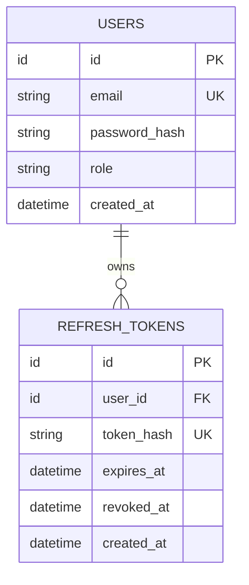

# Addendum — commitgotchi PRD

> PRD 본문에 넣지 않는 기술 상세(시스템 구성·메시지 스키마·내부 계약). 아키텍처 단계 입력. brief 단계 애드덤을 계승하고 PRD에서 확정된 결정을 반영했다.

## 확정된 결정 (이번 단계) — **개정 반영**

- **D1 — 퀴즈 채점 시점 [개정]:** **제출 즉시 동기 채점**(흐름 B). 사용자가 답안을 내면 곧바로 채점·피드백·점수 반영이 일어나고 결과가 즉시 표시된다. (기존: 자정 배치 → 변경)
- **D2 — 점수 누적 모델:** 일 단위 누적. 주간 점수 변화량은 표시·통계·AI 컨텍스트 용도로만 집계. 점수 출처는 흐름 A(학습 리포트)·흐름 B(퀴즈)로 분리하며 상호 배타(이중계상 금지). (brief 애드덤 Open Question 2 해소)
- **D3 — 진화 규칙:** 전투력 1,000점 도달 시 1회 진화. MVP는 스프라이트시트 행 전환(유아형→진화형) + 진화 상태 플래그만, 추가 능력치 보너스 없음(제안값). (brief 애드덤 Open Question 3 일부 해소)
- **D4 — 퀴즈 제출 처리 [개정]:** 제출 시 답안 저장(동기) → 곧바로 FastAPI 동기 채점 호출 → 점수 즉시 반영. 자정 배치는 퀴즈 채점을 하지 않고, 그날 채점된 결과를 종합 코멘트에만 활용.
- **D5 — 캐릭터 이미지 생성 [개정]:** 캐릭터 생성 요청 안에서 Spring Boot가 FastAPI `POST /api/ai/commitgotchi`를 동기 HTTP로 호출한다(자정 배치 아님). 3프레임 1×3 스프라이트시트(감정 3종)를 사용하고, 진화는 baby/evolved 시트 URL 전환으로 처리한다. 실패 시 기본 스프라이트 세트.

## 시스템 구성 및 담당

- **PostgreSQL** — 전체 MVP에서는 사용자, 캐릭터, 학습 리포트, 퀴즈 및 모범답안, 퀴즈 제출 결과, 공유 게시글, 리뷰를 저장한다. 단, **첫 번째 인증·인가 구현 증분에서는 `users`, `refresh_tokens` 테이블만 생성한다.**
- **Spring Boot 서버 (담당: 김윤석)** — 가입·로그인·JWT 인증, 사용자/캐릭터 관리, 활성 캐릭터 단일성 보장, 학습 기록 저장, **퀴즈 채점 요청 중계 + 웹훅 수신(흐름 B)**, **캐릭터 이미지 동기 HTTP 호출(흐름 C)**, 자정 리포트 SQS 적재, FastAPI 처리 결과 수신, 캐릭터 능력치·감정·진화 반영, 랭킹·대시보드 API, 게시글·리뷰 CRUD.
- **FastAPI AI 서버 (담당: 신동운)** — 리포트 SQS 단건 처리·AI 일일 레포트 생성·다음 학습 추천·퀴즈 추천(흐름 A), **퀴즈 답안 채점 후 Spring Boot 웹훅 호출(흐름 B)**, **캐릭터 스프라이트 이미지 생성·저장 동기 응답(흐름 C)**, 결과를 Spring Boot API로 전달.
- **AWS SQS** — 큐는 `report-request-queue`(자정 리포트)에만 사용한다. 퀴즈 채점은 웹훅, 캐릭터 이미지는 동기 HTTP로 처리한다.

## 캐릭터 시스템 규칙

- 능력치 5종: DB, 알고리즘, CS, 네트워크, 프레임워크. 전투력 = 5개 능력치 총합.
- 진화: 기본/진화 2단계. 능력치 총합 1,000점 이상 시 진화. 캐릭터당 최대 1회.
- 감정: 기쁨 / 슬픔 / 화남 중 하나.
- 캐릭터 생성: 사용자 입력 키워드·성격 기반 AI 이미지 생성. 실패 시 기본 이미지 세트 사용.
- 사용자당 최대 3개 보유, 동시 활성 1개. 학습 점수는 활성 캐릭터에만 반영.

## 일일 레포트 생성 흐름

처리 시점:
- 사용자는 하루 동안 학습 리포트 작성.
- 매일 자정 이후 Spring Boot가 레포트 생성 요청을 SQS에 적재.
- FastAPI가 SQS 메시지를 단건씩 처리.
- 생성 결과는 매일 오전 9시까지 사용자에게 제공.

처리 단계(흐름 A):
1. Spring Boot → 그날 학습 리포트 + 이미 채점된 퀴즈 결과 요약을 모아 사용자별 요청을 `report-request-queue`에 적재.
2. FastAPI → SQS 메시지 조회.
3. FastAPI → AI로 레포트·점수 변화량(학습분)·추천 학습·추천 퀴즈 생성 + 그날 퀴즈 결과 종합 코멘트(채점 재수행 아님).
4. FastAPI → Spring Boot `POST /api/internal/reports/result` 호출.
5. Spring Boot → 결과 저장 + 활성 캐릭터에 학습 점수 일 단위 누적 반영.
6. 성공 시 FastAPI가 SQS 메시지 삭제.

### SQS 입력 메시지 예시 (흐름 A — 리포트)

```json
{
  "requestId": "report-request-uuid",
  "userId": 1,
  "targetDate": "2026-06-06",
  "userMetadata": {
    "weeklyStudyStreak": "0100011",
    "weeklyScoreChanges": {
      "db": 0, "algorithm": 3, "cs": 0, "network": 1, "framework": 0
    }
  },
  "characterMetadata": {
    "characterId": 10,
    "name": "커밋 몬스터",
    "personality": "칭찬을 많이 하지만 틀린 부분은 명확하게 지적하는 성격",
    "currentStats": { "db": 120, "algorithm": 200, "cs": 80, "network": 60, "framework": 140 }
  },
  "dailyReport": {
    "title": "오늘 학습 기록",
    "content": "Spring JPA의 N+1 문제와 해결 방법을 공부했다."
  },
  "todayQuizResults": [
    { "quizId": 55, "question": "JPA N+1 문제란?", "score": 7, "maxScore": 10, "feedback": "..." }
  ]
}
```

> 흐름 B(퀴즈 채점 요청 `POST /api/internal/quizzes/grade` + 결과 웹훅)와 흐름 C(이미지 생성 `POST /api/ai/commitgotchi`)의 상세 스키마는 **아키텍처 §4.3·§4.4**에 확정돼 있다.

## 핵심 계약 — Architecture 단계에서 확정됨 (아키텍처 §4 참조)

- ✅ `POST /api/internal/reports/result` 요청/응답 스키마(흐름 A).
- ✅ 퀴즈 채점 요청 + 결과 웹훅 계약 `POST /api/internal/quizzes/grade` / `POST /api/internal/quizzes/grade-result`(흐름 B).
- ✅ 캐릭터 이미지 생성 계약: `POST /api/ai/commitgotchi` 동기 HTTP(흐름 C).
- ✅ 흐름별 재시도·멱등성(requestId/submissionId/userId+s3ObjectUrl).
- ✅ 점수 반영 트랜잭션·활성 단일성·이중계상 금지(흐름 A·B 출처 분리).
- ✅ Fallback 정책(이미지/채점/리포트 흐름별 구체 동작).

## 첫 번째 구현 증분 — 인증·인가 기술 제약

- 구현 대상은 Spring Boot의 회원가입, 로그인, JWT Access Token 발급·검증, Refresh Token Rotation 기반 재발급, 로그아웃, 보호 API, Role 기반 인가다.
- Spring AI 및 캐릭터·리포트·퀴즈·게시판 관련 구현과 전체 도메인 테이블 생성은 이 증분에서 제외한다.
- 공개 회원가입은 Role 입력을 허용하지 않고 항상 `USER`를 생성한다. 초기 `ADMIN` 프로비저닝 방식은 미해결 항목이며 공개 API 생성은 금지한다.
- Access Token은 서명된 JWT이며 사용자 식별자, Role, 발급 시각, 만료 시각을 포함한다. 서버는 보호 API마다 서명·형식·만료를 검증한다.
- JWT 비밀키는 환경변수 또는 외부 Secret으로 주입하고 소스코드 및 Git 저장소에 저장하지 않는다.
- Refresh Token 원문은 저장하지 않고 해시값만 저장하며, 재발급 시 Rotation으로 기존 토큰을 폐기한다.
- Access Token은 로그아웃 시 즉시 무효화하지 않는 무상태 방식이다. 이 증분에서는 Access Token 블랙리스트를 구현하지 않고 짧은 유효기간으로 위험을 완화한다.

### 인증 데이터 모델

**USERS**

| 필드 | 제약/의미 |
|---|---|
| `id` | PK, 사용자 식별자 |
| `email` | unique, 로그인 식별 이메일 |
| `password_hash` | 안전한 단방향 비밀번호 해시 |
| `role` | `USER \| ADMIN` |
| `created_at` | 생성 시각 |

**REFRESH_TOKENS**

| 필드 | 제약/의미 |
|---|---|
| `id` | PK, Refresh Token 레코드 식별자 |
| `user_id` | FK → `users.id` |
| `token_hash` | unique, Refresh Token 원문의 안전한 해시 |
| `expires_at` | 만료 시각 |
| `revoked_at` | nullable, 폐기 시각 |
| `created_at` | 생성 시각 |



### 인증 증분 미해결 기술 결정

- `[ASSUMPTION]` Access Token의 정확한 유효기간, Refresh Token 유효기간, JWT 서명 알고리즘 및 운영 비밀키 최소 길이는 아키텍처 단계에서 확정한다.
- 초기 `ADMIN` 계정 프로비저닝 방식은 공개 회원가입 외의 안전한 운영 절차로 확정해야 한다.

## 잔여 미해결 질문 (PRD §8과 연동)

- 같은 날 학습 리포트 재작성 정책(하루 1개·덮어쓰기 가정).
- 감정 산정 임계 + 흐름 A·B 동시 갱신 시 최종 감정 우선순위.
- 진화 시 능력치 보너스 구체값(MVP 보너스 없음 제안).
- 퀴즈 답안 재제출 마감·점수 롤백 정책(당일 자정 잠금 제안).
- 기본 스프라이트 세트의 개수(레이아웃은 3프레임 1×3로 확정).
