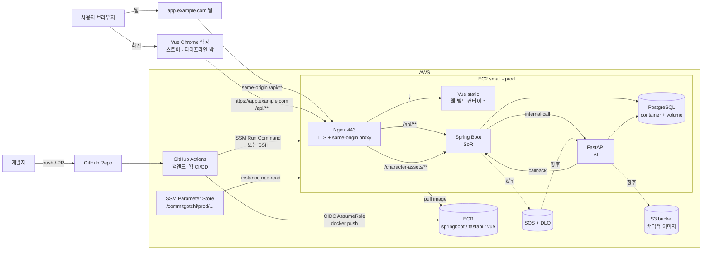

# Commit-Gotchi MVP CI/CD Pipeline Plan

> 이 문서는 **MVP 단계의 배포/운영 계획서**다. 실제 구현물(코드, Dockerfile, workflow, env 파일)은
> 수정하지 않으며, 다음 작업을 바로 쪼갤 수 있도록 "확정된 것"과 "후속 결정 필요"를 구분해 정리한다.

범례:
- ✅ **확정** — 이 문서 또는 팀 문서 기준 합의된 방향
- 🔶 **후속 결정 필요** — 구현 직전에 값/방식 확정 필요
- ⏭ **후속 작업(별도 PR/Story)** — 이 문서 범위 밖, 다음 단계

관련 팀 문서(merge로 반영됨, 본 계획의 상위 근거):
- `_bmad-output/planning-artifacts/cors-origin-boundary-epic-and-stories.md` — CORS/Origin 경계 Epic(COR-1)
- `springboot/docs/public-nginx-reverse-proxy-runbook.md` — 공개 Nginx 리버스 프록시 + 배포 체크리스트 + smoke test
- `springboot/docs/cors-chrome-extension-allowlist.md` — 확장 origin 허용 계약

---

## 1. 범위

- 이 문서는 Commit-Gotchi를 **단일 EC2 small 인스턴스**에 이미지 기반으로 배포/운영하기 위한 MVP 계획이다.
- 다루는 것: 목표 아키텍처, 런타임 선택, dev/prod 환경 분리, AWS 리소스, IAM, CI/CD 흐름, Nginx, 로드맵, 위험.
- **다루지 않는 것(후속 작업으로 둠):**
  - ⏭ 실제 GitHub Actions workflow YAML 구현
  - ⏭ Terraform/CDK 등 IaC 구현
  - ⏭ `docker-compose.prod.yml` 실제 작성
  - ⏭ Nginx config 실제 작성 (단, 팀 runbook에 prod 예시 server block이 이미 있음)
  - ⏭ Chrome 확장프로그램 빌드/스토어 게시 (파이프라인 밖, §2.1.1)

---

## 2. 현재 상태 요약

### 2.1 구성 요소 (레포 기준)

`docker-compose.yml`은 4개 컨테이너로 구성된다. prod 운영 origin 모델은 팀이 **Option A: same-origin reverse proxy**로 확정했다(COR-1.2). 즉 공개 도메인 하나(`https://app.example.com`)에서 Nginx가 **Vue 정적 자산(`/`)** 과 **Spring Boot API(`/api/**`, `/character-assets/**`)** 를 함께 제공한다.

| 서비스 | 역할 | 컨테이너 포트 | prod 운영 | 빌드 산출물 |
|--------|------|---------------|-----------|-------------|
| **vue** | SPA 프론트엔드. 빌드 후 `nginx:1.27-alpine`이 정적 자산 서빙 | 80 | ✅ EC2 (웹 빌드) | Docker image |
| **springboot** | System of Record (인증·캐릭터·리포트·랭킹). multi-stage(gradle→temurin-jre) | 8080 | ✅ EC2 | Docker image |
| **fastapi** | AI/Intelligence (채점·레포트·추천·이미지 생성). python:3.11-slim | 8000 | ✅ EC2 | Docker image |
| **postgres** | 공유 PostgreSQL 16. 백엔드별 DB 1개씩(`SPRING_DB_NAME`, `FASTAPI_DB_NAME`) | 5432 | ✅ EC2 | 공식 이미지 + init 스크립트 |

- 세 앱 모두 Dockerfile에 비-root 사용자 + `HEALTHCHECK`가 정의되어 있다 (springboot `/api/health`, fastapi `/api/health`, vue `/`).
- 공개 Nginx 리버스 프록시 + TLS는 의도적으로 compose에 없음 — 서버 프로비저닝 후 인스턴스에 추가하는 전제(`docker-compose.yml` 주석). prod 예시는 팀 runbook에 있음.

### 2.1.1 Vue 배포 = 웹 + Chrome 확장프로그램 (두 채널)

같은 Vue 코드베이스에서 **빌드 2종**이 나오고, `VITE_API_BASE_URL`(build-time)만 다르다:

| 채널 | `VITE_API_BASE_URL` | 어디서 서빙 | 파이프라인 |
|------|---------------------|-------------|------------|
| **운영 웹** | 빈 값 (상대 `/api/**`, same-origin) | EC2의 Nginx가 `/`에서 서빙 | ✅ 이 백엔드 CI/CD 대상 |
| **Chrome 확장** | `https://app.example.com` (절대 URL) | Chrome Web Store | ❌ 파이프라인 밖(별도 절차) |

- **운영 웹 빌드**는 EC2에 올라가므로 이 파이프라인이 빌드/배포한다.
- **확장 빌드**는 스토어로 별도 배포된다. manifest `host_permissions`/`VITE_API_BASE_URL` 정렬은 팀 runbook의 extension 체크리스트 따름. 이 문서는 확장 빌드를 다루지 않는다.

### 2.1.2 미완성/전제

- 🔶 **Spring Boot 전체 기능** — 인증 외 캐릭터/리포트/랭킹 등 진행 중(merge로 다수 추가됨).
- 🔶 **FastAPI S3 기반 최종 이미지 생성 API** — 미완성. 현재 캐릭터 기본 sprite는 Spring Boot가 `/character-assets/**`로 서빙(repo `docs/default_image*.png`).
- 🔶 **운영용 Nginx/HTTPS, AWS 리소스(ECR/EC2/SSM/S3/IAM)** — 미생성.

### 2.2 이미지 기반 배포가 적절한 이유

- 세 앱 모두 컨테이너화 + compose 오케스트레이션 중 → 빌드 산출물을 **Docker image 단위**로 다루는 게 자연스럽다.
- dev에서 검증한 동일 이미지를 prod로 승격(promote) → 환경 차이 최소화.
- ECR 태그 저장 → 롤백이 "직전 태그로 다시 `up`" 수준으로 단순.
- 나중에 ECS/App Runner로 옮겨도 이미지 자체는 재사용.

---

## 3. 목표 아키텍처

핵심 흐름:
1. GitHub Actions가 백엔드 + 웹 이미지를 빌드 → ECR push.
2. EC2가 ECR에서 pull, SSM에서 env/secret 주입.
3. 공개 진입점은 Nginx 443 하나(same-origin): `/`→Vue 웹, `/api/**`·`/character-assets/**`→Spring Boot.
4. **웹**은 same-origin으로, **확장**은 `https://app.example.com` 절대 URL로 같은 `/api/**`를 호출한다.
5. FastAPI는 외부 비공개 — Spring Boot internal 호출 전용(브라우저 직접 호출 없음).
6. S3/SQS는 기능 완성 시점에 연결(점선).

---

## 4. MVP 런타임 선택

| 항목 | MVP 1차 | 비고 |
|------|---------|------|
| **ECR** | ✅ 사용 | 이미지 레지스트리(springboot/fastapi/vue 웹) |
| **EC2 small (단일)** | ✅ 사용 | compose로 Nginx + Vue(웹) + Spring Boot + FastAPI + PostgreSQL |
| **ECS / Fargate** | ❌ 미사용 | ⏭ 후속 확장 후보 |
| **App Runner** | ❌ 미사용 | ⏭ 후속 후보 |
| **RDS** | ❌ 미사용 | ⏭ PostgreSQL 컨테이너 → 후속 전환 후보 |

**EC2 + compose를 1차로 택하는 이유:**
- 현재 compose 구조를 거의 그대로 재사용 → 학습/운영 비용 최소.
- 단일 EC2는 MVP 운영·디버깅이 단순하고 비용이 낮다.
- ECR 이미지는 나중에 ECS/App Runner로 그대로 이전 가능.

---

## 5. 환경 분리 전략

✅ dev와 prod를 분리한다. dev는 로컬 의존성 유지, prod는 AWS 리소스·환경변수를 별도 관리. 운영 origin 모델은 **Option A same-origin reverse proxy**(COR-1.2).

| 구분 | dev | prod |
|------|-----|------|
| 환경변수 출처 | 로컬 `.env` / `fastapi/.env` / `vue/.env.local` | **SSM Parameter Store** |
| 오케스트레이션 | `docker-compose.yml` (local) | ⏭ `docker-compose.prod.yml` |
| 자격증명 | 로컬 값/개발 키 | EC2 instance role |
| 진입점 | 각 포트 직접 접근 | Nginx 443 단일 진입점(same-origin) + HTTPS |
| Vue 웹 빌드 | `VITE_API_BASE_URL=http://localhost:8080` | **빈 값**(상대 `/api/**`) |
| Vue 확장 빌드 | (로컬 테스트) | `VITE_API_BASE_URL=https://app.example.com` (파이프라인 밖) |
| CORS | `http://localhost:5173` | `CORS_ALLOWED_ORIGINS=https://app.example.com` (Spring 소유, 아래) |
| Spring 프로필 | `local` | `prod` (Swagger 비활성, CORS fail-fast, refresh cookie `Secure;SameSite=None`) |

### 5.1 CORS는 Spring Boot가 소유 (확정·구현 완료)

> 이 항목은 **이미 결정·구현된 사항**이며 인프라 미결 항목이 아니다(`cors-chrome-extension-allowlist.md`, COR-1).

- ✅ CORS source of truth = `CommitgotchiCorsConfiguration`, 적용 경로는 `/api/**`뿐. **Nginx는 CORS 헤더를 붙이지 않고 패스스루**한다(양쪽이 붙이면 헤더 중복으로 깨짐).
- ✅ 허용 = `CORS_ALLOWED_ORIGINS` exact origin + **하드코딩된 확장 origin** `chrome-extension://daijhhcaecladkkpcjdlfgcokohehhmn`(manifest `key`로 고정). prod는 최소 1개 HTTPS origin 필수.
- ✅ method `GET/POST/PATCH/DELETE/OPTIONS`, header `Authorization, Content-Type`, `Access-Control-Allow-Credentials: true`.
- ✅ **FastAPI는 CORS 대상 아님**(브라우저 직접 호출 없음, 서버-투-서버). browser-facing endpoint가 생기기 전엔 추가 금지(별도 decision record 필요).
- ✅ `/character-assets/**`는 `/api/**` CORS 범위 밖(단순 ``/CSS 표시). canvas/fetch/CDN 전환 시 별도 asset CORS 결정(runbook).

### 5.2 SSM 파라미터 경로 (예시 / 🔶 네이밍 확정 필요)

경로 컨벤션: `/commitgotchi/{env}/{component}/{KEY}`. secret은 **SecureString**.

| 경로 | 타입 | 출처(compose/env) |
|------|------|-------------------|
| `/commitgotchi/prod/db/DB_USER` | String | `DB_USER` |
| `/commitgotchi/prod/db/DB_PASSWORD` | **SecureString** | `DB_PASSWORD` |
| `/commitgotchi/prod/spring/JWT_SECRET_BASE64` | **SecureString** | `JWT_SECRET_BASE64` |
| `/commitgotchi/prod/spring/CORS_ALLOWED_ORIGINS` | String | `https://app.example.com` |
| `/commitgotchi/prod/spring/SPRING_INTERNAL_API_SECRET` | **SecureString** | `SPRING_INTERNAL_API_SECRET` (compose 필수) |
| `/commitgotchi/prod/spring/CHARACTER_IMAGE_ENABLED` | String | `CHARACTER_IMAGE_ENABLED` |
| `/commitgotchi/prod/fastapi/GEMINI_API_KEY` | **SecureString** | `fastapi/.env` `GEMINI_API_KEY` |
| `/commitgotchi/prod/fastapi/AWS_REGION` | String | `AWS_REGION` |
| `/commitgotchi/prod/fastapi/S3_BUCKET_NAME` | String | (향후) S3 연동 |
| `/commitgotchi/prod/shared/REPORT_REQUEST_QUEUE_URL` | String | `REPORT_REQUEST_QUEUE_URL` (SQS) |

> SQS 관련 다수 변수(`REPORT_REQUEST_QUEUE_*`, `AWS_*`)는 `REPORT_REQUEST_QUEUE_ENABLED=true`로 켤 때 한 묶음으로 SSM 적재.
> **`VITE_API_BASE_URL`은 SSM 대상이 아니다** — Vue 빌드 시점 baked-in(웹=빈 값, 확장=절대 URL). 백엔드 런타임 env가 아님.
> dev도 동일 트리(`/commitgotchi/dev/...`)를 쓸지, dev는 로컬 `.env`만 쓸지는 🔶 확정 필요.

---

## 6. AWS 리소스 계획

### 6.1 ECR repositories ✅
- `commitgotchi-springboot`
- `commitgotchi-fastapi`
- `commitgotchi-vue` (**웹 빌드** 이미지. 확장 빌드는 ECR 대상 아님)

🔶 lifecycle policy(미사용 태그 만료, 최근 N개 보존)는 구현 시 확정.

### 6.2 SSM Parameter Store ✅
- §5.2 트리. secret은 SecureString(+ KMS key). 평문 secret은 어디에도 커밋하지 않음.

### 6.3 EC2 small ✅
- 단일 인스턴스에서 Nginx + Vue(웹 static) + Spring Boot + FastAPI + PostgreSQL(compose).
- SSM Agent 설치, instance role 부여.
- 🔶 인스턴스 타입(x86 vs arm), 디스크/스왑 확정 필요.

### 6.4 Security Group ✅ (원칙)
- `80`, `443`: public (Nginx). 80은 443으로 리다이렉트(runbook).
- `22` (SSH): 가능하면 닫고 **SSM Session Manager** 우선. 열면 내 IP 제한.
- 앱 포트(8080/8000/5432, vue 80): **외부 비공개**. Nginx가 내부 프록시.

### 6.5 S3 bucket ⏭
- FastAPI 최종 이미지 생성 API 완성 시 연결(§11.2). asset CORS는 API CORS와 분리(runbook).

### 6.6 PostgreSQL ✅(MVP) / ⏭(후속)
- MVP: EC2 내부 컨테이너 + named volume(`postgres-data`).
- 후속: 관리형 **RDS** 전환 후보.

---

## 7. IAM 계획

### 7.1 부트스트랩 (초기)
- 사용자가 **모든 권한을 가진 IAM 계정**으로 ECR/EC2/SSM/S3 등 초기 리소스를 생성/위임할 수 있다.

> ⚠️ **보안 주의:** Admin(광범위) 권한은 **초기 부트스트랩 전용**이다.
> 운영 고정 전에 반드시 아래 least-privilege role/policy로 축소하며, **Admin을 장기 운영 권한으로 사용하지 않는다.**

### 7.2 권장 운영 구조 (least-privilege)

| 주체 | 용도 | 권한 범위 |
|------|------|-----------|
| **GitHub Actions deploy role** | CI/CD가 AssumeRole(OIDC) | ECR push, (배포) SSM SendCommand / 특정 인스턴스 한정 |
| **EC2 instance role** | 런타임 | ECR **pull**, SSM **read**(`/commitgotchi/prod/*` 한정), KMS decrypt(해당 key 한정), (향후) S3 r/w(해당 bucket 한정) |

- ECR **push(CI)** 와 **pull(EC2)** 분리.
- SSM read는 `/commitgotchi/{env}/*` 경로 제한.
- KMS decrypt는 SecureString 암호화 key만 허용.
- GitHub Actions는 앱 secret을 직접 보유하지 않음(OIDC 단기 자격증명만).

---

## 8. CI 계획

대상은 **백엔드 2종 + 웹 1종(springboot, fastapi, vue 웹 빌드)**. Chrome 확장 빌드/게시는 파이프라인 밖(§2.1.1).

| 트리거 | 동작 | ECR push |
|--------|------|----------|
| **PR** | Vue 웹 test/build, Spring Boot test, FastAPI test, Docker image **build only** | ❌ 없음 |
| **main merge** | 위 test + image build + ECR push + dev/staging 배포 | ✅ |
| **tag / manual dispatch** | prod 배포 | ✅ (승격) |

### 8.1 이미지 태그 전략 ✅
- `sha-<git-sha>` — 불변 식별자(롤백 기준).
- `staging` — dev/staging 현재 가리키는 이미지.
- `vX.Y.Z` — prod 릴리스.
- `latest`는 운영 기준으로 쓰지 않음.

> 🔶 PR 단위 test 명령(`./gradlew test`, FastAPI pytest, `npm test`/`npm run build`)의 스텝/캐시 전략은 workflow 구현 시 확정.
> Vue 웹 이미지 빌드 시 `VITE_API_BASE_URL`은 **빈 값**으로 baked-in(same-origin). 확장 빌드(절대 URL)는 별도.

---

## 9. CD 계획

흐름:
1. GitHub Actions가 ECR에 이미지 push(`sha-<git-sha>` + 채널 태그).
2. GitHub Actions가 EC2에 **SSM Run Command**(권장) 또는 SSH로 배포 명령 실행.
3. EC2에서:
   - ECR login → SSM `/commitgotchi/{env}/*` fetch(SecureString decrypt)
   - `.env.prod` 생성/export(배포 시점 주입)
   - `docker compose -f docker-compose.prod.yml pull`
   - `docker compose -f docker-compose.prod.yml up -d`
   - **health check**(컨테이너 `HEALTHCHECK` + Nginx 경유 외부 확인 + 팀 runbook smoke test)
4. 실패 시 **직전 image 태그(`sha-...`)로 rollback** 후 재기동.

🔶 결정 필요:
- 배포 채널: SSM Run Command vs SSH (권장: SSM).
- rollback 자동화 수준(수동 vs 헬스체크 실패 시 자동) — MVP 초기엔 수동 허용.
- 무중단 여부 — MVP는 짧은 다운타임 허용.

> 배포 후 검증은 팀 runbook의 **Smoke Tests**(웹/확장/거부 origin, PATCH/DELETE preflight, SSE)와 **Release CORS Matrix Checklist**를 release gate로 재사용한다.

---

## 10. Spring Boot ↔ FastAPI 통합 계획

- **Spring Boot = System of Record**, **FastAPI = AI/Image Intelligence**.
- **Spring → FastAPI:** 캐릭터 이미지 생성(`CHARACTER_IMAGE_BASE_URL=http://fastapi:8000`), 리포트/퀴즈 분석 또는 향후 SQS 적재.
- **FastAPI → Spring:** 결과 callback(`SPRING_REPORT_CALLBACK_PATH`, `SPRING_QUIZ_GRADE_RESULT_PATH`). internal auth = `SPRING_INTERNAL_API_SECRET`(공유 시크릿 헤더, compose 양쪽 필수).
- **MVP 통신:** 같은 EC2 compose 네트워크 내부 service name으로. FastAPI는 서버-투-서버라 **CORS 대상 아님**.
- **prod secret:** `SPRING_INTERNAL_API_SECRET`은 SSM SecureString(§5.2).
- ⏭ **향후:** SQS(Standard) + DLQ 비동기 단방향 흐름(`REPORT_REQUEST_QUEUE_*`), S3 이미지 저장.

---

## 11. Nginx 계획

> prod 예시 server block / 배포 체크리스트 / smoke test는 팀 `public-nginx-reverse-proxy-runbook.md`에 이미 있다. 이 문서는 요약만.

### 11.1 책임 (Option A same-origin)
- 공개 진입점 = **Nginx 443 하나**(TLS 종료). same-origin이라 웹 API 요청은 상대 `/api/**`.
- 라우팅:
  - `/` → Vue 웹 static (compose의 vue 컨테이너 proxy 또는 호스트 static root)
  - `/api/**` → Spring Boot (8080)
  - `/character-assets/**` → Spring Boot (8080) — 기본 sprite 제공 동안
  - **FastAPI로는 절대 프록시하지 않음**
- `Host`, `X-Forwarded-*`, `Upgrade`, `Connection` 헤더 보존(SSE/`/api/game/.../events` 위해).
- **CORS 헤더는 Nginx가 붙이지 않음** — Spring Boot가 소유(§5.1). Nginx는 패스스루.
- **HTTPS:** MVP는 **Certbot(Let's Encrypt)**. ⏭ 후속 ALB + ACM 후보.

### 11.2 asset 경로 보류
- 현재 `/character-assets/**`는 Spring Boot가 repo sprite를 서빙. ⏭ S3/CloudFront 전환 시 asset 전용 CORS(웹 + 확장 origin) 별도 적용(runbook 예시 있음).

---

## 12. MVP 단계별 로드맵

| Phase | 내용 | 상태 |
|-------|------|------|
| **Phase 1** | 문서/계획 정리 (이 문서) | ✅ 본 PR |
| **Phase 2** | `docker-compose.prod.yml` 초안 + Nginx config(runbook 기반) | ⏭ Story INFRA-1 |
| **Phase 3** | ECR repo 생성 + GitHub Actions **CI** (test + build + push) | ⏭ INFRA-2 |
| **Phase 4-5** | EC2 프로비저닝 + SSM env 주입 + **수동 배포** 검증 | ⏭ INFRA-3 |
| **Phase 6** | GitHub Actions **CD** (OIDC + 배포 + 롤백) | ⏭ INFRA-4 |
| **Phase 7-8** | FastAPI **S3 이미지 저장** + RDS/ECS 등 고도화 후보 | ⏭ INFRA-5 |

---

## 13. 위험과 보류사항

| # | 위험 | 영향 | 완화/메모 |
|---|------|------|-----------|
| 1 | **단일 EC2 = 단일 장애 지점** | 다운 시 전체 중단 | MVP 허용. 후속 ALB+다중/ECS |
| 2 | **PostgreSQL 컨테이너 운영** | 볼륨 손상/백업 부재 시 유실 | 정기 `pg_dump`. 후속 RDS |
| 3 | **Admin IAM 장기 사용** | 유출 시 피해 큼 | 부트스트랩 후 least-privilege 축소(§7) |
| 4 | **Vue 채널별 build-time 변수** | 웹(빈 값)·확장(절대 URL) 빌드를 혼동하면 API 호출 실패 | 빌드 분리 + 팀 runbook의 "Common Wrong Combinations" 표 준수. (CORS 자체는 Spring에서 확정·구현됨) |
| 5 | **S3 이미지 API 미완성** | 이미지 영속화 불가 | INFRA-5에서 연동. 현재는 Spring `/character-assets/**` 기본 sprite |
| 6 | **Spring Boot 기능 미완성** | 전체 기능 배포 불가 | 점진 배포 |
| 7 | **secret rotation 미구현** | 장기 노출 위험 | SSM 기반 rotation 후속 |
| 8 | **rollback 자동화 미흡** | 복구 지연 | MVP 수동 롤백 허용, 후속 자동화 |

---

## 14. 후속 작업 체크리스트

- [ ] `docker-compose.prod.yml` 설계 (Nginx + Vue 웹 + Spring Boot + FastAPI + PostgreSQL, 앱 포트 비공개, ECR 이미지 참조)
- [ ] `.github/workflows/ci.yml` (PR/main: 백엔드+웹 test + build (+ push))
- [ ] `.github/workflows/deploy.yml` (OIDC AssumeRole + ECR push + EC2 배포)
- [ ] ECR repository 3개 생성 (springboot, fastapi, vue 웹)
- [ ] SSM parameter naming 확정 + 값 적재 (SecureString; `SPRING_INTERNAL_API_SECRET`, SQS 묶음 포함)
- [ ] EC2 bootstrap script (docker/compose, SSM agent, ECR login, instance role)
- [ ] Nginx config — 팀 runbook server block 기반(`/`→Vue, `/api/**`·`/character-assets/**`→Spring, TLS/Certbot, FastAPI 비프록시)
- [ ] prod health check + 팀 runbook **Smoke Tests / Release CORS Matrix** release gate 연결
- [ ] FastAPI S3 storage adapter (이미지 업로드/Presigned URL) + asset CORS(전환 시)
- [ ] (파이프라인 밖) Chrome 확장 빌드(`VITE_API_BASE_URL=https://app.example.com`)/스토어 게시 — runbook extension 체크리스트 따름

---

> 이 문서는 MVP 기준 계획이며, 실제 운영 고도화 단계에서는 ECS/RDS/ALB/Secrets Manager 전환을 재검토한다.
