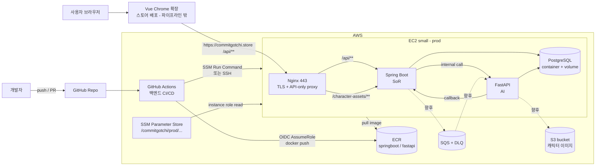

# Commit-Gotchi MVP CI/CD Pipeline Plan

> 이 문서는 **MVP 단계의 배포/운영 계획서**다. 실제 구현물(코드, Dockerfile, workflow, env 파일)은
> 수정하지 않으며, 다음 작업을 바로 쪼갤 수 있도록 "확정된 것"과 "후속 결정 필요"를 구분해 정리한다.

범례:
- ✅ **확정** — 이 문서 또는 팀 문서 기준 합의된 방향
- 🔶 **후속 결정 필요** — 구현 직전에 값/방식 확정 필요
- ⏭ **후속 작업(별도 PR/Story)** — 이 문서 범위 밖, 다음 단계

관련 팀 문서(merge로 반영됨, 본 계획의 상위 근거):
- `_bmad-output/planning-artifacts/cors-origin-boundary-epic-and-stories.md` — CORS/Origin 경계 Epic(COR-1)
- `springboot/docs/public-nginx-reverse-proxy-runbook.md` — 공개 Nginx 리버스 프록시 + 배포 체크리스트 + smoke test
- `springboot/docs/cors-chrome-extension-allowlist.md` — 확장 origin 허용 계약

---

## 1. 범위

- 이 문서는 Commit-Gotchi를 **단일 EC2 small 인스턴스**에 이미지 기반으로 배포/운영하기 위한 MVP 계획이다.
- 다루는 것: 목표 아키텍처, 런타임 선택, **.env local/prod 통합**, AWS 리소스, IAM, **aws-cli 부트스트랩**, CI/CD 흐름, Nginx, 로드맵, 위험.
- **리소스 생성 방식(확정):** AWS 리소스(ECR·SQS·S3·EC2·IAM)는 사용자의 풀권한 IAM 계정으로 **aws-cli 멱등 스크립트**를 통해 생성한다(§6.0). Terraform/CDK 같은 IaC는 후속 고도화 옵션으로 둔다.
- **다루지 않는 것(후속 작업으로 둠):**
  - ⏭ 실제 GitHub Actions workflow YAML 구현
  - ⏭ Terraform/CDK 등 IaC 전환
  - ⏭ Chrome 확장프로그램 빌드/스토어 게시 (파이프라인 밖, §2.1.1)

---

## 2. 현재 상태 요약

### 2.1 구성 요소 (레포 기준)

`docker-compose.yml`은 로컬 개발용으로 4개 컨테이너(vue 포함)로 구성되지만, **prod 배포 대상은 백엔드 3종(Spring Boot·FastAPI·PostgreSQL) + API용 Nginx**다. **Vue는 Chrome 확장프로그램으로만 배포**되므로 EC2/ECR/CI/Nginx 서빙 대상이 아니다(§2.1.1). 운영 공개 진입점은 **API 도메인 하나**이며, Nginx는 `/api/**`·`/character-assets/**`만 Spring Boot로 프록시한다.

| 서비스 | 역할 | 컨테이너 포트 | prod 배포 | 빌드 산출물 |
|--------|------|---------------|-----------|-------------|
| **springboot** | System of Record (인증·캐릭터·리포트·랭킹). multi-stage(gradle→temurin-jre) | 8080 | ✅ EC2 | Docker image |
| **fastapi** | AI/Intelligence (채점·레포트·추천·이미지 생성). python:3.11-slim | 8000 | ✅ EC2 | Docker image |
| **postgres** | 공유 PostgreSQL 16. 백엔드별 DB 1개씩(`SPRING_DB_NAME`, `FASTAPI_DB_NAME`) | 5432 | ✅ EC2 | 공식 이미지 + init 스크립트 |
| **vue** | SPA 프론트엔드 | (로컬 80) | ❌ 배포 제외 (Chrome 확장) | Chrome 확장프로그램(.zip) |

- 백엔드 두 앱 모두 Dockerfile에 비-root 사용자 + `HEALTHCHECK`(springboot `/api/health`, fastapi `/api/health`).
- 공개 Nginx(API 전용) + TLS는 의도적으로 compose에 없음 — 서버 프로비저닝 후 인스턴스에 추가하는 전제. prod 예시는 팀 runbook 참고(§11에 API-only 정렬 노트).

### 2.1.1 Vue = Chrome 확장프로그램 전용 (배포 제외)

- Vue SPA는 **Chrome 확장프로그램**으로만 배포된다. EC2/ECR/compose(prod)/CI/Nginx 서빙 대상이 **아니다**.
- 확장 빌드(`VITE_API_BASE_URL=https://commitgotchi.store` 절대 URL)는 **Chrome Web Store로 별도 배포** — 이 파이프라인 밖. manifest `host_permissions`/build는 팀 runbook의 extension 체크리스트 따름.
- **Vue 소스·로컬 개발 흐름은 유지**한다. 로컬 `docker-compose.yml`의 vue 서비스는 로컬 개발/미리보기용으로 둘 수 있다(단, **독립 `docker-compose.prod.yml`**·ECR·CI에서는 제외).
- 확장은 백엔드 API를 **호출하는 클라이언트**일 뿐 — 백엔드(Spring·FastAPI·Postgres·API Nginx)는 그대로 배포된다.

### 2.1.2 미완성/전제

- 🔶 **Spring Boot 전체 기능** — 인증 외 캐릭터/리포트/랭킹 등 진행 중(merge로 다수 추가됨).
- 🔶 **FastAPI S3 기반 최종 이미지 생성 API** — 미완성. 현재 캐릭터 기본 sprite는 Spring Boot가 `/character-assets/**`로 서빙(Spring Boot 이미지에 포함된 classpath resource; 루트 `docs/default_image*.png` 원본은 호환용으로 유지).
- 🔶 **운영용 Nginx/HTTPS, AWS 리소스(ECR/EC2/SSM/S3/IAM)** — 미생성.

### 2.2 이미지 기반 배포가 적절한 이유

- 세 앱 모두 컨테이너화 + compose 오케스트레이션 중 → 빌드 산출물을 **Docker image 단위**로 다루는 게 자연스럽다.
- dev에서 검증한 동일 이미지를 prod로 승격(promote) → 환경 차이 최소화.
- ECR 태그 저장 → 롤백이 "직전 태그로 다시 `up`" 수준으로 단순.
- 나중에 ECS/App Runner로 옮겨도 이미지 자체는 재사용.

---

## 3. 목표 아키텍처

핵심 흐름:
1. GitHub Actions가 **백엔드 이미지(springboot/fastapi)**를 빌드 → ECR push.
2. EC2가 ECR에서 pull, SSM에서 env/secret 주입.
3. 공개 진입점은 Nginx 443 하나(**API 전용**): `/api/**`·`/character-assets/**`→Spring Boot. **프론트 서빙 없음.**
4. **Chrome 확장**이 `https://commitgotchi.store` 절대 URL로 `/api/**`를 호출한다(스토어 배포, 파이프라인 밖).
5. FastAPI는 외부 비공개 — Spring Boot internal 호출 전용(브라우저 직접 호출 없음).
6. S3/SQS는 기능 완성 시점에 연결(점선).

---

## 4. MVP 런타임 선택

| 항목 | MVP 1차 | 비고 |
|------|---------|------|
| **ECR** | ✅ 사용 | 백엔드 이미지 레지스트리(springboot/fastapi) |
| **EC2 small (단일)** | ✅ 사용 | compose로 API Nginx + Spring Boot + FastAPI + PostgreSQL (Vue 없음) |
| **ECS / Fargate** | ❌ 미사용 | ⏭ 후속 확장 후보 |
| **App Runner** | ❌ 미사용 | ⏭ 후속 후보 |
| **RDS** | ❌ 미사용 | ⏭ PostgreSQL 컨테이너 → 후속 전환 후보 |

**EC2 + compose를 1차로 택하는 이유:**
- 현재 compose 구조를 거의 그대로 재사용 → 학습/운영 비용 최소.
- 단일 EC2는 MVP 운영·디버깅이 단순하고 비용이 낮다.
- ECR 이미지는 나중에 ECS/App Runner로 그대로 이전 가능.

---

## 5. 환경 분리 전략 (.env 통합)

✅ **dev와 prod는 같은 변수 이름 집합을 쓰고, 값만 환경별로 분리**한다. 통합 실행의 기준 env는 **루트 `.env` 하나(SSOT)**다. 운영 origin 모델은 **Option A same-origin reverse proxy**(COR-1.2).

### 5.0 env 파일 구조

| 파일 | 용도 | 비고 |
|------|------|------|
| `.env` | **로컬 통합 실행(docker compose) 기준 SSOT** | 커밋 금지, `.env.example` 템플릿 제공 |
| `.env.prod` | prod 값(EC2 배포 시 SSM에서 생성/주입) | 커밋 금지, `.env.prod.example` 템플릿 |
| `fastapi/.env`, `vue/.env.local` | 각 앱 **단독(비도커) 개발용** | 통합 실행에는 쓰지 않음 |

| 구분 | dev (`.env`) | prod (`.env.prod`) |
|------|--------------|--------------------|
| 오케스트레이션 | `docker-compose.yml` (vue 포함) | **독립 `docker-compose.prod.yml` 단독 실행** (vue 없이 nginx+spring+fastapi+postgres 자체 정의) |
| 값 출처 | 로컬 직접 입력 | **SSM Parameter Store**에서 배포 시점 주입 |
| 자격증명 | 로컬 값/개발 키 | EC2 instance role |
| 진입점 | 각 포트 직접 접근 | Nginx 443 단일 진입점(same-origin) + HTTPS |
| Spring 프로필 | `local` | `prod` (Swagger 비활성, CORS fail-fast, refresh cookie `Secure;SameSite=None`) |
| Vue 확장 빌드 | 로컬 개발(`VITE_API_BASE_URL=http://localhost:8080`) | `VITE_API_BASE_URL=https://commitgotchi.store` (스토어, **파이프라인 밖**) |
| CORS | `http://localhost:5173` | `CORS_ALLOWED_ORIGINS=https://commitgotchi.store` (부팅용 placeholder) + 확장 origin은 Spring 하드코딩 |
| SQS | **기존 `fastapi/.env`의 큐 재사용**(§6.7) | **동일 스펙 prod 전용 큐**(§6.7) |
| S3 | **공용 버킷 + `dev/` prefix**(§6.5) | **공용 버킷 + `prod/` prefix** |
| AI 키 | `GEMINI_API_KEY`(로컬 값) | `GEMINI_API_KEY`(SSM SecureString) |

> ⚠️ **실측 갭:** 현재 `docker-compose.yml`의 `fastapi` 서비스 env에 `GEMINI_API_KEY`가 주입되지 않는다.
> 통합 실행에서 AI(이미지 생성·퀴즈 채점)가 동작하려면 `.env`/compose에 `GEMINI_API_KEY`를 추가해야 한다(INFRA-1).

### 5.1 CORS는 Spring Boot가 소유 (확정·구현 완료)

> 이 항목은 **이미 결정·구현된 사항**이며 인프라 미결 항목이 아니다(`cors-chrome-extension-allowlist.md`, COR-1).

- ✅ CORS source of truth = `CommitgotchiCorsConfiguration`, 적용 경로는 `/api/**`뿐. **Nginx는 CORS 헤더를 붙이지 않고 패스스루**한다(양쪽이 붙이면 헤더 중복으로 깨짐).
- ✅ 허용 = `CORS_ALLOWED_ORIGINS` exact origin + **하드코딩된 확장 origin** `chrome-extension://daijhhcaecladkkpcjdlfgcokohehhmn`(manifest `key`로 고정).
- ⚠️ **확장 전용이어도 prod 부팅 조건**: `prod` 프로필은 `CORS_ALLOWED_ORIGINS`에 **HTTPS origin 최소 1개**를 요구해 fail-fast한다. 웹앱이 없어도 **API 자체 도메인**(`https://commitgotchi.store`)을 placeholder로 넣어 부팅을 통과시킨다. 확장 요청은 하드코딩 origin으로 허용되므로 별개.
- ✅ method `GET/POST/PATCH/DELETE/OPTIONS`, header `Authorization, Content-Type`, `Access-Control-Allow-Credentials: true`.
- ✅ **FastAPI는 CORS 대상 아님**(브라우저 직접 호출 없음, 서버-투-서버). browser-facing endpoint가 생기기 전엔 추가 금지(별도 decision record 필요).
- ✅ `/character-assets/**`는 `/api/**` CORS 범위 밖(단순 ``/CSS 표시). canvas/fetch/CDN 전환 시 별도 asset CORS 결정(runbook).

### 5.2 SSM 파라미터 경로 (예시 / 🔶 네이밍 확정 필요)

경로 컨벤션: `/commitgotchi/{env}/{component}/{KEY}`. secret은 **SecureString**.

| 경로 | 타입 | 출처(compose/env) |
|------|------|-------------------|
| `/commitgotchi/prod/db/DB_USER` | String | `DB_USER` |
| `/commitgotchi/prod/db/DB_PASSWORD` | **SecureString** | `DB_PASSWORD` |
| `/commitgotchi/prod/spring/JWT_SECRET_BASE64` | **SecureString** | `JWT_SECRET_BASE64` |
| `/commitgotchi/prod/spring/CORS_ALLOWED_ORIGINS` | String | `https://commitgotchi.store` (부팅용 placeholder) |
| `/commitgotchi/prod/spring/SPRING_INTERNAL_API_SECRET` | **SecureString** | `SPRING_INTERNAL_API_SECRET` (compose 필수) |
| `/commitgotchi/prod/spring/CHARACTER_IMAGE_ENABLED` | String | `CHARACTER_IMAGE_ENABLED` |
| `/commitgotchi/prod/fastapi/GEMINI_API_KEY` | **SecureString** | `fastapi/.env` `GEMINI_API_KEY` |
| `/commitgotchi/prod/fastapi/AWS_REGION` | String | `AWS_REGION` |
| `/commitgotchi/prod/shared/S3_BUCKET_NAME` | String | **공용 버킷명**(dev/prod 동일, §6.5) |
| `/commitgotchi/prod/shared/S3_OBJECT_PREFIX` | String | `prod/` (dev는 로컬에서 `dev/`) |
| `/commitgotchi/prod/shared/REPORT_REQUEST_QUEUE_URL` | String | **prod 전용 큐** URL (§6.7) |

> SQS 관련 다수 변수(`REPORT_REQUEST_QUEUE_*`, `AWS_*`)는 `REPORT_REQUEST_QUEUE_ENABLED=true`로 켤 때 한 묶음으로 SSM 적재.
> **SQS는 local/prod 분리:** local은 기존 `fastapi/.env`의 큐를 재사용하고(SSM 미사용), prod는 동일 스펙의 **새 prod 전용 큐**를 만들어 SSM에 적재한다(§6.7).
> **S3는 dev/prod 공용 버킷 1개**를 쓰되 `S3_OBJECT_PREFIX`(`dev/`·`prod/`)로 객체 경로를 분리한다(§6.5).
> **`VITE_API_BASE_URL`은 SSM 대상이 아니다** — Chrome 확장 빌드 시점 baked-in(`https://commitgotchi.store` 절대 URL). 확장 빌드/게시는 파이프라인 밖.
> dev도 동일 트리(`/commitgotchi/dev/...`)를 쓸지, dev는 로컬 `.env`만 쓸지는 🔶 확정 필요(현재 제안: dev=로컬 `.env`).

---

## 6. AWS 리소스 계획

### 6.0 생성 방식 = aws-cli 부트스트랩 ✅
- 모든 AWS 리소스(ECR·SQS·S3·EC2·IAM·SSM)는 **aws-cli 멱등 스크립트**로 생성한다(`scripts/aws/`).
- 사용자의 **풀권한 IAM 계정**으로 최초 부트스트랩을 실행한다(§7.1 보안 주의 적용).
- **aws-cli 프로필: `default` 금지.** 이 프로젝트 전용으로 **새로 만든 named 프로필**(예: `commitgotchi`)을 사용한다. 스크립트/명령은 항상 `--profile commitgotchi`(또는 `AWS_PROFILE=commitgotchi`)를 명시한다. → 다른 계정 오작동 방지 + 자격증명 격리. 프로필명 🔶 확정.
- 스크립트는 **멱등**해야 한다: 이미 있으면 생성하지 않고 통과(예: `describe-* || create-*` 패턴).
- 리전 기본값 `ap-northeast-2`. 생성 결과(큐 URL, 버킷명 등)는 SSM(`/commitgotchi/prod/...`)에 적재한다.
- 🔶 Terraform/CDK는 후속 고도화 옵션(상태관리·드리프트 감지가 필요해질 때).

### 6.1 ECR repositories ✅
- `commitgotchi-springboot`
- `commitgotchi-fastapi`

> Vue는 ECR 대상이 아니다(Chrome 확장 .zip, 파이프라인 밖). 백엔드 이미지 **2개**만 ECR에 둔다.

🔶 lifecycle policy(미사용 태그 만료, 최근 N개 보존)는 구현 시 확정.

### 6.2 SSM Parameter Store ✅
- §5.2 트리. secret은 SecureString(+ KMS key). 평문 secret은 어디에도 커밋하지 않음.

### 6.3 EC2 small ✅
- 단일 인스턴스에서 Nginx + Vue(웹 static) + Spring Boot + FastAPI + PostgreSQL(compose).
- SSM Agent 설치, instance role 부여.
- 🔶 인스턴스 타입(x86 vs arm), 디스크/스왑 확정 필요.

### 6.4 Security Group ✅ (원칙)
- `80`, `443`: public (Nginx). 80은 443으로 리다이렉트(runbook).
- `22` (SSH): 가능하면 닫고 **SSM Session Manager** 우선. 열면 내 IP 제한.
- 앱 포트(8080/8000/5432, vue 80): **외부 비공개**. Nginx가 내부 프록시.

### 6.5 S3 bucket ✅ (dev/prod 공용, prefix 분리)
- **dev와 prod가 같은 버킷 1개**를 공용한다(aws-cli로 생성, §6.0). 비용·운영 단순화 목적.
- 객체 경로를 **prefix로 분리**: dev=`dev/characters/...`, prod=`prod/characters/...` (`S3_OBJECT_PREFIX`).
- 퍼블릭 접근 차단 + Presigned URL 또는 same-origin 프록시. asset CORS는 API CORS와 분리(runbook).
- ⚠️ **위험(§13 #9):** 공용 버킷이라 dev가 prod 객체를 덮어쓸 수 있다 → prefix 경계를 코드/IAM에서 강제하고, prod prefix는 dev 자격증명으로 쓰기 금지하는 방향을 후속 검토.
- FastAPI storage adapter가 이 버킷에 1×3 sprite를 업로드(INFRA-5). 미완성 동안은 Spring `/character-assets/**` 기본 sprite.

### 6.6 PostgreSQL ✅(MVP) / ⏭(후속)
- MVP: EC2 내부 컨테이너 + named volume(`postgres-data`).
- 후속: 관리형 **RDS** 전환 후보.

### 6.7 SQS (report-request) — local/prod 분리 ✅
- **local:** 기존 `fastapi/.env`의 SQS 설정(`REPORT_REQUEST_QUEUE_URL` 등)을 **그대로 재사용**한다. 새로 만들지 않는다.
- **prod:** local과 **동일 스펙의 prod 전용 큐**(+ DLQ)를 aws-cli로 새로 생성하고, URL을 SSM(`/commitgotchi/prod/shared/REPORT_REQUEST_QUEUE_URL`)에 적재한다.
- 두 환경의 큐를 분리해 로컬 테스트 메시지가 prod 소비자에 섞이지 않게 한다.
- report consumer 워커 기동(별도 프로세스 + 별도 compose 서비스)은 **INFRA-0**이 담당한다. VisibilityTimeout은 리포트 생성+Spring callback 시간보다 길게(큐 생성 시 INFRA-2).

### 6.8 도메인 / DNS ✅ (MVP=가비아 A 레코드, ALB 시 Route53)
- **도메인:** `commitgotchi.store` — **레지스트라는 가비아(Gabia)**. 레지스트라는 어느 단계에서도 가비아에 유지(도메인 이전 없음).
- **MVP(현재):** **가비아 DNS에서 직접 관리.** apex `commitgotchi.store` **A 레코드 → EC2 Elastic IP**. TLS는 Certbot(HTTP-01). 추가 AWS 의존성 없음.
  - EC2 재시작에도 IP가 안 바뀌도록 **Elastic IP를 먼저 할당**(INFRA-2)하고 그 IP를 A 레코드에 등록한다.
- **결정(후속, ALB 도입 시점):** **ALB를 붙이는 시점에 DNS를 Route53로 이전**한다.
  - 이유: apex 도메인은 표준 CNAME으로 ALB/CloudFront에 못 붙음 → Route53 **alias 레코드**로 apex→ALB 연결. ACM 인증서 **DNS 검증 자동화**, aws-cli/IaC로 레코드 관리.
  - 절차: Route53 호스티드 존 생성 → 발급된 **NS 4개를 가비아 네임서버로 등록** → 전파 후 Route53에서 레코드 관리(레지스트라는 가비아 유지).
- ALB는 MVP 범위 밖이므로 **지금은 Route53를 만들지 않는다.** Route53 전환은 ALB 작업과 함께(plan §13 #1, INFRA-5 고도화 후보).

---

## 7. IAM 계획

### 7.1 부트스트랩 (초기)
- 사용자가 **모든 권한을 가진 IAM 계정**으로 ECR/EC2/SSM/S3 등 초기 리소스를 생성/위임할 수 있다.

> ⚠️ **보안 주의:** Admin(광범위) 권한은 **초기 부트스트랩 전용**이다.
> 운영 고정 전에 반드시 아래 least-privilege role/policy로 축소하며, **Admin을 장기 운영 권한으로 사용하지 않는다.**

### 7.2 권장 운영 구조 (least-privilege)

| 주체 | 용도 | 권한 범위 |
|------|------|-----------|
| **GitHub Actions deploy role** | CI/CD가 AssumeRole(OIDC) | ECR push, (배포) SSM SendCommand / 특정 인스턴스 한정 |
| **EC2 instance role** | 런타임 | ECR **pull**, SSM **read**(`/commitgotchi/prod/*` 한정), KMS decrypt(해당 key 한정), (향후) S3 r/w(해당 bucket 한정) |

- ECR **push(CI)** 와 **pull(EC2)** 분리.
- SSM read는 `/commitgotchi/{env}/*` 경로 제한.
- KMS decrypt는 SecureString 암호화 key만 허용.
- GitHub Actions는 앱 secret을 직접 보유하지 않음(OIDC 단기 자격증명만).

---

## 8. CI 계획

대상은 **백엔드 2종(springboot, fastapi)**. Vue(Chrome 확장) 빌드/게시는 파이프라인 밖(§2.1.1). (원하면 PR 게이트로 Vue lint/test만 돌릴 수 있으나 이미지화·배포는 안 함.)

| 트리거 | 동작 | ECR push |
|--------|------|----------|
| **PR** | Spring Boot test, FastAPI test, Docker image **build only** | ❌ 없음 |
| **main merge** | 위 test + image build + ECR push + dev/staging 배포 | ✅ |
| **tag / manual dispatch** | prod 배포 | ✅ (승격) |

### 8.1 이미지 태그 전략 ✅
- `sha-<git-sha>` — 불변 식별자(롤백 기준).
- `staging` — dev/staging 현재 가리키는 이미지.
- `vX.Y.Z` — prod 릴리스.
- `latest`는 운영 기준으로 쓰지 않음.

> 🔶 PR 단위 test 명령(`./gradlew test`, FastAPI pytest)의 스텝/캐시 전략은 workflow 구현 시 확정.
> Chrome 확장 빌드(`VITE_API_BASE_URL=https://commitgotchi.store`)/게시는 이 파이프라인 밖이다.

---

## 9. CD 계획

흐름:
1. GitHub Actions가 ECR에 이미지 push(`sha-<git-sha>` + 채널 태그).
2. GitHub Actions가 EC2에 **SSM Run Command**(권장) 또는 SSH로 배포 명령 실행.
3. EC2에서:
   - ECR login → SSM `/commitgotchi/{env}/*` fetch(SecureString decrypt)
   - `.env.prod` 생성/export(배포 시점 주입)
   - `docker compose -f docker-compose.prod.yml pull`
   - `docker compose -f docker-compose.prod.yml up -d`
   - **health check**(컨테이너 `HEALTHCHECK` + Nginx 경유 외부 확인 + 팀 runbook smoke test)
4. 실패 시 **직전 image 태그(`sha-...`)로 rollback** 후 재기동.

🔶 결정 필요:
- 배포 채널: SSM Run Command vs SSH (권장: SSM).
- rollback 자동화 수준(수동 vs 헬스체크 실패 시 자동) — MVP 초기엔 수동 허용.
- 무중단 여부 — MVP는 짧은 다운타임 허용.

> 배포 후 검증은 팀 runbook의 **Smoke Tests**(확장/거부 origin, PATCH/DELETE preflight, SSE — 웹 origin 항목은 확장 전용이라 제외)와 **Release CORS Matrix Checklist**를 release gate로 재사용한다.

---

## 10. Spring Boot ↔ FastAPI 통합 계획

- **Spring Boot = System of Record**, **FastAPI = AI/Image Intelligence**.
- **Spring → FastAPI:** 캐릭터 이미지 생성(`CHARACTER_IMAGE_BASE_URL=http://fastapi:8000`), 리포트/퀴즈 분석 또는 향후 SQS 적재.
- **FastAPI → Spring:** 결과 callback(`SPRING_REPORT_CALLBACK_PATH`, `SPRING_QUIZ_GRADE_RESULT_PATH`). internal auth = `SPRING_INTERNAL_API_SECRET`(공유 시크릿 헤더, compose 양쪽 필수).
- **MVP 통신:** 같은 EC2 compose 네트워크 내부 service name으로. FastAPI는 서버-투-서버라 **CORS 대상 아님**.
- **prod secret:** `SPRING_INTERNAL_API_SECRET`은 SSM SecureString(§5.2).
- ⏭ **향후:** SQS(Standard) + DLQ 비동기 단방향 흐름(`REPORT_REQUEST_QUEUE_*`), S3 이미지 저장.

---

## 11. Nginx 계획

> prod 예시 server block / 배포 체크리스트 / smoke test는 팀 `public-nginx-reverse-proxy-runbook.md`에 이미 있다. 이 문서는 요약만.

### 11.1 책임 (API 전용)
- 공개 진입점 = **Nginx 443 하나**(TLS 종료). **Vue를 서빙하지 않으므로 API 전용 프록시**다. `/`는 프론트 서빙 없음.
- 라우팅:
  - `/api/**` → Spring Boot (8080)
  - `/character-assets/**` → Spring Boot (8080) — 기본 sprite 제공 동안(확장이 절대 URL로 가져감)
  - **FastAPI로는 절대 프록시하지 않음** (외부 비공개)
- `Host`, `X-Forwarded-*`, `Upgrade`, `Connection` 헤더 보존(SSE/`/api/game/.../events` 위해).
- **CORS 헤더는 Nginx가 붙이지 않음** — Spring Boot가 소유(§5.1). Nginx는 패스스루.
- **HTTPS:** MVP는 **Certbot(Let's Encrypt)** for `commitgotchi.store`. DNS는 가비아 A 레코드 → EC2 EIP(§6.8). ⏭ ALB 도입 시 ACM + Route53 alias로 전환.
- Chrome 확장은 `https://commitgotchi.store/api/**`(절대 URL)로 호출한다. 웹 정적 서빙 경로(`/`)는 없다.

### 11.2 asset 경로 보류
- 현재 `/character-assets/**`는 Spring Boot가 이미지에 포함된 기본 sprite를 서빙. ⏭ S3/CloudFront 전환 시 asset 전용 CORS(확장 origin) 별도 적용(runbook 예시 있음).

> 팀 `public-nginx-reverse-proxy-runbook.md`는 same-origin **웹 서빙**을 전제로 작성됨(COR-1.2). 본 배포는 **확장 전용/API-only**이므로 runbook의 `/`→Vue 서빙 부분은 적용하지 않는다(runbook 상단에 정렬 노트 추가). `/api/**`·`/character-assets/**` 프록시, 헤더 보존, smoke test(확장/거부 origin·PATCH/DELETE preflight·SSE)는 그대로 유효.

---

## 12. MVP 단계별 로드맵

| Phase | 내용 | 상태 |
|-------|------|------|
| **Phase 1** | 문서/계획 정리 (이 문서) | ✅ |
| **Phase 2 (앞단)** | **report consumer 워커 배선** — 별도 프로세스 entrypoint + 별도 compose 서비스 | ⏭ INFRA-0 |
| **Phase 2** | **.env 통합** + GEMINI 갭 수정 + **로컬 통합 실행** + **독립 `docker-compose.prod.yml`**(vue 제외) **prod 드라이런** + Nginx config(runbook 기반) | ⏭ INFRA-1 (이 브랜치) |
| **Phase 3** | **aws-cli 부트스트랩** — ECR·SQS(prod 큐)·S3(공용 버킷)·IAM·EC2 생성 + SSM 적재 | ⏭ INFRA-2 |
| **Phase 4** | EC2 prod 배포(SSM env 주입) + **수동 배포** 검증 | ⏭ INFRA-3 |
| **Phase 5** | GitHub Actions **CI/CD** (OIDC + ECR push + 배포 + 롤백) | ⏭ INFRA-4 |
| **Phase 6** | FastAPI **S3 이미지 저장** 연동(공용 버킷 prefix) + RDS/ECS 등 고도화 후보 | ⏭ INFRA-5 |

---

## 13. 위험과 보류사항

| # | 위험 | 영향 | 완화/메모 |
|---|------|------|-----------|
| 1 | **단일 EC2 = 단일 장애 지점** | 다운 시 전체 중단 | MVP 허용. 후속 ALB+다중/ECS |
| 2 | **PostgreSQL 컨테이너 운영** | 볼륨 손상/백업 부재 시 유실 | 정기 `pg_dump`. 후속 RDS |
| 3 | **Admin IAM 장기 사용** | 유출 시 피해 큼 | 부트스트랩 후 least-privilege 축소(§7) |
| 4 | **확장 build-time 변수 / prod CORS 부팅** | 확장 빌드 `VITE_API_BASE_URL`을 잘못 주면 API 호출 실패. prod 프로필은 HTTPS origin 1개 없으면 부팅 실패 | 확장 빌드는 `https://commitgotchi.store` 절대 URL. `CORS_ALLOWED_ORIGINS`에 `https://commitgotchi.store` placeholder 유지(§5.1). CORS는 Spring 확정·구현됨 |
| 5 | **S3 이미지 API 미완성** | 이미지 영속화 불가 | INFRA-5에서 연동. 현재는 Spring 이미지에 포함된 `/character-assets/**` 기본 sprite |
| 6 | **Spring Boot 기능 미완성** | 전체 기능 배포 불가 | 점진 배포 |
| 7 | **secret rotation 미구현** | 장기 노출 위험 | SSM 기반 rotation 후속 |
| 8 | **rollback 자동화 미흡** | 복구 지연 | MVP 수동 롤백 허용, 후속 자동화 |
| 9 | **S3 dev/prod 공용 버킷** | dev가 prod 객체를 덮어쓸 위험(blast radius) | `S3_OBJECT_PREFIX`(`dev/`·`prod/`)로 경로 분리 강제. 후속: prod prefix를 dev 자격증명으로 쓰기 금지(IAM), 또는 버킷 분리 |
| 10 | **부트스트랩 aws-cli 멱등성** | 재실행 시 중복 생성/충돌 | `describe \|\| create` 패턴으로 멱등 보장, 생성 결과는 SSM에 적재 |

---

## 14. 후속 작업 체크리스트

- [ ] **report consumer 워커 entrypoint + 별도 compose 서비스**(별도 프로세스, uvicorn 미탑재)(INFRA-0)
- [ ] **.env 통합** — `.env.example`/`.env.prod.example` 정리, `GEMINI_API_KEY` compose 주입(INFRA-1)
- [ ] **aws-cli 전용 named 프로필**(`default` 금지) 생성·사용 명시(INFRA-2)
- [ ] **독립 `docker-compose.prod.yml`** (단독 실행용, **vue 미정의** — overlay 아님; nginx+spring+fastapi+postgres 자체 정의, 앱 포트 비공개, prod는 ECR 이미지 / 드라이런은 build)
- [ ] Nginx config(**API 전용**) — `/api/**`·`/character-assets/**`→Spring, TLS/Certbot, FastAPI 비프록시, `/`→Vue 서빙 없음. 팀 runbook 상단에 API-only 정렬 노트 추가
- [ ] **aws-cli 부트스트랩 스크립트**(`scripts/aws/`, 멱등) — ECR×2(springboot/fastapi), prod SQS 큐(+DLQ), S3 공용 버킷, IAM role, SSM 적재
- [ ] SSM parameter naming 확정 + 값 적재 (SecureString; `SPRING_INTERNAL_API_SECRET`, `GEMINI_API_KEY`, SQS/S3 포함)
- [ ] EC2 bootstrap script (docker/compose, SSM agent, ECR login, instance role)
- [ ] **Elastic IP 할당** + 가비아 DNS에 `commitgotchi.store` A 레코드 → EIP 등록 (§6.8). Certbot으로 `commitgotchi.store` TLS 발급
- [ ] (후속, ALB 도입 시) **Route53 호스티드 존 생성 + 가비아 NS 변경** → apex alias→ALB, ACM DNS 검증
- [ ] `.github/workflows/ci.yml` + `deploy.yml` (OIDC AssumeRole + ECR push + EC2 배포)
- [ ] prod health check + 팀 runbook **Smoke Tests / Release CORS Matrix** release gate 연결
- [ ] FastAPI S3 storage adapter (공용 버킷 + `S3_OBJECT_PREFIX`, 업로드/Presigned URL) + asset CORS(전환 시)
- [ ] (파이프라인 밖) Chrome 확장 빌드/스토어 게시 — runbook extension 체크리스트 따름

---

> 이 문서는 MVP 기준 계획이며, 실제 운영 고도화 단계에서는 ECS/RDS/ALB/Secrets Manager 전환을 재검토한다.
